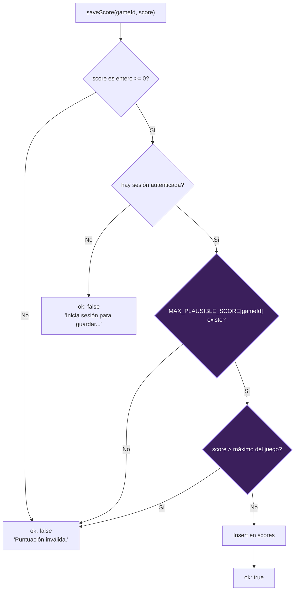

# Proposal

**Spec:** `11-score-plausibility-caps` · **Target version:** `v0.2.5` · **Fecha:** 2026-09-20

> Sigue la convención de numeración/versionado de `specs/` (`NN-slug-vX.Y.Z`,
> ver `CHANGELOG.md`), aplicada aquí al change de OpenSpec para mantener
> trazabilidad entre ambos sistemas de specs de este repo. La versión se
> bump en `package.json` recién al implementar/archivar este change, no en
> la etapa de propuesta.

## Why

`saveScore` (`app/actions/scores.ts`) only validates that a submitted score is a
non-negative integer and that the caller has a session. The score itself is
computed entirely client-side by the game engine and sent as-is — there is no
server-side check that it's achievable. Any authenticated user can open the
browser console on `/juegos/<id>/jugar` and call `saveScore("rocas", 999999999)`
directly, and it inserts into `scores` unmodified, immediately topping the
global leaderboard (`/salon-de-la-fama`) and that game's own leaderboard. This
undermines the core "competir por la mayor cantidad de puntos" premise of the
app for every legitimate player.

## What Changes

- `saveScore` rejects any score above a per-game maximum plausible score before
  inserting into `scores`, instead of accepting any non-negative integer.
- **BLOQUE BUSTER** (`bloque-buster`) gets an exact cap: its 5 levels have a
  fixed, enumerable block layout (208 blocks total across all levels, 10
  points each), so no legitimate playthrough can score above `2080`. Any
  submission above that is provably impossible and rejected outright.
- **ROCAS**, **CAÍDA**, and **SERPENTINA** are effectively endless (infinite
  asteroid waves / infinite Tetris pieces / a snake whose score keeps
  accumulating across its 3 lives without resetting), so they get a generous
  per-game "sanity ceiling" instead of a tight bound — a round number set far
  above any realistic human play session, but far below an obviously
  fabricated value. This does not catch moderate cheating in these three
  games; it only rejects the trivial "paste a huge number" case. Full
  anti-cheat for endless games (e.g. duration tracking, server-issued run
  tokens, server-authoritative replay) is out of scope for this change — see
  Non-goals in `design.md`.
- Rejected submissions return the existing `SaveScoreResult` error shape
  (`{ ok: false, error: string }`); no schema or API surface change.

### Flujo de `saveScore` (nuevo paso resaltado)

Los nodos resaltados (D, E) son la validación nueva de este change; todo lo
demás es el comportamiento actual de `saveScore` sin modificar.

## Capabilities

### New Capabilities

- `score-integrity`: server-side plausibility validation of submitted scores
  in `saveScore`, with a per-game maximum score (exact for games with a
  finite scoring ceiling, a generous sanity ceiling for effectively endless
  games).

### Modified Capabilities

(none — no existing capability in `openspec/specs/` covers score submission;
this is the first OpenSpec-tracked capability touching `saveScore`)

## Impact

- **Code:** `app/actions/scores.ts` (`saveScore`) — new validation step before
  the Supabase insert.
- **New:** a per-game max-score lookup (e.g. a constant map keyed by
  `game_id`), colocated with or near `saveScore`.
- **No DB schema change** — validation happens in the server action, before
  the insert; `scores` and `games` tables are unaffected.
- **No client/engine change** — the 4 existing engines (`rocas`, `caida`,
  `bloque-buster`, `serpentina`) are untouched; this is purely a server-side
  guard on the existing `saveScore(gameId, score)` call the shell already
  makes.
- **Games without an engine yet** (4 of the 8 catalog entries have no
  registered engine in `components/games/registry.ts`): out of scope. A max
  score can't be grounded for a game with no scoring logic; adding one is
  part of porting that game's engine, not this change.
