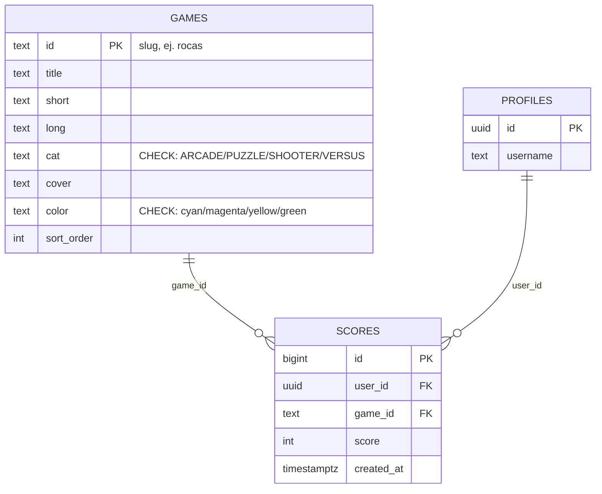
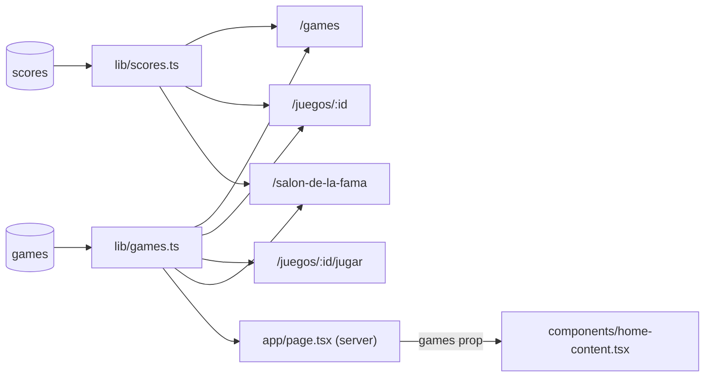

# SPEC 06 — Ranking global y catálogo de juegos en Supabase

> **Estado:** Implementado
> **Depende de:** 04-supabase-auth-scores, 05-rocas-asteroids-motor
> **Fecha:** 2026-09-05
> **Versión:** 0.1.0 → 0.2.0 (minor — `package.json` es la fuente de verdad; ver Decisiones)
> **Objetivo:** Migrar el catálogo de 8 juegos de `lib/data.ts` a una tabla real `games` en Supabase y agregar un ranking global de jugadores (suma de todos sus puntajes históricos, en una tab nueva de `/salon-de-la-fama`), reemplazando de paso el leaderboard falso de `/juegos/[id]`.

## Alcance

**Incluye:**

- `sql/004_recreate_games_table.sql`: `DROP TABLE` + recrea `games` (`id text primary key` = slug, `title`, `short`, `long`, `cat` con `CHECK` contra las 4 categorías, `cover`, `color` con `CHECK` contra los 4 colores, `sort_order integer` para preservar el orden de exhibición actual, `created_at`), RLS habilitado con `select` público y **sin** políticas de `insert`/`update`/`delete` (solo lectura desde la app), seed con `INSERT` de los 8 juegos actuales de `lib/data.ts`, y `ALTER TABLE scores ADD CONSTRAINT scores_game_id_fkey FOREIGN KEY (game_id) REFERENCES games(id)`. Aplicado al proyecto real vía el MCP de Supabase (`apply_migration`), igual que specs 04/05.
- `lib/games.ts` (nuevo): `GameCategory`, `Game` (sin `best` ni `plays` — siguen siendo valores derivados, no parte del catálogo), `CATEGORIES`, `getGames()` (ordenado por `sort_order`), `getGameById(id)`.
- `lib/scores.ts`: agrega `getPlaysCount(gameId)` y `getPlaysCountByGames(gameIds)` (mismo patrón que `getBestScore`/`getBestScoresByGames`, `count(*)` sobre `scores`), y `getGlobalTopPlayers(limit)` — suma todos los `score` históricos de cada jugador en cualquier juego, agrupado por `user_id`, resuelto a `username` vía `profiles` (mismo patrón que `getTopScoresByGame`).
- `lib/data.ts`: se elimina por completo (incluye `PLAYERS`, `ScoreRow` y `getSeededScores`, que quedan sin uso).
- `components/game-card.tsx`: importa el tipo `Game` desde `lib/games` en vez de `lib/data`.
- `app/games/page.tsx`: usa `getGames()` + `CATEGORIES` de `lib/games` en vez del array estático.
- `app/juegos/[id]/page.tsx`: usa `getGameById(id)` (404 si no existe), agrega `getPlaysCount(id)` real para el stat "Partidas", y reemplaza `getSeededScores()` por `getTopScoresByGame(id, 10)` real en el panel "MEJORES PUNTUACIONES" (`getBestScore` para "Mejor global" no cambia).
- `app/juegos/[id]/jugar/page.tsx`: usa `getGameById(id)` en vez de `GAMES.find(...)`.
- `app/salon-de-la-fama/page.tsx`: agrega una tab **"GLOBAL"** primero en la lista (antes de las 8 tabs por juego) y como tab por defecto al entrar sin `?game=`; para esa tab consulta `getGlobalTopPlayers(12)` y muestra **PARTIDAS** (conteo total de scores del jugador, en cualquier juego) en la columna donde las tabs por juego muestran FECHA; las 8 tabs por juego siguen funcionando igual, listadas ahora vía `getGames()`.
- `app/page.tsx` pasa a ser un server component async que llama `getGames()` y renderiza un client component nuevo, `components/home-content.tsx`, con todo el contenido actual (hero, features, mini-rail, stats, actividad en vivo, `useReveal`) recibiendo `games` por prop. `TOP_PLAYERS` y `ACTIVITY_TICKER` de esa sección siguen siendo arrays mock, sin cambios.
- `package.json`: `"version"` sube de `0.1.0` a `0.2.0` — pasa a ser la única fuente de verdad de la versión de la app.
- `components/nav.tsx` (`Footer`): deja de mostrar el string hardcodeado `v2.6.0` y muestra `v${version}` leído en tiempo de build desde `package.json`.

**Fuera de alcance (para futuros specs):**

- Interfaz de administración (crear/editar/borrar juegos) — el catálogo es de solo lectura desde la app; cambios se hacen a mano en Supabase (Studio/SQL/MCP).
- Reemplazar `TOP_PLAYERS` y `ACTIVITY_TICKER` del home por datos reales — quedan como mock, decisión explícita.
- Cualquier definición de "partida" distinta a "una fila en `scores`" (ej. distinguir completadas de abandonadas).
- Cambios al motor genérico de juegos (`game-engine.ts`, `game-player-shell.tsx`, `registry.ts`) — sin tocar.
- Vista materializada o RPC de Postgres para el ranking global — se calcula en la capa de aplicación (Node), no en la base.
- Paginación del ranking global o de las tablas por juego — mismo límite fijo que ya usa Salón de la Fama hoy.
- Historial o progreso de un jugador a través del tiempo (ej. gráfico de evolución de puntaje).

## Modelo de datos

**Relación entre tablas** (nueva FK `scores.game_id → games.id`, ambas usan el mismo slug de texto):



**Flujo de datos nuevo/afectado** (de dónde lee cada página):



```ts
// lib/games.ts
export type GameCategory = "ARCADE" | "PUZZLE" | "SHOOTER" | "VERSUS";
export type Game = {
  id: string; // slug, ej. "rocas" — mismo id usado en rutas y en scores.game_id
  title: string;
  short: string;
  long: string;
  cat: GameCategory;
  cover: string;
  color: "cyan" | "magenta" | "yellow" | "green";
};
export const CATEGORIES = ["TODOS", "ARCADE", "PUZZLE", "SHOOTER", "VERSUS"] as const;

export function getGames(): Promise<Game[]>; // ORDER BY sort_order
export function getGameById(id: string): Promise<Game | null>;
```

```ts
// lib/scores.ts (agregado)
export function getPlaysCount(gameId: string): Promise<number>;

export type GlobalRankRow = { username: string; totalScore: number; gamesPlayed: number };
export function getGlobalTopPlayers(limit?: number): Promise<GlobalRankRow[]>;
```

Convención: `games.id` es el mismo slug ya usado en rutas (`/juegos/rocas`) y en `scores.game_id` — no se introduce un id numérico paralelo. `sort_order` existe solo para preservar el orden actual de exhibición (bloque-buster, caída, serpentina, glotón, invasores, rocas, ranaria, duelo-pixel), ya que Postgres no garantiza orden de fila sin `ORDER BY` explícito.

## Plan de implementación

1. Aplicar `sql/004_recreate_games_table.sql` vía Supabase MCP (`apply_migration`): drop+recreate `games`, RLS, seed de 8 filas, FK `scores.game_id -> games.id`. Test manual: `list_tables` confirma `games` con 8 filas y RLS habilitado; `get_advisors` sin hallazgos nuevos.
2. Crear `lib/games.ts` con `Game`, `GameCategory`, `CATEGORIES`, `getGames()`, `getGameById(id)`. Test manual: `npm run lint` pasa (nada lo usa aún).
3. Agregar a `lib/scores.ts`: `getPlaysCount(gameId)`, `getPlaysCountByGames(gameIds)`, `GlobalRankRow`, `getGlobalTopPlayers(limit)`. Test manual: `npm run lint` pasa (aún no conectadas).
4. Actualizar `components/game-card.tsx` para importar `Game` desde `lib/games`. Test manual: `npm run lint` pasa.
5. Actualizar `app/games/page.tsx` para usar `getGames()`/`CATEGORIES` de `lib/games`. Test manual: `/games` sigue mostrando las 8 cards igual que antes, con los mejores puntajes reales sin cambios.
6. Actualizar `app/juegos/[id]/page.tsx`: `getGameById(id)` + `getPlaysCount(id)` + reemplazar `getSeededScores` por `getTopScoresByGame(id, 10)`. Test manual: cada uno de los 8 detalles muestra "Partidas" real (0 para los 7 sin scores, el valor real para rocas) y el panel "MEJORES PUNTUACIONES" muestra datos reales (vacío o con las filas reales de rocas), sin números inventados.
7. Actualizar `app/juegos/[id]/jugar/page.tsx` para usar `getGameById(id)`. Test manual: las 8 rutas `/juegos/<id>/jugar` siguen funcionando igual que hoy (rocas jugable, el resto con arena-mock).
8. Dividir `app/page.tsx`: crear `components/home-content.tsx` (client component, contenido actual movido tal cual, recibe `games: Game[]` por prop) y dejar `app/page.tsx` como server component async que llama `getGames()` y renderiza `<HomeContent games={games} />`. Test manual: `/` se ve visualmente idéntico (hero, features, mini-rail con 6 juegos reales, stats, actividad en vivo con los mismos mocks).
9. Actualizar `app/salon-de-la-fama/page.tsx`: agregar tab "GLOBAL" primero, default sin `?game=`, usando `getGlobalTopPlayers(12)` con columna PARTIDAS; las 8 tabs por juego ahora vía `getGames()`. Test manual: entrar sin parámetro muestra GLOBAL; cada una de las 8 tabs sigue funcionando; cambiar entre GLOBAL y una tab de juego no rompe la navegación.
10. Borrar `lib/data.ts`. Test manual: `npm run lint`/`npm run dev` sin errores de import roto (confirma que ya nada depende de él). _(Invertido respecto al orden original del spec: los Pasos 8/9 originales dependían de que `app/page.tsx` y `app/salon-de-la-fama/page.tsx` ya no importaran `lib/data.ts` — algo que solo pasaba en los Pasos 9/10 originales. Se invierte el orden de ejecución, sin cambiar el contenido de ningún paso, para que cada uno deje el sistema funcional. Encontrado en dos partes durante la implementación: primero con `app/page.tsx`, luego con `app/salon-de-la-fama/page.tsx`.)
11. Actualizar `package.json` (`"version": "0.2.0"`) y `components/nav.tsx`: el `Footer` deja de tener el string hardcodeado `v2.6.0` y muestra `v${version}` leído de `package.json`. Crear `CHANGELOG.md` (formato Keep a Changelog) con la entrada `[0.2.0]` de este spec y un primer entry `[0.1.0]` retroactivo resumiendo los specs 01-05 a partir del historial de git. Test manual: el footer de cualquier página muestra "v0.2.0"; `CHANGELOG.md` documenta ambas versiones. _(El CHANGELOG se agregó después de marcar este spec como Implementado, a pedido explícito del usuario — ver Decisiones.)_
12. Verificación final: jugar una partida de ROCAS con sesión iniciada hasta game over (guarda un score real) y confirmar que se refleja en: `/juegos/rocas` (Mejor global + Partidas + panel MEJORES PUNTUACIONES), `/games` (card de rocas), `/salon-de-la-fama` (tab ROCAS y tab GLOBAL con el jugador sumando ese puntaje). Confirmar que los otros 7 juegos muestran "SIN RÉCORD"/0 partidas/paneles vacíos sin errores. Confirmar que el footer muestra "v0.2.0" en cualquier página. `npm run lint` pasa sin errores.

## Criterios de aceptación

- [x] `npm run dev` levanta la app sin errores en consola.
- [x] La tabla `games` existe en Supabase con 8 filas (una por cada juego de `lib/data.ts` original), RLS habilitado, `select` público y sin políticas de `insert`/`update`/`delete`.
- [x] `scores.game_id` tiene una foreign key real hacia `games.id`; `get_advisors` no reporta hallazgos de seguridad nuevos.
- [x] `lib/data.ts` ya no existe en el repo.
- [x] `lib/games.ts` exporta `Game`, `GameCategory`, `CATEGORIES`, `getGames()`, `getGameById(id)`.
- [x] `lib/scores.ts` exporta además `getPlaysCount`, `getGlobalTopPlayers`.
- [x] `/games` muestra las 8 cards en el mismo orden que antes, con el mismo mejor puntaje real que ya mostraba.
- [x] `/juegos/[id]` para cada uno de los 8 juegos muestra "Partidas" como un número real (conteo de `scores`, no el string "12.4K" hardcodeado anterior).
- [x] `/juegos/[id]` para "rocas" muestra en el panel "MEJORES PUNTUACIONES" las filas reales de `scores` (no nombres aleatorios de `getSeededScores`); para los otros 7 juegos sin puntajes, el panel se muestra vacío en vez de datos falsos.
- [x] `/salon-de-la-fama` sin `?game=` muestra la tab "GLOBAL" activa por defecto.
- [x] La tab "GLOBAL" muestra el ranking de jugadores ordenado por la suma total de sus puntajes en todos los juegos, con una columna "PARTIDAS" (conteo total de filas en `scores` de ese jugador).
- [x] Las 8 tabs por juego de `/salon-de-la-fama` siguen funcionando igual que en spec 04.
- [x] `/` (home) se ve visualmente igual que antes (hero, features, mini-rail, stats, actividad en vivo), con el mini-rail mostrando los 6 primeros juegos reales desde `games`.
- [x] `TOP_PLAYERS` y `ACTIVITY_TICKER` del home siguen siendo arrays mock, sin cambios de comportamiento.
- [x] Jugar una partida real de ROCAS hasta game over con sesión iniciada actualiza, sin recargar manualmente ni intervención en la base: `/juegos/rocas` (mejor global + partidas + panel de mejores puntuaciones), `/games` (card), y ambas tabs relevantes de `/salon-de-la-fama` (ROCAS y GLOBAL).
- [x] `package.json` tiene `"version": "0.2.0"`.
- [x] El Footer de la app (visible en cualquier página) muestra "v0.2.0", leído de `package.json`, no hardcodeado.
- [x] `CHANGELOG.md` existe (formato Keep a Changelog) con entradas `[0.2.0]` (este spec) y `[0.1.0]` (resumen retroactivo de specs 01-05 según git).
- [x] `npm run lint` pasa sin errores.

## Decisiones

- **Sí:** `games.id` es texto (slug), no el `BIGINT` de `sql/001_create_games_table.sql` — se recrea la tabla desde cero para no romper rutas ni `scores.game_id` ya existente.
- **Sí:** se agrega FK real `scores.game_id -> games.id` — ahora que `games` es la fuente de verdad del catálogo, tiene sentido que la constraint lo garantice; revierte la decisión de "no FK" de spec 04, tomada cuando `games` todavía no tenía datos reales.
- **Sí:** columna `sort_order` en `games` para preservar el orden de exhibición actual — Postgres no garantiza orden de filas sin `ORDER BY` explícito.
- **Sí:** `CHECK` constraints en `cat` y `color` — replican en la base los union types de TypeScript (`GameCategory`, colores), evitando que una fila mal insertada a mano rompa el render.
- **Sí:** el catálogo es de solo lectura desde la app — sin CRUD de administración en este spec (confirmado con el usuario). Cambios futuros al catálogo se hacen a mano en Supabase.
- **Sí:** el ranking global suma **todos** los puntajes históricos de un jugador (no el mejor por juego) — decisión explícita del usuario: premia jugar mucho, no solo jugar bien.
- **Sí:** "Partidas" pasa de un string estático (`"12.4K"`) a un número real (`count(*)` de `scores` para ese `game_id`) — cada guardado exitoso de `saveScore` (spec 05) cuenta como una partida; partidas sin sesión iniciada (que nunca se guardan) no se cuentan.
- **Sí:** el ranking global se calcula en la capa de aplicación (traer filas y agrupar en Node), no con una vista materializada ni una función RPC de Postgres — más simple dado el volumen actual de datos; se puede migrar a una vista/RPC en un spec futuro si el volumen crece.
- **Sí:** la tab "GLOBAL" se agrega primero y es la tab por defecto de `/salon-de-la-fama` sin `?game=` — cambia el comportamiento de spec 04 (donde el default era el primer juego), decisión explícita del usuario.
- **Sí:** se reemplaza `getSeededScores()` (mock) por `getTopScoresByGame()` real en `/juegos/[id]` — deja de haber datos falsos de puntajes en toda la plataforma, excepto los mocks explícitamente dejados fuera de alcance en el home.
- **No:** reemplazar `TOP_PLAYERS`/`ACTIVITY_TICKER` del home por datos reales — decisión explícita del usuario, quedan como mock/marketing.
- **Sí:** `app/page.tsx` se divide en un server component (fetch de `games`) + `components/home-content.tsx` (client component con el contenido actual) — necesario porque el archivo es `"use client"` y ya no puede importar un array estático; es el único cambio estructural no relacionado directamente con el leaderboard, pero obligatorio para que la migración del catálogo no rompa el home.
- **No:** paginación en el ranking global ni en las tablas por juego — mismo límite fijo (`limit`) que ya usaba Salón de la Fama.
- **Sí:** se adopta semver tradicional (minor/patch según el tamaño del cambio) en vez de atar la versión 1:1 al número de spec — decisión explícita del usuario.
- **Sí:** `package.json` pasa a ser la única fuente de verdad de la versión de la app; el Footer (`components/nav.tsx`) deja de tener un string hardcodeado y lee ese valor — corrige el desacople entre "0.1.0" (nunca usado) y "v2.6.0" (decorativo, nunca real) que existía hasta ahora.
- **Sí:** este spec sube la versión de `0.1.0` a `0.2.0` (minor) — agrega funcionalidad nueva de cara al usuario (ranking global, catálogo real) sin romper nada existente.
- **Sí:** se acepta que el número visible en el Footer "baje" de v2.6.0 a v0.2.0 — el v2.6.0 nunca representó nada real, así que no es un retroceso funcional, solo deja de mostrar un dato inventado.
- **Sí:** el encabezado de este spec (y de los futuros, por convención de repo desde ahora) agrega un campo "Versión" declarando a qué versión de `package.json` queda el proyecto al implementarlo — da trazabilidad spec ↔ versión desplegada sin necesitar un archivo aparte.
- **Sí (pasada de limpieza post-implementación con `/code-review`):** tras marcar el spec como Implementado, se corrió `/code-review` sobre el diff completo (specs 05+06) y se aplicaron 8 correcciones: `getGames()`/`getGameById()` ahora lanzan en vez de devolver `[]`/`null` ante un error real de Supabase (distingue "falló" de "no existe/vacío"); `/salon-de-la-fama` restaura el fallback al primer juego para un `?game=` inválido (antes caía silenciosamente en GLOBAL); `saveScore` (Server Action) ya no expone el mensaje crudo de Postgres al usuario; se eliminó la duplicación de `getSessionUsername()` (ahora vive en `lib/session.ts`, compartido por `app/layout.tsx` y `app/juegos/[id]/jugar/page.tsx`) y de la resolución de `username` en `lib/scores.ts` (helper `resolveUsernames` compartido); se quitó `getPlaysCountByGames` (código muerto, nunca se conectó a ninguna UI); y se actualizó `components/games/README.md` para ya no mencionar `lib/data.ts`.
- **Sí:** el nombre del archivo del spec y el de la rama de git también incluyen la versión destino (`specs/06-...-v0.2.0.md`, `feature/spec-06-...-v0.2.0`) — decisión explícita del usuario, extiende la misma trazabilidad al archivo y a la rama, no solo al encabezado.
- **Sí (verificación final, paso 12):** se verificó jugando una partida real de principio a fin con Playwright (cuenta nueva `spec06test`, botón FIN, score real de 20 por un asteroide grande) en vez de solo revisar código — confirmó en vivo que `saveScore` (spec 05) dispara y que `/juegos/rocas`, `/games` y ambas tabs de `/salon-de-la-fama` (ROCAS y GLOBAL) reflejan el dato nuevo sin intervención manual en la base. La cuenta y el score de prueba se dejaron en la base real a pedido explícito del usuario (no se limpiaron).
- **Sí (agregado después de marcar el spec como Implementado, a pedido explícito del usuario):** se crea `CHANGELOG.md` (formato Keep a Changelog) con una entrada `[0.2.0]` para este spec y una entrada `[0.1.0]` retroactiva resumiendo los specs 01-05, derivada del historial de `git log` (esos specs nunca bumpearon versión, todos quedaron bajo "0.1.0"). Se arreglaron también los skills `/spec` (el paso del plan que bumpea versión ahora siempre incluye la entrada del CHANGELOG) y `/spec-impl` (red de seguridad: si el paso no la menciona explícitamente, se agrega igual) para que esto sea automático en specs futuros.

## Riesgos

| Riesgo                                                                                                                                                                            | Mitigación                                                                                                                                                                                                                                              |
| --------------------------------------------------------------------------------------------------------------------------------------------------------------------------------- | ------------------------------------------------------------------------------------------------------------------------------------------------------------------------------------------------------------------------------------------------------- |
| `DROP TABLE games` en `sql/004` es destructivo; si algo más llegara a depender de la tabla `games` original (BIGINT, vacía) se perdería sin aviso.                                | Confirmado por `list_tables`/`get_advisors` en spec 04 que la tabla original está vacía y sin ningún código del repo que la use (`grep` no encontró referencias) — se dropea con seguridad.                                                             |
| Agregar la FK `scores.game_id -> games.id` falla si alguna fila existente de `scores` tiene un `game_id` que no coincide con ningún slug de `games` (ej. typo o juego eliminado). | Antes de crear la constraint, verificar con una consulta (`select distinct game_id from scores`) que todos los valores están en la lista de 8 slugs sembrados; en el estado actual solo existen scores de "rocas" (spec 05), así que el riesgo es bajo. |
| El ranking global (`getGlobalTopPlayers`) trae todas las filas de `scores` a Node para agrupar — no escala indefinidamente.                                                       | Aceptable al volumen actual (una plataforma nueva, pocos usuarios); documentado como decisión a revisar (vista materializada/RPC) si el volumen crece.                                                                                                  |
| Dividir `app/page.tsx` en server+client component puede introducir un desajuste de hidratación si el `games` prop no coincide exactamente entre server y cliente.                 | Verificar explícitamente en el paso 9 del plan que `/` se ve idéntico visualmente y sin warnings de hidratación en consola.                                                                                                                             |
| Next.js 16.2.10 posdata el entrenamiento del modelo; el patrón exacto de "server component que envuelve un client component" puede tener matices propios de esta versión.         | Releer `node_modules/next/dist/docs/01-app/` (server/client components) antes de implementar el paso 9 si algo no coincide con lo esperado.                                                                                                             |

## Lo que **no** está en este spec

- Interfaz de administración de juegos.
- Datos reales para `TOP_PLAYERS`/`ACTIVITY_TICKER` del home.
- Vista materializada/RPC para el ranking global.
- Paginación del ranking global o de las tablas por juego.
- Historial/progreso de un jugador en el tiempo.
- Cambios al motor genérico de juegos.

Cada uno de estos, si se implementa, va en su propio spec.
