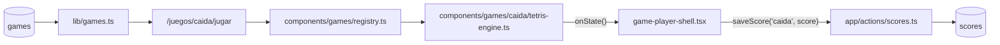

# SPEC 07 — Motor real del juego CAÍDA (Tetris)

> **Estado:** Implementado
> **Depende de:** 05-rocas-asteroids-motor
> **Fecha:** 2026-09-12
> **Versión:** 0.2.0 → 0.2.1 (patch — el juego ya está en el catálogo, esto completa su motor)
> **Objetivo:** Portar Tetris (`references/started-games/03-tetris`) como el motor real del juego CAÍDA, con 3 vidas donde cada topout limpia el tablero en vez de terminar la partida.

## Alcance

**Incluye:**

- `components/games/caida/tetris-engine.ts`: motor que exporta `createTetrisEngine: EngineFactory`, portado de `references/started-games/03-tetris/game.js`, con la mecánica de 3 vidas descrita en el Modelo de datos.
- `components/games/registry.ts`: agrega la línea `caida: () => import("./caida/tetris-engine").then((m) => m.createTetrisEngine),`.
- `package.json`: version `0.2.0` → `0.2.1`.
- `CHANGELOG.md`: entrada para `0.2.1` enlazando a este spec.

**Fuera de alcance (para futuros specs):**

- Controles táctiles/móvil.
- Audio (el original no tiene, tampoco se agrega).
- `devicePixelRatio` / escalado por densidad de píxeles.
- Validación en build de que `registry.ts` tenga fila en `games` para cada id.
- Cambios a `game-player-shell.tsx`, `game-engine.ts` o `app/actions/scores.ts`.
- Tema claro/oscuro del original (usaba `localStorage` — se elimina, el motor no toca `localStorage` ni el DOM).
- Otras variantes de Tetris (sprint, marathon infinito, multijugador) — este spec porta el balance original (`LINE_SCORES`, `dropInterval`, wall kicks) agregándole solo el sistema de 3 vidas.
- Persistencia del high score fuera de la tabla `scores` de Supabase.

## Modelo de datos

Sin nuevas tablas — reusa `scores`/`games` de specs 04/06. La fila `caida` ya existe en el catálogo.

**Tabla de puntuación:**

| Evento                                  | Puntos                                 |
| --------------------------------------- | -------------------------------------- |
| Completar 1 / 2 / 3 / 4 líneas a la vez | `100 / 300 / 500 / 800 × nivel actual` |
| Caída dura (Space)                      | +2 por celda caída                     |
| Caída suave (↓ mantenida)               | +1 por fila                            |

Todas las fórmulas dan enteros (`LINE_SCORES` son enteros, `nivel` es entero, celdas/filas son enteros) — cumple el requisito de `saveScore`.

**Mapeo a `EngineState`:**

| Campo   | Valor                                                                                                                                                                                                                                           |
| ------- | ----------------------------------------------------------------------------------------------------------------------------------------------------------------------------------------------------------------------------------------------- |
| `score` | Acumulado de la tabla de puntuación. Nunca se resetea al perder una vida — solo al perder la partida entera (`restart()`).                                                                                                                      |
| `lives` | Arranca en `3`. Se resta 1 en cada **topout** (una pieza nueva no puede spawnear). En vez de terminar la partida, se limpia el tablero (nuevo `current`/`next`, mismo `score` y `level`) y se sigue jugando. Llega a `0` → `phase: "gameover"`. |
| `level` | `floor(líneas_totales / 10) + 1`. Controla `dropInterval = max(100, 1000 - (level-1)*90)`. **No se resetea** entre vidas, solo el tablero.                                                                                                      |
| `badge` | `{ label: "LÍNEAS", value: String(líneas_totales) }`. Líneas acumuladas de toda la partida, tampoco se resetea entre vidas.                                                                                                                     |
| `phase` | `"paused"` si `isPaused`; `"gameover"` si `lives === 0`; si no, `"playing"` — un topout con vidas restantes **sigue siendo `"playing"`**, no es un estado intermedio visible desde `EnginePhase`.                                               |

**Controles:**

| Tecla              | Acción                              | `preventDefault`             |
| ------------------ | ----------------------------------- | ---------------------------- |
| `ArrowLeft`        | Mover pieza a la izquierda          | Sí                           |
| `ArrowRight`       | Mover pieza a la derecha            | Sí                           |
| `ArrowDown`        | Caída suave (+1/fila)               | Sí                           |
| `ArrowUp` / `KeyX` | Rotar con wall-kick `[0,-1,1,-2,2]` | Sí en `ArrowUp`              |
| `Space`            | Caída dura (+2/celda)               | Sí (el original ya lo hacía) |

**Resolución:** tablero nativo 300×600 (10 cols × 20 filas × `BLOCK=30px`), centrado dentro del arena 800×600 vía `ctx.translate(...)`. El espacio sobrante a la derecha se usa para dibujar la "próxima pieza" (misma escala de 30px/celda) — sin segundo canvas ni DOM aparte.

## Plan de implementación

1. Esqueleto del motor en `components/games/caida/tetris-engine.ts`: la factory, `ctx`, los 6 métodos de `EngineHandle` con sus guardas de idempotencia, el loop RAF, `reportState()` con diff campo por campo. Dibuja solo el tablero vacío centrado (300×600 dentro de 800×600), sin mecánica de juego. Test manual: `npm run lint` limpio.

2. Piezas y spawn: arrays `PIECES`/`COLORS` (los 8 tipos, incluida la "tuerca"), `randomPiece()`, `collide()`, `spawn()` inicial. Dibuja la pieza actual en el tablero y la próxima en la franja lateral derecha. Sin movimiento todavía. Test manual: revisar visualmente que aparece una pieza centrada y su vista previa a la derecha.

3. Movimiento y rotación: mapas `keys`/`justPressed` + `pressed(code)`, `ArrowLeft`/`ArrowRight` mueven, `ArrowUp`/`KeyX` rotan con wall-kick `[0,-1,1,-2,2]`, `preventDefault()` en las 4 flechas y `Space`. Test manual: la pieza responde a las 4 teclas sin scrollear la página.

4. Caída automática y bloqueo: `dropAccum`/`dropInterval`, `lockPiece()` (`merge()` + `clearLines()` + `spawn()`), `clearLines()` con el scoring `LINE_SCORES[cleared] × level`, actualización de `level`/`dropInterval` según la fórmula original. Test manual: completar una línea y ver `score`/`level` subir correctamente.

5. Caída suave y dura: `ArrowDown` (+1/fila), `Space` (+2/celda). Test manual: usar ambas teclas y confirmar el incremento de puntos esperado en cada una.

6. Sistema de 3 vidas: detectar topout (spawn colisiona), `lives--`, limpiar el tablero sin resetear `score`/`level`/líneas acumuladas, `badge: { label: "LÍNEAS", value: ... }`, `currentPhase()`/`reportState()` reportando `"gameover"` solo cuando `lives === 0`. Test manual: forzar topouts seguidos — el juego sigue tras el 1º y 2º, termina en el 3º.

7. Línea en `components/games/registry.ts` con `import()` dinámico: `caida: () => import("./caida/tetris-engine").then((m) => m.createTetrisEngine),`. Test manual: entrar a `/juegos/caida/jugar` y ver el motor real reemplazando el mock estático.

8. `package.json` `0.2.0` → `0.2.1` + entrada en `CHANGELOG.md` enlazando a este spec. Test manual: el Footer muestra `v0.2.1`.

9. Verificación end-to-end completa (build, lint, recorrido Playwright, sesión activa, fila nueva en `scores`, reflejo en `/juegos/caida`/`/games`/`/salon-de-la-fama`, aislamiento del chunk, sin fugas de listeners/RAF). Test manual: partida completa agotando las 3 vidas hasta el game over real, con el puntaje guardado y visible en las tres páginas.

## Criterios de aceptación

- [x] El motor exporta `createTetrisEngine` cumpliendo `EngineFactory`.
- [x] `registry.ts` carga el motor con `import()` dinámico (no import estático).
- [x] El tablero se dibuja centrado (300×600) dentro del arena 800×600, con la próxima pieza en la franja lateral.
- [x] Las 8 piezas (7 tetrominós + la "tuerca") aparecen con sus colores originales.
- [x] `ArrowLeft`/`ArrowRight` mueven la pieza; `ArrowUp`/`KeyX` rotan con wall-kick; ninguna de las 4 flechas ni `Space` scrollea la página.
- [x] Completar 1/2/3/4 líneas a la vez suma `100/300/500/800 × nivel` puntos.
- [x] La caída dura suma +2 por celda caída; la caída suave suma +1 por fila.
- [x] El nivel sube según `floor(líneas/10)+1` y la velocidad de caída aumenta en consecuencia. _(fórmula verificada por código y por HUD: con 2 líneas limpiadas el nivel correctamente se mantuvo en 01 — `floor(2/10)+1=1` — no se llegó a probar el cruce a nivel 02 en una partida real)_
- [x] El HUD (`player-hud`) refleja score/vidas/nivel/badge LÍNEAS reales del motor, nada hardcodeado.
- [x] El canvas no dibuja su propio texto de HUD ni overlay de pausa/game over.
- [x] Un topout con vidas restantes limpia el tablero y sigue la partida sin resetear score/nivel/líneas.
- [x] El tercer topout (`lives === 0`) dispara `phase: "gameover"` y abre el modal de fin de partida.
- [x] PAUSA congela la caída automática real (el RAF se cancela); REANUDAR continúa sin salto de velocidad.
- [x] FIN fuerza game over con el score actual en cualquier momento, incluso a mitad de una vida.
- [x] Con sesión activa, una partida terminada crea exactamente una fila nueva en `scores`.
- [x] Sin sesión, el modal muestra el CTA a `/auth` y no se guarda nada.
- [x] "JUGAR DE NUEVO" reinicia el motor (score 0, 3 vidas, nivel 1, tablero vacío) sin remontar el componente.
- [x] Salir de la página cancela el RAF y saca los listeners de teclado del motor.
- [x] Visitar otro juego no descarga el chunk de `tetris-engine.ts`.
- [x] `/juegos/caida` ("Mejor global", "Partidas") y `/salon-de-la-fama` (tab CAÍDA y tab GLOBAL) reflejan la partida sin intervención manual.
- [x] `npm run lint` y `npm run build` sin errores.
- [x] El motor no lee `localStorage` ni toca el DOM fuera del canvas recibido (se elimina el toggle de tema claro/oscuro del original).

## Decisiones

- **Sí:** 3 vidas donde cada topout limpia el tablero y la partida continúa. Le da más profundidad al port que el Tetris original (una sola vida) sin inventar una mecánica ajena al género.
- **No:** al perder una vida, quitar solo las filas superiores en vez de vaciar todo el tablero. Más complejo de implementar y de comunicar visualmente al jugador; se prefirió la opción simple.
- **Sí:** score, nivel y líneas acumuladas NO se resetean al perder una vida — solo el tablero. Perder una vida es un contratiempo, no un reinicio de progreso.
- **Sí:** dibujar la "próxima pieza" en una franja del mismo canvas (no un segundo `<canvas>`, que el shell no provee). Mantiene la funcionalidad original del port.
- **Sí:** tablero centrado con el `BLOCK=30px` original, sin reescalar. Preserva el balance/sensación del juego original sin retocar todas las coordenadas de dibujo.
- **Sí:** `preventDefault()` en las 4 flechas y `Space`, no solo en `Space` como el original. Evita que el juego scrollee la página — el mismo bug que quedó pendiente en `rocas` no se repite acá.
- **Sí:** bump de versión **patch** (`0.2.0 → 0.2.1`), no minor. El juego ya tenía fila en el catálogo desde spec 06 — este spec completa su motor, no agrega un juego nuevo visible al catálogo.
- **No:** tocar `game-player-shell.tsx`, `game-engine.ts` o `app/actions/scores.ts`. El contrato existente alcanza sin modificarlos.
- **No:** conservar el toggle de tema claro/oscuro ni `localStorage` del original. El motor no toca el DOM fuera del canvas ni persiste nada por su cuenta.

## Riesgos

| Riesgo                                                                                                                                       | Mitigación                                                                                                          |
| -------------------------------------------------------------------------------------------------------------------------------------------- | ------------------------------------------------------------------------------------------------------------------- |
| Wall-kick mal portado permite rotaciones ilegales (pieza dentro de otra o fuera del tablero)                                                 | Reusar exactamente el arreglo de kicks `[0,-1,1,-2,2]` y `collide()` del original, sin modificarlos                 |
| Confundir "topout" (pierde una vida) con "gameover" (pierde la partida) en el código, dejando el modal sin abrirse nunca o abriéndose de más | `currentPhase()` deriva `"gameover"` solo de `lives === 0`; probar los 3 topouts seguidos en la verificación manual |
| El score deja de ser entero por algún cálculo intermedio                                                                                     | Todas las fórmulas de puntuación ya son enteras; validar con `Number.isInteger(score)` en la verificación           |
| El letterbox del tablero (300×600 centrado en 800×600) deja coordenadas de dibujo mal alineadas con la franja de "próxima pieza"             | Revisar visualmente con Playwright antes de dar el paso 2 por terminado                                             |

## Lo que **no** está en este spec

- Controles táctiles/móvil.
- Audio.
- `devicePixelRatio`.
- Validación en build de ids de `registry.ts` contra `games`.
- Cambios a `game-player-shell.tsx`, `game-engine.ts` o `app/actions/scores.ts`.
- Tema claro/oscuro del original.
- Otras variantes de Tetris (sprint, marathon infinito, multijugador).
- Persistencia del high score fuera de `scores`.

Cada uno de estos, si se implementa, va en su propio spec.
