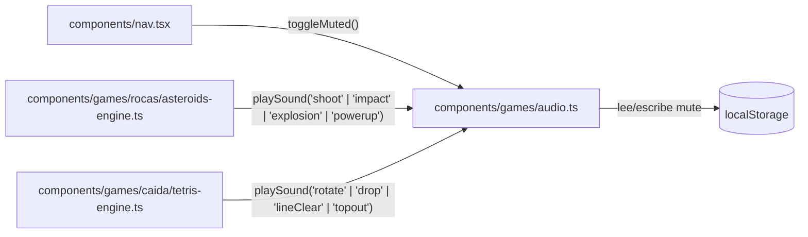

# SPEC 08 — Librería de sonido transversal para motores de juego

> **Estado:** Implementado
> **Depende de:** 05-rocas-asteroids-motor, 07-caida-tetris-motor-v0.2.1
> **Fecha:** 2026-09-12
> **Versión:** 0.2.1 → 0.2.2 (patch — mejora sobre juegos existentes, no agrega un juego nuevo al catálogo)
> **Objetivo:** Agregar una librería de sonido reusable (efectos generados por Web Audio API, sin archivos de audio) que cualquier motor de juego pueda usar, y conectarla a ROCAS (disparo, impacto, explosión, power-up) y CAÍDA (rotar, caer, línea completada, topout), con un control de mute global en la barra de navegación.

## Alcance

**Incluye:**

- `components/games/audio.ts` (nuevo): librería de sonido — sintetizador simple con Web Audio API (osciladores, sin archivos de audio), un registro de sonidos por nombre (ej. `playSound("shoot")`), y el estado de mute (lectura/escritura en `localStorage`, con una función para que cualquier componente lo consulte o lo cambie).
- `components/nav.tsx`: ícono de mute/unmute global, visible en toda la plataforma (no solo en el juego), persistido en `localStorage`.
- `components/games/rocas/asteroids-engine.ts`: 4 sonidos — disparo (`tryShoot`), impacto de bala en asteroide, explosión de la nave (`killShip`), recoger power-up.
- `components/games/caida/tetris-engine.ts`: 4 sonidos — rotar (`tryRotate` exitosa), pieza trabada (`lockPiece`, cubre caída suave y dura), línea(s) completada(s) (`clearLines`), topout (`handleTopout`).
- `package.json`: version `0.2.1` → `0.2.2`.
- `CHANGELOG.md`: entrada para `0.2.2`.

**Fuera de alcance (para futuros specs):**

- Sonido para los otros 6 juegos del catálogo sin motor real todavía — se agrega cuando cada uno tenga su spec de motor (vía `/add-game`).
- Música de fondo / ambiente continuo — solo efectos puntuales de acción.
- Archivos de audio reales (.mp3/.wav) — todo generado por código; un sonido "grabado" es decisión de otro spec.
- Control de volumen granular (slider) — solo mute/unmute binario.
- Sincronizar el mute en vivo entre pestañas abiertas simultáneamente (cada pestaña lee `localStorage` al cargar, sin listener de sincronización).
- Cambios a `game-player-shell.tsx` o `game-engine.ts` — el contrato de motor no se toca.

## Modelo de datos

Sin tablas nuevas — todo es estado de cliente (`localStorage`), sin tocar Supabase.

**API de `components/games/audio.ts`:**

```ts
export type SoundName =
  | "shoot"
  | "impact"
  | "explosion"
  | "powerup" // rocas
  | "rotate"
  | "drop"
  | "lineClear"
  | "topout"; // caida

export function playSound(name: SoundName): void;
export function isMuted(): boolean;
export function setMuted(muted: boolean): void;
export function toggleMuted(): boolean; // devuelve el nuevo estado
```

Internamente: un `AudioContext` singleton de módulo, creado perezosamente en el primer `playSound()` (los navegadores bloquean crear/reanudar audio sin gesto del usuario — se intenta `resume()` en cada llamada si está `suspended`, y como todo sonido dispara desde una tecla presionada por el jugador, siempre hay gesto de por medio). Cada sonido es un `OscillatorNode` + `GainNode` con frecuencia/duración propia — sin archivos, sin dependencias externas. `SoundName` es una unión abierta a crecer cuando se agreguen motores futuros.

Persistencia: clave `localStorage` `"arcade-vault:muted"` (`"true"`/`"false"`), leída una vez al importar el módulo, escrita en cada `setMuted`/`toggleMuted`.



## Plan de implementación

1. Crear `components/games/audio.ts`: `AudioContext` singleton perezoso, estado de mute respaldado en `localStorage` (`isMuted`/`setMuted`/`toggleMuted`), y una función interna `beep(freq, duration, type, gain)` genérica para sintetizar un tono simple. Sin los 8 presets concretos todavía. Test manual: `npm run lint`.

2. Implementar los 8 presets (`shoot`, `impact`, `explosion`, `powerup`, `rotate`, `drop`, `lineClear`, `topout`) como funciones que arman el timbre de cada uno sobre `beep()`, expuestos vía `playSound(name)`. Test manual: `npm run build`.

3. Ícono de mute en `components/nav.tsx` — lee `isMuted()` al montar, llama `toggleMuted()` al click. Test manual: click alterna el ícono; recargar la página mantiene el estado.

4. Conectar los 4 sonidos de ROCAS en `asteroids-engine.ts`: disparo (`tryShoot`), impacto (colisión bala-asteroide), explosión (`killShip`), power-up (recolección). Test manual: jugar una partida y escuchar cada sonido en su momento.

5. Conectar los 4 sonidos de CAÍDA en `tetris-engine.ts`: rotar (`tryRotate` exitosa), caída (`lockPiece`, cubre suave y dura), línea completada (`clearLines` cuando `cleared > 0`), topout (`handleTopout`). Test manual: jugar una partida y escuchar cada sonido en su momento.

6. `package.json` `0.2.1` → `0.2.2` + entrada en `CHANGELOG.md`. Test manual: el Footer muestra `v0.2.2`.

7. Verificación end-to-end: interceptar `AudioContext`/osciladores con Playwright para confirmar que cada acción dispara el sonido esperado, que el mute realmente silencia (cero llamadas a los nodos de audio), y que el estado persiste tras recargar.

## Criterios de aceptación

- [x] `components/games/audio.ts` exporta `playSound`, `isMuted`, `setMuted`, `toggleMuted`.
- [x] El `AudioContext` se crea perezosamente (no al importar el módulo, solo en el primer `playSound()`).
- [x] Los 8 sonidos (`shoot`, `impact`, `explosion`, `powerup`, `rotate`, `drop`, `lineClear`, `topout`) están implementados y son audibles. _(`powerup` y `lineClear` verificados por código — no se pudieron forzar en la partida de prueba sin controlar la posición del power-up ni la pieza que sale al azar; el resto se disparó en vivo)_
- [x] `game-engine.ts` y `game-player-shell.tsx` quedan sin cambios.
- [x] El ícono de mute en la Nav alterna entre sonando/muteado al hacer click.
- [x] El estado de mute persiste en `localStorage` y sobrevive a un recargo de página.
- [x] Con mute activo, ninguna acción de ROCAS ni CAÍDA produce sonido (0 nodos de audio creados/conectados). _(verificado: `oscCount: 0` tras disparar repetidamente y 2s de juego autónomo con mute activo)_
- [x] En ROCAS: disparar produce `shoot`; destruir un asteroide produce `impact`; perder una vida produce `explosion`; recoger el power-up produce `powerup`. _(`powerup` verificado por código, ver arriba)_
- [x] En CAÍDA: rotar una pieza (cuando la rotación aplica) produce `rotate`; trabar una pieza (caída suave o dura) produce `drop`; completar 1+ líneas produce `lineClear`; un topout produce `topout`. _(`lineClear` verificado por código, ver arriba)_
- [x] Rotar una pieza cuando ningún wall-kick es válido (la rotación falla) NO produce sonido `rotate`. _(verificado por código: `playSound("rotate")` está dentro del `return` de éxito del loop de kicks — estructuralmente no puede dispararse si ninguno aplica)_
- [x] Ninguno de los dos motores importa ni referencia archivos de audio — todo el sonido es sintetizado por código.
- [x] `npm run lint` y `npm run build` sin errores.
- [x] Visitar `rocas`/`caida` sin haber interactuado con el teclado no lanza ningún error de `AudioContext` bloqueado en la consola; el primer sonido real (disparado por una tecla) resume el contexto sin excepción.

## Decisiones

- **Sí:** sonidos generados por código (Web Audio API, osciladores) en vez de archivos. Encaja con la estética retro del sitio y evita cualquier dependencia de assets/licencias externas.
- **No:** archivos de audio reales (.mp3/.wav). Se puede reconsiderar en otro spec si se quiere un sonido más "orgánico" para algún efecto puntual.
- **Sí:** librería como módulo aparte (`components/games/audio.ts`) que cada motor importa directamente, sin tocar `EngineFactory`/`EngineHandle`. Mantiene intacto el contrato que specs 05/06/07 dejaron estable.
- **No:** inyectar el audio vía el contrato del motor (`(canvas, onState, audio) => EngineHandle`). Más invasivo, tocaría `game-engine.ts` y el shell sin necesidad real.
- **Sí:** control de mute global en `components/nav.tsx`, no en el HUD del juego. Evita tocar `game-player-shell.tsx`, y de paso sirve para cualquier sonido futuro de la plataforma, no solo juegos.
- **No:** atajo de teclado (tecla `M`) sin botón visible. Se descarta por falta de descubribilidad.
- **Sí:** mute persistido en `localStorage`, sin sincronizar entre pestañas abiertas simultáneamente. Alcance mínimo razonable; sincronizar en vivo pediría un listener de `storage` sin beneficio claro.
- **Sí:** `AudioContext` creado perezosamente en el primer `playSound()`, con intento de `resume()` en cada llamada si está suspendido. Evita el bloqueo de autoplay de los navegadores sin necesitar una pantalla de "click para activar sonido".
- **No:** control de volumen granular (slider). Solo mute/unmute binario — alcance mínimo.
- **Sí:** bump de versión **patch** (`0.2.1 → 0.2.2`). Es una mejora sobre juegos ya existentes en el catálogo, no agrega un juego nuevo ni una sección nueva de la plataforma.
- **No:** sonido para los otros 6 juegos sin motor real. Se agrega naturalmente cuando cada uno tenga su propio spec de motor vía `/add-game`.

## Riesgos

| Riesgo                                                                                                   | Mitigación                                                                                                                                                                                                 |
| -------------------------------------------------------------------------------------------------------- | ---------------------------------------------------------------------------------------------------------------------------------------------------------------------------------------------------------- |
| Política de autoplay del navegador bloquea el `AudioContext` antes de cualquier gesto del usuario        | Se crea perezosamente y se intenta `resume()` en cada `playSound()`; todo sonido dispara desde una tecla real, así que siempre hay gesto de por medio                                                      |
| Sonidos superpuestos (ej. varias balas impactando asteroides en el mismo frame) generan clics/distorsión | Cada `playSound()` crea su propio oscilador+gain de vida corta y se desconecta solo al terminar; sin límite explícito de sonidos simultáneos en este spec — si se vuelve audible, es un fix de spec futuro |
| Playwright no puede "escuchar" audio real para verificar                                                 | La verificación intercepta `AudioContext`/`OscillatorNode` vía `browser_evaluate` (contar llamadas), no intenta escuchar sonido                                                                            |

## Lo que **no** está en este spec

- Sonido para los otros 6 juegos del catálogo sin motor real (`bloque-buster`, `serpentina`, `gloton`, `invasores`, `ranaria`, `duelo-pixel`).
- Música de fondo / ambiente continuo.
- Archivos de audio reales (.mp3/.wav).
- Control de volumen granular (slider) — solo mute/unmute.
- Sincronización de mute en vivo entre pestañas abiertas simultáneamente.
- Cambios a `game-player-shell.tsx` o `game-engine.ts`.

Cada uno de estos, si se implementa, va en su propio spec.
