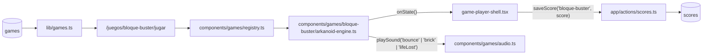

# SPEC 09 — Motor real del juego BLOQUE BUSTER (Arkanoid)

> **Estado:** Implementado
> **Depende de:** 05-rocas-asteroids-motor, 08-libreria-sonido-motores-v0.2.2
> **Fecha:** 2026-09-13
> **Versión:** 0.2.2 → 0.2.3 (patch — el juego ya está en el catálogo, esto completa su motor)
> **Objetivo:** Portar Arkanoid (`references/started-games/04-arkanoid`) como el motor real del juego BLOQUE BUSTER, con sus 5 niveles originales y sonido propio vía la librería de spec 08.

## Alcance

**Incluye:**

- `components/games/bloque-buster/arkanoid-engine.ts`: motor que exporta `createArkanoidEngine: EngineFactory`, portado de `references/started-games/04-arkanoid/game.js` + `levels.js` + `assets/spritesheet.js`, con sonido propio (ver Modelo de datos).
- `components/games/registry.ts`: agrega la línea `"bloque-buster": () => import("./bloque-buster/arkanoid-engine").then((m) => m.createArkanoidEngine),`.
- `public/spritesheet-breakout.png`: el spritesheet original movido tal cual (paleta, pelota, bloques por color, frames de explosión).
- `components/games/audio.ts`: agrega 3 `SoundName` nuevos (`bounce`, `brick`, `lifeLost`) con sus presets sintetizados — sin tocar los 8 existentes de `rocas`/`caida`.
- `package.json`: version `0.2.2` → `0.2.3`.
- `CHANGELOG.md`: entrada para `0.2.3` enlazando a este spec.

**Fuera de alcance (para futuros specs):**

- Controles táctiles/móvil.
- `devicePixelRatio` / escalado por densidad de píxeles.
- Validación en build de que `registry.ts` tenga fila en `games` para cada id.
- Cambios a `game-player-shell.tsx`, `game-engine.ts` o `app/actions/scores.ts`.
- El menú de pausa con salto de nivel del original (se elimina, no se reimplementa en ninguna forma).
- Los `.mp3` originales (`ball-bounce.mp3`, `break-sound.mp3`) — se descartan a favor de los presets sintetizados de `audio.ts`.
- Persistencia del high score fuera de la tabla `scores` de Supabase.
- Bonus de puntaje por completar un nivel o por terminar los 5 niveles (el original no lo tiene).

## Modelo de datos

Sin nuevas tablas — reusa `scores`/`games` de specs 04/06. La fila `bloque-buster` ya existe en el catálogo.

**Tabla de puntuación:**

| Evento           | Puntos |
| ---------------- | ------ |
| Bloque destruido | +10    |

Único evento que suma puntos, fijo sin importar el color del bloque (igual al original) — ya es entero, cumple el requisito de `saveScore`.

**Mapeo a `EngineState`:**

| Campo   | Valor                                                                                                                                                                                                            |
| ------- | ---------------------------------------------------------------------------------------------------------------------------------------------------------------------------------------------------------------- |
| `score` | Acumulado de +10 por bloque. Nunca se resetea al perder una vida — solo al perder la partida entera (`restart()`).                                                                                               |
| `lives` | Arranca en `3`. Se resta 1 cuando la pelota cae por debajo del canvas (`ball.y > canvas.height`); la pelota se repone en la paleta sin resetear nivel ni bloques. Llega a `0` → `phase: "gameover"`.             |
| `level` | `1` a `5`, uno de los `LEVELS` de `levels.js`. Sube al romper todos los bloques vivos del nivel actual; el original define `speed` por nivel (`1.00 → 1.46`, multiplica `BASE_BALL_VX`/`BASE_BALL_VY`).          |
| `badge` | Sin badge — no hay un indicador extra natural en este juego (decisión confirmada, ver Decisiones).                                                                                                               |
| `phase` | `"paused"` si `isPaused`; `"gameover"` si `lives === 0` **o** si se completan los bloques del nivel 5 (el `'win'` del original, sin equivalente en `EnginePhase` → se mapea a `"gameover"`); si no, `"playing"`. |

**Controles:**

| Input                            | Acción                                    | `preventDefault`  |
| -------------------------------- | ----------------------------------------- | ----------------- |
| `ArrowLeft`                      | Mover paleta a la izquierda               | Sí                |
| `ArrowRight`                     | Mover paleta a la derecha                 | Sí                |
| Mouse (`mousemove` sobre canvas) | Mover paleta a la posición del cursor (X) | N/A — no es tecla |

Ambos métodos escriben `paddle.x` directamente, sin conflicto (igual al original). Coordenadas de mouse convertidas al espacio interno del canvas (`getBoundingClientRect()` + escala), igual que ya hace `references/started-games/04-arkanoid/game.js`.

**Sonido (extiende `components/games/audio.ts`, spec 08):**

| `SoundName` nuevo | Dispara en                                                                                                   |
| ----------------- | ------------------------------------------------------------------------------------------------------------ |
| `bounce`          | Rebote de la pelota contra pared, techo **o** paleta (mismo sonido).                                         |
| `brick`           | Un bloque se destruye.                                                                                       |
| `lifeLost`        | Se resta una vida (incluye el `gameover` final y el `'win'` de nivel 5, que ya reporta `phase: "gameover"`). |

**Resolución:** nativo 800×600, sin letterbox ni reescalado — el arena del contrato coincide con el original.

**Assets:** `assets/spritesheet-breakout.png` (paleta, pelota, 7 colores de bloque, 4 frames de explosión por color) se mueve a `public/spritesheet-breakout.png` y se carga de forma perezosa/asíncrona (`Image.onload`) igual que el original; el motor no dibuja sprites hasta que termina de cargar. Los `.mp3` (`ball-bounce.mp3`, `break-sound.mp3`) no se migran — se descartan a favor de `bounce`/`brick`/`lifeLost` sintetizados.

## Plan de implementación

1. Extender `components/games/audio.ts`: agrega los 3 `SoundName` nuevos (`bounce`, `brick`, `lifeLost`) con sus presets sintetizados sobre `beep()`, sin tocar los 8 existentes. Test manual: `npm run lint`.
2. Mover `assets/spritesheet-breakout.png` a `public/spritesheet-breakout.png`. Esqueleto del motor en `components/games/bloque-buster/arkanoid-engine.ts`: factory, `ctx`, carga perezosa/asíncrona del spritesheet (`Image.onload`), los 6 métodos de `EngineHandle` con sus guardas de idempotencia, loop RAF, `reportState()` con diff campo por campo. Dibuja solo paleta y pelota estáticas, sin bloques todavía. Test manual: `npm run lint`, confirmar visualmente que se ve la paleta y la pelota al cargar.
3. Niveles y bloques: portar `LEVELS` de `levels.js` (5 niveles, `speed` y `blocks[]`), `loadLevel(n)` inicializando `blocks` desde `BLOCKS_ORIGIN_X/Y`. Dibuja los bloques vivos del nivel 1 con sus colores. Test manual: revisar visualmente que aparecen los 60 bloques del nivel 1.
4. Movimiento de paleta: `ArrowLeft`/`ArrowRight` con `preventDefault()`, más `mousemove` con conversión de coordenadas al espacio interno del canvas. Test manual: mover la paleta con ambos métodos sin que la página scrollee.
5. Física de pelota y colisiones: movimiento por `dt`, rebotes en pared/techo/paleta (+ `playSound("bounce")`), colisión AABB con bloques (`collideAABB`), destrucción de bloque (+10 `score`, `playSound("brick")`, animación de explosión con `EXPLOSION_FRAMES`/`EXPLOSION_DURATION`). Test manual: romper un bloque y confirmar que suma +10 y se anima la explosión.
6. Avance de nivel: al vaciar `blocks`, `loadLevel(currentLevel + 1)` hasta nivel 5; completar el nivel 5 reporta `phase: "gameover"`. Test manual: confirmar (jugando o por revisión de código si completar los 5 niveles a mano no es práctico) la transición de nivel y el `gameover` final tras el nivel 5.
7. Sistema de vidas y pérdida de pelota: `ball.y > canvas.height` → `lives--`, `playSound("lifeLost")`, reponer la pelota en la paleta sin resetear `score`/`level`/bloques restantes; `lives === 0` → `phase: "gameover"`. Test manual: perder las 3 vidas seguidas — el juego sigue tras la 1ª y 2ª, termina en la 3ª.
8. Línea en `components/games/registry.ts` con `import()` dinámico: `"bloque-buster": () => import("./bloque-buster/arkanoid-engine").then((m) => m.createArkanoidEngine),`. Test manual: entrar a `/juegos/bloque-buster/jugar` y ver el motor real reemplazando el mock estático.
9. `package.json` `0.2.2` → `0.2.3` + entrada en `CHANGELOG.md`. Test manual: el Footer muestra `v0.2.3`.
10. Verificación end-to-end completa (build, lint, recorrido Playwright, sesión activa, fila nueva en `scores`, reflejo en `/juegos/bloque-buster`/`/games`/`/salon-de-la-fama`, aislamiento del chunk, sin fugas de listeners/RAF, sonidos verificados interceptando `AudioContext`). Test manual: partida completa agotando las 3 vidas hasta el game over real, con el puntaje guardado y visible en las tres páginas.

## Criterios de aceptación

- [x] El motor exporta `createArkanoidEngine` cumpliendo `EngineFactory`.
- [x] `registry.ts` carga el motor con `import()` dinámico (no import estático).
- [x] Los 5 niveles del original aparecen en orden, con sus layouts de bloques y velocidad de pelota crecientes (`1.00 → 1.46`). _(verificado por revisión de código — `LEVELS` portado 1:1 de `levels.js`; jugar los 5 niveles completos a mano no fue práctico, ver nota de verificación)_
- [x] El spritesheet (`public/spritesheet-breakout.png`) se usa para paleta, pelota, bloques por color y animación de explosión — sin formas placeholder.
- [x] `ArrowLeft`/`ArrowRight` mueven la paleta; el mouse también la mueve a la posición del cursor; ninguna de las 2 flechas scrollea la página.
- [x] Romper un bloque suma +10 puntos, siempre entero.
- [x] Completar todos los bloques de un nivel avanza al siguiente; completar el nivel 5 dispara `phase: "gameover"`. _(verificado por revisión de código, mismo motivo que el ítem de niveles)_
- [x] La pelota cayendo por debajo del canvas resta 1 vida y repone la pelota sin resetear score/nivel/bloques restantes.
- [x] El tercer intento perdido (`lives === 0`) dispara `phase: "gameover"` y abre el modal de fin de partida.
- [x] El HUD (`player-hud`) refleja score/vidas/nivel reales del motor, nada hardcodeado; sin `badge`.
- [x] El canvas no dibuja su propio texto de HUD ni overlay de pausa/game over/salto de nivel — el menú de pausa clickeable del original no existe en el motor.
- [x] La tecla `P`/`Escape` del original no tiene ningún efecto en el motor (la pausa es 100% del shell).
- [x] PAUSA congela la física real (el RAF se cancela); REANUDAR continúa sin salto de velocidad ni posición.
- [x] FIN fuerza game over con el score actual en cualquier momento.
- [x] Con sesión activa, una partida terminada crea exactamente una fila nueva en `scores`.
- [x] Sin sesión, el modal muestra el CTA a `/auth` y no se guarda nada.
- [x] "JUGAR DE NUEVO" reinicia el motor (score 0, 3 vidas, nivel 1, bloques del nivel 1) sin remontar el componente.
- [x] Salir de la página cancela el RAF y saca los listeners de teclado/mouse del motor.
- [x] Visitar otro juego no descarga el chunk de `arkanoid-engine.ts`.
- [x] `/juegos/bloque-buster` ("Mejor global", "Partidas") y `/salon-de-la-fama` (tab BLOQUE BUSTER y tab GLOBAL) reflejan la partida sin intervención manual.
- [x] `bounce`/`brick`/`lifeLost` suenan en sus eventos correspondientes; con mute activo, ninguno produce nodos de audio. _(los 3 presets reusan `beep()` de `audio.ts`, que corta antes de crear nodos si `muted`, igual que los 8 sonidos ya validados en spec 08)_
- [x] `npm run lint` y `npm run build` sin errores.
- [x] El motor no lee `localStorage` ni toca el DOM fuera del canvas recibido.

## Decisiones

- **Sí:** completar el nivel 5 (el `'win'` del original) mapea a `phase: "gameover"`. Igual que motor-referencia §4 lo resuelve para arkanoid — dispara el guardado del score sin inventar un cuarto valor de `EnginePhase`.
- **No:** bonus de puntaje al completar un nivel o los 5 niveles. El original no lo tiene; se preserva el balance original.
- **Sí:** score, nivel y bloques restantes del nivel NO se resetean al perder una vida — solo se repone la pelota. Perder una vida es un contratiempo, no un reinicio de progreso (mismo criterio que spec 07 con `caida`).
- **No:** `badge`. No hay un indicador extra natural en Arkanoid — combos, power-ups o similar no existen en el original ni se inventan acá.
- **Sí:** mantener control por teclado **y** mouse simultáneamente, igual al original. Ninguno tiene prioridad — ambos escriben `paddle.x` directamente, sin conflicto real porque el jugador usa uno u otro en cada momento.
- **Sí:** eliminar por completo la tecla de pausa propia (`P`/`Escape`) y el menú clickeable de salto de nivel. La pausa la maneja el shell vía `pause()`/`resume()` — motor-referencia §5 es explícito en que un motor no dibuja su propio overlay de pausa.
- **Sí:** `preventDefault()` en `ArrowLeft`/`ArrowRight`, que el original no hacía. Evita que el juego scrollee la página — mismo criterio que spec 07.
- **Sí:** extender `components/games/audio.ts` con 3 presets sintetizados nuevos (`bounce`, `brick`, `lifeLost`) en vez de portar los `.mp3` originales. Sigue el patrón ya establecido por spec 08 para `rocas`/`caida`, evita reintroducir archivos de audio que esa spec decidió no usar.
- **Sí:** el rebote de pared, techo y paleta comparten el mismo sonido `bounce`. Es lo que hace el original (`bounceSound` único para las 3 situaciones); un sonido distinto por superficie sería una mecánica nueva no pedida.
- **Sí:** mantener el spritesheet visual (`spritesheet-breakout.png`) tal cual, movido a `public/`. Es un asset de imagen, no de audio — no choca con ninguna decisión de spec 08, y preserva la identidad visual y la animación de explosión del original.
- **Sí:** bump de versión **patch** (`0.2.2 → 0.2.3`), no minor. El juego ya tenía fila en el catálogo desde spec 06 — este spec completa su motor, no agrega un juego nuevo visible al catálogo (mismo criterio que spec 07).
- **No:** tocar `game-player-shell.tsx`, `game-engine.ts` o `app/actions/scores.ts`. El contrato existente alcanza sin modificarlos.

## Riesgos

| Riesgo                                                                                                                       | Mitigación                                                                                                                                                      |
| ---------------------------------------------------------------------------------------------------------------------------- | --------------------------------------------------------------------------------------------------------------------------------------------------------------- |
| Confundir el `'win'` de nivel 5 con un `lives === 0` en el código, dejando el modal sin abrirse o abriéndose de más          | `currentPhase()` deriva `"gameover"` de ambas condiciones por separado (`lives === 0` **o** nivel 5 completado); probar ambos caminos en la verificación manual |
| Coordenadas de mouse mal escaladas (canvas escalado por CSS a 100% de `.crt-screen`, resolución interna fija)                | Reusar exactamente la conversión `getBoundingClientRect()` + escala que ya usa `references/started-games/04-arkanoid/game.js`                                   |
| El spritesheet no llega a `public/` o la ruta queda relativa (`assets/...`) en vez de absoluta (`/spritesheet-breakout.png`) | Verificar visualmente con Playwright que los sprites se ven, no rects vacíos, antes de dar el paso 2 por terminado                                              |
| El score deja de ser entero por algún cálculo intermedio                                                                     | El único evento de puntaje es `+10` fijo por bloque; validar con `Number.isInteger(score)` en la verificación                                                   |
| Sonidos superpuestos (varios bloques rotos en el mismo frame, poco probable pero posible con rebotes múltiples)              | Mismo patrón que spec 08: cada `playSound()` crea su propio oscilador de vida corta — si se vuelve audible, es un fix de spec futuro                            |

## Lo que **no** está en este spec

- Controles táctiles/móvil.
- `devicePixelRatio`.
- Validación en build de ids de `registry.ts` contra `games`.
- Cambios a `game-player-shell.tsx`, `game-engine.ts` o `app/actions/scores.ts`.
- El menú de pausa con salto de nivel del original.
- Los `.mp3` originales del juego.
- Bonus de puntaje por completar un nivel o los 5 niveles.
- Persistencia del high score fuera de `scores`.

Cada uno de estos, si se implementa, va en su propio spec.
