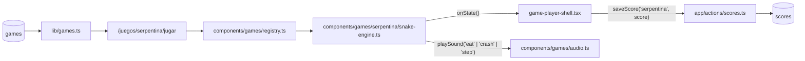

# SPEC 10 — Motor real del juego SERPENTINA (Snake)

> **Estado:** Implementado
> **Depende de:** 05-rocas-asteroids-motor, 08-libreria-sonido-motores-v0.2.2
> **Fecha:** 2026-09-13
> **Versión:** 0.2.3 → 0.2.4 (patch — el juego ya está en el catálogo, esto le agrega su motor real)
> **Objetivo:** Escribir desde cero el motor real del juego SERPENTINA (Snake) sobre una grilla de 20px, con sonido propio (spec 08) y sprite de fruta migrado desde `references/source-asset/snake-assets/fruits.png`.

## Alcance

**Incluye:**

- `components/games/serpentina/snake-engine.ts`: motor que exporta `createSnakeEngine: EngineFactory`, escrito desde cero (Snake no tiene fuente completa en `references/started-games/` — solo hay material gráfico en `references/source-asset/snake-assets/`), sobre una grilla de 20px (40×30 celdas) con sonido propio (ver Modelo de datos).
- `components/games/registry.ts`: agrega la línea `serpentina: () => import("./serpentina/snake-engine").then((m) => m.createSnakeEngine),`.
- `public/fruits.png`: copia del spritesheet de frutas `references/source-asset/snake-assets/fruits.png` (3790×442px, fondo transparente) — el original queda intacto en `references/`, igual que hizo spec 09 con `spritesheet-breakout.png`.
- `components/games/audio.ts`: agrega 3 `SoundName` nuevos (`eat`, `crash`, `step`) con sus presets sintetizados — sin tocar los 9 existentes.
- `package.json`: version `0.2.3` → `0.2.4`.
- `CHANGELOG.md`: entrada para `0.2.4` enlazando a este spec.

**Fuera de alcance (para futuros specs):**

- Controles táctiles/móvil.
- Audio distinto al de `eat`/`crash`/`step` (ej. sonido de subida de nivel).
- `devicePixelRatio` / escalado por densidad de píxeles.
- Validación en build de que cada clave de `registry.ts` tenga fila en `games`.
- Variedad de frutas aleatoria entre las 21 del atlas — se usa una única fruta fija (`apple`), recortada de `fruits.png`.
- El archivo `references/source-asset/snake-assets/sprites.js` y su patrón `window.SPRITE_ATLAS` global — se descarta como archivo; solo las coordenadas de `apple` se portan como constante TS dentro del motor.
- Bonus de puntaje por velocidad, combo o tiempo sobrevivido — el único evento que suma puntos es comer fruta.
- Cambios a `game-player-shell.tsx`, `game-engine.ts` o `app/actions/scores.ts`.

## Modelo de datos

Sin nuevas tablas — reusa `scores`/`games` de specs 04/06. La fila `serpentina` ya existe en el catálogo (no aplica el bloque de "fila nueva" del caso C).

**Tabla de puntuación:**

| Evento       | Puntos |
| ------------ | ------ |
| Fruta comida | +10    |

Único evento que suma puntos, fijo (ya es entero, cumple el requisito de `saveScore`). El número de frutas comidas en cualquier momento es `score / 10`.

**Mapeo a `EngineState`:**

| Campo   | Valor                                                                                                                                                                                                                                                                                                                                                                                                                      |
| ------- | -------------------------------------------------------------------------------------------------------------------------------------------------------------------------------------------------------------------------------------------------------------------------------------------------------------------------------------------------------------------------------------------------------------------------- |
| `score` | Acumulado de +10 por fruta. Nunca se resetea al perder una vida — solo al perder la partida entera (`restart()`).                                                                                                                                                                                                                                                                                                          |
| `lives` | Arranca en `3`. Los bordes del arena hacen **wrap-around** (cruzar uno teletransporta la cabeza al lado opuesto de la misma fila/columna, sin penalización) — solo chocar contra el propio cuerpo resta 1 vida; la serpiente vuelve a la posición y dirección de partida (centro-izquierda, moviendo a la derecha) **conservando su longitud actual**, sin resetear `score` ni `level`. Llega a `0` → `phase: "gameover"`. |
| `level` | `1 + floor((score / 10) / 10)` — sube 1 cada 10 frutas comidas, sin techo. El intervalo de movimiento de la serpiente (velocidad) baja con el nivel: `max(60, 150 - (level - 1) * 15)` ms entre celdas.                                                                                                                                                                                                                    |
| `badge` | `{ label: "LARGO", value: String(length) }` — longitud actual de la serpiente en celdas.                                                                                                                                                                                                                                                                                                                                   |
| `phase` | `"paused"` si `isPaused`; `"gameover"` si `lives === 0`; si no, `"playing"`.                                                                                                                                                                                                                                                                                                                                               |

**Controles:**

| Input                 | Acción                       | Restricción                                               | `preventDefault` |
| --------------------- | ---------------------------- | --------------------------------------------------------- | ---------------- |
| `ArrowUp` / `KeyW`    | Dirección deseada: arriba    | Ignorado si la serpiente se mueve actualmente hacia abajo | Sí               |
| `ArrowDown` / `KeyS`  | Dirección deseada: abajo     | Ignorado si se mueve hacia arriba                         | Sí               |
| `ArrowLeft` / `KeyA`  | Dirección deseada: izquierda | Ignorado si se mueve hacia la derecha                     | Sí               |
| `ArrowRight` / `KeyD` | Dirección deseada: derecha   | Ignorado si se mueve hacia la izquierda                   | Sí               |

Sin mouse/touch. La restricción de "ignorado" es lo que impide el giro de 180° instantáneo sobre el propio cuerpo (decisión confirmada).

**Sonido (extiende `components/games/audio.ts`, spec 08):**

| `SoundName` nuevo | Dispara en                                                                                                                                                            |
| ----------------- | --------------------------------------------------------------------------------------------------------------------------------------------------------------------- |
| `eat`             | La serpiente come una fruta.                                                                                                                                          |
| `crash`           | Se resta una vida (incluye el choque final que lleva a `lives === 0` / `gameover`).                                                                                   |
| `step`            | Cada celda avanzada por el tick de movimiento (ni fruta ni choque en ese tick), un blip corto y silencioso — agregado a pedido del usuario durante la implementación. |

**Resolución:** grilla de 40×30 celdas de 20px sobre el arena nativo 800×600 — exacto, sin letterbox ni reescalado. Los 4 bordes hacen wrap-around (ver fila `lives` arriba).

**Assets:** `public/fruits.png` (copia de `references/source-asset/snake-assets/fruits.png`) se carga de forma perezosa/asíncrona (`Image.onload`); la fruta (`apple`, recorte `{x:2786, y:136, w:110, h:160}` del spritesheet, portado como constante TS) se dibuja escalada a 1 celda (20×20). Hasta que la imagen termina de cargar, la fruta se dibuja como un cuadrado placeholder verde de 1 celda — igual de espíritu que la carga perezosa del spritesheet de `bloque-buster`.

## Plan de implementación

1. Extender `components/games/audio.ts`: agrega los 3 `SoundName` nuevos (`eat`, `crash`, `step`) con sus presets sintetizados sobre `beep()`, sin tocar los 9 existentes. Test manual: `npm run lint`.
2. Copiar `references/source-asset/snake-assets/fruits.png` a `public/fruits.png` (original intacto en `references/`). Esqueleto del motor en `components/games/serpentina/snake-engine.ts`: factory, `ctx`, grilla 40×30 de celdas de 20px, carga perezosa/asíncrona de la imagen (`Image.onload`), los 6 métodos de `EngineHandle` con sus guardas de idempotencia, loop RAF, `reportState()` con diff campo por campo. Dibuja la serpiente inicial (3 segmentos) estática y la fruta como placeholder verde, sin movimiento todavía. Test manual: `npm run lint`, confirmar visualmente que se ve la serpiente y la fruta al cargar.
3. Movimiento por grilla: tick de movimiento a intervalo variable según `level` (`max(60, 150 - (level - 1) * 15)` ms), la serpiente avanza 1 celda por tick en la dirección actual — desacoplado del RAF de dibujo (dt acumulado, no cada frame). Test manual: la serpiente se mueve sola hacia la derecha sin ningún input.
4. Input de dirección: `ArrowUp/Down/Left/Right` + `KeyW/A/S/D`, con `preventDefault()`, ignorando la dirección que revertiría 180° sobre el segundo segmento. Test manual: cambiar de dirección con ambos esquemas de teclas sin que la página scrollee; confirmar que ir a la derecha y presionar izquierda de inmediato no hace nada.
5. Fruta y crecimiento: la fruta aparece en una celda libre aleatoria (sin colisionar con el cuerpo); cuando la cabeza entra en su celda, suma `+10` a `score`, crece la serpiente 1 segmento, dispara `playSound("eat")`, y reubica la fruta en otra celda libre. Reemplaza el recorte de `fruits.png` (`apple`, `{x:2786,y:136,w:110,h:160}`) por el placeholder verde una vez cargada la imagen. Test manual: comer una fruta y confirmar `+10`, un segmento nuevo y el sonido.
6. Nivel y velocidad: `level = 1 + floor((score / 10) / 10)`, recalculando el intervalo del tick al cambiar. Test manual: comer 10 frutas seguidas y confirmar que `level` sube a `2` y la serpiente se mueve visiblemente más rápido.
7. Bordes y colisión: cruzar cualquier borde del arena hace wrap-around (teletransporta la cabeza al lado opuesto de la misma fila/columna, sin penalización); chocar contra el propio cuerpo resta 1 `lives`, dispara `playSound("crash")`, resetea la serpiente a la posición/dirección de partida **conservando su longitud actual** (sin resetear `score`/`level`); `lives === 0` dispara `phase: "gameover"`. Test manual: cruzar cada uno de los 4 bordes y confirmar que reaparece del lado opuesto sin restar vidas; chocar contra el propio cuerpo tras crecer y confirmar que la vida perdida no acorta la serpiente; perder las 3 vidas por auto-colisión — el juego sigue tras la 1ª y 2ª, termina en la 3ª.
8. Línea en `components/games/registry.ts` con `import()` dinámico: `serpentina: () => import("./serpentina/snake-engine").then((m) => m.createSnakeEngine),`. Test manual: entrar a `/juegos/serpentina/jugar` y ver el motor real reemplazando el mock estático.
9. `package.json` `0.2.3` → `0.2.4` + entrada en `CHANGELOG.md`. Test manual: el Footer muestra `v0.2.4`.
10. Verificación end-to-end completa vía Playwright MCP contra `npm run dev`: partida real moviendo la serpiente con ambos esquemas de teclas, comiendo fruta, subiendo de nivel, agotando las 3 vidas hasta el game over real; con sesión activa, confirmar fila nueva en `scores` y su reflejo en `/juegos/serpentina`, `/games` y `/salon-de-la-fama`; confirmar aislamiento del chunk (`serpentina` no se descarga al visitar otro juego), ausencia de fugas de listeners/RAF/timer al salir y volver a entrar, y los sonidos `eat`/`crash` interceptando `AudioContext`. Además `npm run lint` y `npm run build` sin errores. Test manual: partida completa hasta game over real, puntaje guardado y visible en las tres páginas.

## Criterios de aceptación

- [ ] El motor exporta `createSnakeEngine` cumpliendo `EngineFactory`.
- [ ] `registry.ts` carga el motor con `import()` dinámico (no import estático).
- [ ] La serpiente se mueve sola por la grilla a intervalos discretos (no cada frame de RAF), y la velocidad aumenta visiblemente al subir de nivel.
- [ ] `ArrowUp/Down/Left/Right` y `KeyW/A/S/D` cambian la dirección; ninguna de las 8 teclas scrollea la página.
- [ ] Presionar la dirección opuesta a la actual (ej. izquierda yendo a la derecha) no tiene efecto — la serpiente no puede revertir 180° sobre sí misma.
- [ ] Comer la fruta (dibujada con el sprite `apple` de `public/fruits.png`, no un placeholder, una vez cargada la imagen) suma +10 puntos, siempre entero, y crece la serpiente 1 segmento.
- [ ] La fruta reaparece en una celda libre (nunca dentro del cuerpo de la serpiente) tras ser comida.
- [ ] Cada 10 frutas comidas sube `level` en 1, sin techo, y el intervalo de movimiento baja acorde a la fórmula documentada.
- [ ] Cruzar cualquier borde del arena teletransporta la cabeza (y el resto del cuerpo la sigue) al lado opuesto de la misma fila/columna, sin restar vidas ni interrumpir la partida.
- [ ] Chocar contra el propio cuerpo resta 1 vida, reproduce `crash`, y resetea la serpiente a la posición/dirección de partida **sin acortarla** (conserva la longitud que tenía) ni resetear `score` ni `level`.
- [ ] El tercer choque (`lives === 0`) dispara `phase: "gameover"` y abre el modal de fin de partida.
- [ ] El HUD (`player-hud`) refleja `score`/`lives`/`level` reales del motor, nada hardcodeado; el `badge` muestra "LARGO" con la longitud actual.
- [ ] El canvas no dibuja su propio texto de HUD ni overlay de pausa/game over.
- [ ] PAUSA congela la simulación real (el tick de movimiento y el RAF se cancelan, no solo un flag visual).
- [ ] REANUDAR continúa sin salto de posición ni velocidad (el tick no acumula el tiempo pausado).
- [ ] FIN fuerza game over con el score actual en cualquier momento.
- [ ] Con sesión activa, una partida terminada crea exactamente una fila nueva en `scores`.
- [ ] Sin sesión, el modal muestra el CTA a `/auth` y no se guarda nada.
- [ ] "JUGAR DE NUEVO" reinicia el motor (score 0, 3 vidas, nivel 1, serpiente de 3 segmentos) sin remontar el componente.
- [ ] "VOLVER AL VAULT" navega a `/juegos/serpentina`.
- [ ] Salir de la página cancela el RAF/tick y saca los listeners de teclado del motor (sin fugas al entrar/salir repetidas veces).
- [ ] Visitar otro juego no descarga el chunk de `snake-engine.ts`.
- [ ] `/juegos/serpentina` ("Mejor global", "Partidas") y `/salon-de-la-fama` (tab SERPENTINA y tab GLOBAL) reflejan la partida sin intervención manual.
- [ ] `eat`/`crash`/`step` suenan en sus eventos correspondientes; con mute activo, ninguno produce nodos de audio.
- [ ] `npm run lint` y `npm run build` sin errores.
- [ ] El motor no lee `localStorage` ni toca el DOM fuera del canvas recibido.

## Decisiones

- **Sí:** `lives` se reinterpreta como "intentos de la serpiente", no como el Snake clásico de un solo choque. Un choque (contra el propio cuerpo) resetea posición/dirección **conservando la longitud actual**, sin resetear `score`/`level` — ajustado durante la implementación a pedido explícito del usuario (la versión original de este spec resetaba también la longitud a 3; ver historial de la branch).
- **Sí:** wrap-around real en los bordes — cruzar cualquier borde teletransporta la cabeza al lado opuesto sin penalización. Decisión revertida durante la implementación a pedido explícito del usuario (la versión original de este spec trataba cualquier borde como colisión, más fiel al Snake de Nokia); solo el choque contra el propio cuerpo resta vidas.
- **Sí:** `level` sube cada 10 frutas (ajustado de 5 a 10 a pedido explícito del usuario durante la implementación) y acelera el movimiento (`max(60, 150 - (level-1)*15)` ms por celda), sin techo. Da sensación de progresión con una fórmula simple, mismo espíritu que el `speed` creciente por nivel de `bloque-buster`.
- **Sí:** `badge` muestra la longitud actual (`{ label: "LARGO", value: String(length) }`). Es el único dato relevante del juego que no cabe en `score`/`lives`/`level`, mismo patrón que el badge "LÍNEAS" de `caida`.
- **Sí:** una única fruta fija (`apple`) recortada de `fruits.png`, no variedad aleatoria entre las 21 del atlas. Simplifica el motor sin perder identidad visual — variedad de frutas queda para un spec futuro si se pide.
- **No:** portar `references/source-asset/snake-assets/sprites.js` como archivo. Es un script suelto con patrón `window.SPRITE_ATLAS` global, incompatible con el aislamiento de módulo que tienen `rocas`/`caida`/`bloque-buster` — solo se copian las coordenadas de `apple` como constante TS dentro del motor.
- **Sí:** `fruits.png` se copia (no se mueve) a `public/`. El original queda intacto en `references/source-asset/` — mismo criterio que spec 09 con `spritesheet-breakout.png` en `references/started-games/04-arkanoid/assets/`.
- **Sí:** doble esquema de controles (flechas + WASD) como alias sin conflicto — ambos escriben la misma "dirección deseada"; el jugador usa uno u otro, igual de criterio que el teclado+mouse simultáneo de `bloque-buster`.
- **Sí:** ignorar la entrada que revertiría la dirección 180° sobre el segundo segmento. Estándar del género — sin esto, un input accidental sería una muerte instantánea e injusta.
- **Sí:** extender `components/games/audio.ts` con 3 presets sintetizados nuevos (`eat`, `crash`, `step`) en vez de agregar archivos de audio. Sigue el patrón de spec 08/09; `step` (un blip corto y silencioso por celda avanzada en un tick normal) se agregó a pedido explícito del usuario durante la implementación.
- **Sí:** `preventDefault()` en las 8 teclas de movimiento (flechas + WASD). Mismo criterio que specs 07/09 — evita que jugar scrollee la página.
- **No:** SQL nuevo ni bloque `.cover-serpentina` en `globals.css`. La fila `serpentina` y su portada (`cover-snake`) ya existen en el catálogo desde antes de este spec — es Caso B, no C.
- **Sí:** bump de versión **patch** (`0.2.3 → 0.2.4`), no minor. El juego ya tenía fila y portada en el catálogo — este spec completa su motor, no agrega un juego nuevo visible al catálogo (mismo criterio que spec 09 con `bloque-buster`).
- **No:** tocar `game-player-shell.tsx`, `game-engine.ts` o `app/actions/scores.ts`. El contrato existente alcanza sin modificarlos.

## Riesgos

| Riesgo                                                                                                                               | Mitigación                                                                                                                                                                          |
| ------------------------------------------------------------------------------------------------------------------------------------ | ----------------------------------------------------------------------------------------------------------------------------------------------------------------------------------- |
| El tick de movimiento acoplado al RAF de dibujo hace que la velocidad dependa del framerate real en vez de ser consistente           | Acumular `dt` en una variable separada del loop de dibujo y disparar el movimiento solo cuando supera el intervalo del nivel actual, igual de patrón que un "fixed timestep" simple |
| `resume()`/`restart()` no resetean el acumulador de tiempo del tick, causando un salto de varias celdas de golpe tras pausar         | Mismo fix que ya exige el contrato para `lastTime` del RAF (motor-referencia §2): resetear también el acumulador del tick en `resume()`/`restart()`                                 |
| La fruta reaparece dentro del cuerpo de la serpiente por un sorteo de celda que no excluye las ocupadas                              | Sortear solo entre celdas libres (`40*30` menos las ocupadas por el cuerpo) antes de reubicar la fruta                                                                              |
| El score deja de ser entero por algún cálculo intermedio de `level` (división)                                                       | El único evento de puntaje es `+10` fijo por fruta; `level` se deriva con `floor()`, nunca se escribe en `score`; validar con `Number.isInteger(score)` en la verificación          |
| Confundir "perder una vida" con "gameover" en el código, dejando el modal sin abrirse o abriéndose antes de tiempo                   | `currentPhase()` deriva `"gameover"` únicamente de `lives === 0`; probar los 3 choques por separado en la verificación manual                                                       |
| El sprite de `apple` no llega a `public/fruits.png` o las coordenadas del recorte quedan mal calibradas (rect vacío o fruta cortada) | Verificar visualmente con Playwright que se ve la fruta real, no el placeholder verde, antes de dar el paso 2 por terminado                                                         |

## Lo que **no** está en este spec

- Controles táctiles/móvil.
- Audio distinto al de `eat`/`crash`/`step`.
- `devicePixelRatio`.
- Validación en build de ids de `registry.ts` contra `games`.
- Variedad de frutas aleatoria entre las 21 del atlas.
- El archivo `sprites.js` original y su patrón `window.SPRITE_ATLAS`.
- Wrap-around en los bordes del arena.
- Bonus de puntaje por velocidad, combo o tiempo sobrevivido.
- Cambios a `game-player-shell.tsx`, `game-engine.ts` o `app/actions/scores.ts`.

Cada uno de estos, si se implementa, va en su propio spec.
