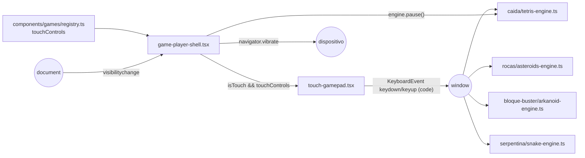

# SPEC 12 — Controles táctiles para jugar en el celular

> **Estado:** Aprobado/
> **Depende de:** 05-rocas-asteroids-motor (contrato motor/shell), 07-caida-tetris-motor-v0.2.1, 09-bloque-buster-arkanoid-motor-v0.2.3, 10-serpentina-snake-motor-v0.2.4, v0.3.0 (skins: campo `skins` en `registry.ts`)
> **Fecha:** 2026-10-03
> **Versión:** 0.3.0 → 0.4.0 (minor — funcionalidad nueva visible al usuario: los juegos pasan a ser jugables en pantallas táctiles)
> **Objetivo:** Que los 4 juegos con motor se puedan jugar en un celular con pantalla táctil, mediante un gamepad virtual en el reproductor que emite las mismas teclas que ya entienden los motores.

## Alcance

**Incluye:**

- `next.config.ts`: `allowedDevOrigins: ["192.168.*.*"]`, para que el dev server sirva sus assets y el HMR cuando se abre la app por la IP de la red local desde el celular. Ya aplicado en el working tree y sin commitear; este spec lo formaliza.
- `components/games/touch-gamepad.tsx` (nuevo): componente cliente del gamepad virtual. Dibuja los botones que recibe y, en cada pulsación, emite `KeyboardEvent` sintéticos (`keydown`/`keyup`) sobre `window` con el `code` de la tecla mapeada. Repite el `keydown` mientras se mantiene apretado un botón marcado con `repeat`. También exporta los tipos del layout táctil.
- `components/games/registry.ts`: campo opcional `touchControls` en `GameRegistration`, declarado para los 4 juegos con motor (CAÍDA, ROCAS, BLOQUE BUSTER, SERPENTINA). Un juego sin `touchControls` no muestra gamepad.
- `components/games/game-player-shell.tsx`:
  - Muestra el gamepad solo si `(pointer: coarse)`.
  - Usa el layout vertical (canvas arriba, controles abajo) u horizontal (canvas al centro, controles a los costados) según la orientación.
  - Pausa automática en todos los dispositivos con `visibilitychange`: queda en EN PAUSA hasta tocar REANUDAR.
  - Botón PANTALLA COMPLETA (Fullscreen API), oculto si el navegador no la soporta.
  - Vibración (`navigator.vibrate`) cuando `lives` baja y al pasar a `phase: "gameover"`, sin efecto donde no existe la API.
- `app/globals.css`: estilos del gamepad y del layout táctil vertical/horizontal. `touch-action: none` y `user-select: none` en la zona de juego para que los toques no hagan scroll, zoom ni seleccionen texto.
- `components/games/README.md`: documenta `touchControls` en la receta para agregar un juego.
- `package.json`: version `0.3.0` → `0.4.0`.
- `CHANGELOG.md`: entrada para `0.4.0` enlazando a este spec.

**Fuera de alcance (para futuros specs):**

- Gestos nativos por motor (swipe en SERPENTINA, arrastrar la paleta en BLOQUE BUSTER, tocar para disparar): descartado en favor de un gamepad único.
- Cualquier cambio en los motores (`*-engine.ts`) o en el contrato `game-engine.ts`.
- Los 4 juegos sin motor (mock estático de `app/juegos/[id]/jugar/page.tsx`).
- Revisión responsive del resto del sitio (home, catálogo, ranking, auth, about).
- Vibración al pulsar los botones del gamepad.
- Toggle manual para mostrar/ocultar el gamepad, y personalizar botones, tamaño u opacidad.
- Gamepads físicos (Gamepad API).
- Bloqueo de orientación, PWA/instalable, `devicePixelRatio`.
- Pantalla completa en iPhone Safari: la API no la soporta para elementos que no son video, así que el botón queda oculto ahí.

## Modelo de datos

Sin tablas ni persistencia nuevas: nada se guarda entre sesiones ni en Supabase. Solo aparecen tipos nuevos en `components/games/touch-gamepad.tsx` y un campo opcional en `GameRegistration`.

```ts
// components/games/touch-gamepad.tsx
export type DpadSlot = "up" | "down" | "left" | "right";

export type TouchButton = {
  /** `KeyboardEvent.code` que se emite, ej. "ArrowLeft", "Space". */
  code: string;
  /** Texto visible en el botón, ej. "◀", "GIRAR". */
  label: string;
  /** Re-emite `keydown` mientras el botón sigue apretado, para motores que
   * dependen del auto-repeat nativo del teclado (CAÍDA). */
  repeat?: boolean;
};

export type TouchControls = {
  /** Cruceta (grupo izquierdo). Un slot ausente no se dibuja. */
  dpad: Partial<Record<DpadSlot, TouchButton>>;
  /** Botones de acción (grupo derecho), en orden de izquierda a derecha. */
  actions?: TouchButton[];
};

/** Imitan el auto-repeat típico de un teclado. */
const REPEAT_DELAY_MS = 200;
const REPEAT_INTERVAL_MS = 60;

// components/games/registry.ts
export type GameRegistration = {
  load: EngineLoader;
  maxPlausibleScore: number;
  skins?: readonly SkinId[];
  touchControls?: TouchControls; // nuevo
};
```

**Mapeo por juego (`touchControls` en `registry.ts`):**

| Juego         | Cruceta                                                                           | Acciones                       |
| ------------- | --------------------------------------------------------------------------------- | ------------------------------ |
| CAÍDA         | `left` ArrowLeft (repeat), `right` ArrowRight (repeat), `down` ArrowDown (repeat) | `GIRAR` ArrowUp, `CAER` Space  |
| ROCAS         | `left` ArrowLeft, `right` ArrowRight                                              | `MOTOR` ArrowUp, `FUEGO` Space |
| BLOQUE BUSTER | `left` ArrowLeft, `right` ArrowRight                                              | —                              |
| SERPENTINA    | `up` ArrowUp, `down` ArrowDown, `left` ArrowLeft, `right` ArrowRight              | —                              |

Solo CAÍDA usa `repeat`. ROCAS y BLOQUE BUSTER leen las teclas mantenidas por polling (`keys[code]`) en cada frame, y SERPENTINA solo necesita un `keydown` por cambio de dirección.

**Ciclo de vida de un botón (por puntero, así que soporta multitouch):**

| Evento del puntero                                   | Efecto                                                                                                                   |
| ---------------------------------------------------- | ------------------------------------------------------------------------------------------------------------------------ |
| `pointerdown`                                        | `setPointerCapture` + `keydown` con su `code`. Si `repeat`: tras `REPEAT_DELAY_MS`, `keydown` cada `REPEAT_INTERVAL_MS`. |
| `pointerup` / `pointercancel` / `lostpointercapture` | Corta la repetición + `keyup`.                                                                                           |
| Desmontaje del gamepad, `visibilitychange` a oculto  | Emite `keyup` de todos los botones apretados, para que ninguna tecla quede pegada.                                       |

**Estado nuevo en `game-player-shell.tsx` (solo en memoria):**

| Estado         | Tipo          | Origen                                                                                                                                       |
| -------------- | ------------- | -------------------------------------------------------------------------------------------------------------------------------------------- |
| `isTouch`      | `boolean`     | `matchMedia("(pointer: coarse)")` con listener de `change`. Arranca en `false` para que la hidratación coincida con el render del servidor.  |
| `isFullscreen` | `boolean`     | `fullscreenchange`. El botón solo se muestra si `document.fullscreenEnabled`. El elemento a pantalla completa es `.av-player`.               |
| `prevLivesRef` | `ref<number>` | Último `lives` visto. Si el nuevo es menor → `navigator.vibrate(150)`. Al pasar a `gameover` → `navigator.vibrate([100, 60, 100, 60, 300])`. |



Convenciones:

- Los motores no cambian: siguen escuchando `keydown`/`keyup` en `window` y comparan `e.code`. Ninguno revisa `e.isTrusted`.
- La pausa automática solo actúa si `phase === "playing"` y nunca reanuda sola.

## Plan de implementación

1. **`next.config.ts`:** commitear `allowedDevOrigins: ["192.168.*.*"]` (ya aplicado). Prueba manual: con `npm run dev`, abrir `http://<IP-LAN>:3000/juegos/serpentina/jugar` desde el celular y ver que el juego pasa de "CARGANDO…" a jugable con teclado bluetooth o, al menos, que el canvas dibuja.
2. **Tipos y datos:** crear `components/games/touch-gamepad.tsx` solo con los tipos `DpadSlot`, `TouchButton` y `TouchControls`. Agregar `touchControls?: TouchControls` a `GameRegistration` y declarar el mapeo de los 4 juegos en `registry.ts` según la tabla del Modelo de datos. Sin cambios visibles: `npm run build` compila.
3. **Componente `TouchGamepad` sin repetición:** en el mismo archivo, componente cliente que recibe `controls: TouchControls`. Dibuja la cruceta (grupo izquierdo) y las acciones (grupo derecho). Por botón: `pointerdown` → `setPointerCapture` + `window.dispatchEvent(new KeyboardEvent("keydown", { code }))`; `pointerup`/`pointercancel`/`lostpointercapture` → `keyup`. Al desmontar emite `keyup` de los botones que sigan apretados. Todavía no se monta en ningún lado.
4. **Repetición:** agregar a `TouchGamepad` el soporte de `repeat` con `REPEAT_DELAY_MS`/`REPEAT_INTERVAL_MS` y limpiar los timers en `keyup` y al desmontar.
5. **Montaje en el shell, layout vertical:** en `game-player-shell.tsx`, estado `isTouch` con `matchMedia("(pointer: coarse)")` (arranca en `false`, listener de `change`). Si `isTouch && GAME_ENGINES[gameId]?.touchControls`, se dibuja `<TouchGamepad>` debajo del `.crt`. En `app/globals.css`: estilos del gamepad (diseñados con `/frontend-design`, coherentes con la estética CRT/neón), `touch-action: none` y `user-select: none` en `.crt` y en el gamepad, y `-webkit-touch-callout: none`. Prueba manual: Chrome DevTools en modo dispositivo (iPhone/Pixel) → los 4 juegos se pueden jugar en vertical, y en desktop sin emulación el gamepad no aparece.
6. **Layout horizontal:** con `@media (pointer: coarse) and (orientation: landscape)`, la cruceta queda a la izquierda del canvas y las acciones a la derecha. El canvas toma la altura disponible manteniendo 4:3. Prueba manual: girar el dispositivo emulado → los controles pasan a los costados sin scroll de página.
7. **Pausa automática:** en el shell, listener de `visibilitychange`: si `document.hidden && state.phase === "playing"` llama a `engineRef.current.pause()`. `TouchGamepad` también escucha `visibilitychange` y suelta las teclas apretadas. Prueba manual: cambiar de pestaña a mitad de partida → al volver aparece EN PAUSA. Funciona igual en desktop.
8. **Pantalla completa:** botón PANTALLA COMPLETA / SALIR DE PANTALLA COMPLETA en `.hud-actions`, solo si `document.fullscreenEnabled`. Llama a `requestFullscreen()` sobre `.av-player` o a `document.exitFullscreen()`, y sigue `fullscreenchange` en `isFullscreen`. Prueba manual: en Chrome Android entra y sale de pantalla completa; en iPhone Safari el botón no aparece.
9. **Vibración:** en el shell, `prevLivesRef`. Si `state.lives` baja → `navigator.vibrate?.(150)`; al pasar a `gameover` → `navigator.vibrate?.([100, 60, 100, 60, 300])`. Prueba manual: en un Android, perder una vida vibra y el game over vibra con un patrón más largo.
10. **Documentación:** en `components/games/README.md`, describir `touchControls` en la receta para agregar un juego (qué códigos usar, cuándo poner `repeat`).
11. **Versión:** `package.json` `0.3.0` → `0.4.0` y entrada `0.4.0` en `CHANGELOG.md` (Added/Changed) enlazando a este spec.

## Criterios de aceptación

**Acceso y detección**

- [ ] Con `npm run dev`, `http://<IP-LAN>:3000/juegos/<id>/jugar` carga el juego desde el celular sin quedarse en "CARGANDO…", y la terminal no muestra "Blocked cross-origin request".
- [ ] En un dispositivo táctil (`pointer: coarse`) el gamepad aparece en los 4 juegos con motor.
- [ ] En desktop con mouse el gamepad no aparece y el reproductor se ve igual que en v0.3.0.
- [ ] En un juego sin motor (ej. `/juegos/gloton/jugar`) no aparece el gamepad.
- [ ] La consola no muestra errores de hidratación al cargar el reproductor en móvil ni en desktop.

**Controles por juego**

- [ ] CAÍDA: ◀/▶ mueven la pieza una columna por toque, y mantenerlos apretados la sigue moviendo. ▼ baja la pieza (también al mantenerlo). GIRAR rota la pieza. CAER la deja caer de golpe.
- [ ] ROCAS: mantener ◀/▶ hace girar la nave de forma continua, mantener MOTOR la propulsa y cada toque de FUEGO dispara una bala.
- [ ] BLOQUE BUSTER: mantener ◀/▶ mueve la paleta de forma continua y soltar la detiene.
- [ ] SERPENTINA: ▲▼◀▶ cambian la dirección, respetando la regla de no girar 180°.
- [ ] Se pueden apretar dos botones a la vez (ej. en ROCAS, ◀ + MOTOR + FUEGO) y los tres actúan.
- [ ] Al soltar un botón ninguna tecla queda pegada: la nave deja de girar y la paleta se detiene.

**Pantalla e interacción**

- [ ] Tocar o arrastrar sobre el canvas o el gamepad no hace scroll, zoom ni selección de texto, y no abre el menú contextual de mantener apretado.
- [ ] En vertical: canvas arriba, gamepad abajo, todo dentro de la pantalla sin scroll horizontal (probado a 375×667).
- [ ] En horizontal: cruceta a la izquierda del canvas, acciones a la derecha, sin scroll de página (probado a 667×375).
- [ ] PAUSA, FIN, SALIR y el selector de skins siguen funcionando con el dedo.

**Extras**

- [ ] Cambiar de pestaña o bloquear el celular a mitad de partida deja el juego EN PAUSA al volver, y no se reanuda hasta tocar REANUDAR. En desktop también ocurre al cambiar de pestaña.
- [ ] En un juego pausado o en game over, ocultar la pestaña no cambia el estado.
- [ ] En Chrome Android, PANTALLA COMPLETA pone el reproductor (HUD, canvas y gamepad) a pantalla completa, y el mismo botón permite salir.
- [ ] En un navegador sin `document.fullscreenEnabled` (iPhone Safari) el botón PANTALLA COMPLETA no aparece.
- [ ] En Android, perder una vida produce una vibración corta y el game over una vibración con patrón más largo.
- [ ] En navegadores sin `navigator.vibrate` (iOS) no hay errores en consola.

**Proyecto**

- [ ] Ningún archivo `components/games/*/*-engine.ts` ni `components/games/game-engine.ts` cambió (`git diff --stat`).
- [ ] `npm run build` y `npm run lint` terminan sin errores.
- [ ] `package.json` dice `0.4.0`, el Footer muestra `v0.4.0` y `CHANGELOG.md` tiene la entrada `0.4.0` enlazando a este spec.
- [ ] `components/games/README.md` documenta `touchControls`.

## Decisiones

- **Sí:** gamepad virtual genérico en el shell que emite `KeyboardEvent` sintéticos. Los motores ya escuchan `keydown`/`keyup` en `window` y no revisan `isTrusted`, así que ninguno cambia y un juego nuevo solo necesita declarar `touchControls`.
- **No:** gestos nativos por motor (swipe, arrastrar la paleta, tocar para disparar). Serían más naturales en SERPENTINA y BLOQUE BUSTER, pero tocan los 4 motores y amplían el contrato `EngineHandle`. Se puede retomar en otro spec.
- **No:** híbrido (gamepad + gestos donde convienen). Tiene la misma complejidad que los gestos nativos para dos de los cuatro juegos.
- **Sí:** `touchControls` en `registry.ts`, junto a `skins` y `maxPlausibleScore`. El shell sabe qué dibujar sin cargar el chunk del motor, y todo lo que la plataforma necesita saber de un juego queda en un solo lugar.
- **No:** que cada motor exporte su layout táctil. Obligaría a esperar el `import()` del motor para dibujar el gamepad.
- **Sí:** `repeat` por botón, emulado con timers. CAÍDA depende del auto-repeat nativo del teclado (`tetris-engine.ts`) y los eventos sintéticos no se repiten solos. Los demás motores leen teclas por polling y no lo necesitan.
- **Sí:** Pointer Events con `setPointerCapture`, en lugar de Touch Events. Un solo modelo para dedo, lápiz y mouse, con multitouch nativo (un puntero por dedo) y `keyup` garantizado aunque el dedo se salga del botón.
- **Sí:** detección con `(pointer: coarse)`. Muestra el gamepad por tipo de puntero y no por ancho, así que funciona en tablets y no aparece en ventanas chicas de desktop.
- **No:** detección por ancho de pantalla ni toggle manual. El ancho falla en tablets y en ventanas chicas. El toggle queda fuera de alcance.
- **Sí:** `isTouch` arranca en `false` y se resuelve en el cliente. Es el mismo patrón que el mute y la skin, para que la hidratación no falle.
- **Sí:** soportar vertical y horizontal. El canvas 4:3 aprovecha mucho mejor la horizontal, pero obligar a girar el teléfono es fricción.
- **Sí:** pausa automática en todos los dispositivos, sin reanudación automática. Volver a la pestaña y encontrar la partida corriendo (o perdida) es peor que tocar REANUDAR.
- **Sí:** vibración solo al perder una vida y en game over, detectada en el shell comparando `EngineState`. No requiere tocar motores.
- **No:** vibración en cada pulsación de botón. El usuario la descartó.
- **Sí:** pantalla completa sobre `.av-player`, con el botón oculto si `document.fullscreenEnabled` es falso. iPhone Safari no soporta la API para elementos que no son video; un botón que no hace nada es peor que no tenerlo.
- **Sí:** `touch-action: none` solo en `.crt` y en el gamepad, no en todo el sitio. El resto de las páginas conserva scroll y zoom (accesibilidad).
- **No:** `user-scalable=no` en el viewport. Bloquearía el zoom en todo el sitio.
- **Sí:** incluir `allowedDevOrigins: ["192.168.*.*"]` en este spec. Sin eso el gamepad no se puede probar desde un celular real en desarrollo. El comodín sobrevive a cambios de IP en la red local y no afecta producción.
- **Sí:** versión minor `0.3.0` → `0.4.0`. Es funcionalidad nueva visible al usuario, y sigue la convención de la v0.2.0 y la v0.3.0.

## Riesgos

| Riesgo                                                                                                                                           | Mitigación                                                                                                                                                                                                                                                          |
| ------------------------------------------------------------------------------------------------------------------------------------------------ | ------------------------------------------------------------------------------------------------------------------------------------------------------------------------------------------------------------------------------------------------------------------- |
| Tecla "pegada": el `keyup` no llega (el dedo sale del botón, llega una notificación, se cambia de app) y la nave gira o la paleta se mueve sola. | `setPointerCapture` asegura `pointerup`/`lostpointercapture` en el mismo botón. Además `TouchGamepad` suelta todo en `pointercancel`, `visibilitychange` y al desmontarse.                                                                                          |
| Audio mudo en iOS: Safari solo permite activar el `AudioContext` dentro de un gesto del usuario.                                                 | El `keydown` sintético se emite de forma síncrona dentro del `pointerdown`, que cuenta como gesto, así que `getContext()` → `ctx.resume()` de `audio.ts` corre dentro de él. Se verifica en un iPhone real. Si falla, se arregla en otro spec sin tocar el gamepad. |
| Un motor futuro filtra `e.isTrusted` o lee `e.key` en lugar de `e.code`, y el gamepad deja de funcionar en ese juego.                            | `components/games/README.md` documenta que los motores deben leer `e.code` y no filtrar `isTrusted` si declaran `touchControls`.                                                                                                                                    |
| Canvas demasiado chico en vertical en celulares pequeños (~375px de ancho → canvas de unos 343×257).                                             | Aceptado: es el costo del 4:3. La orientación horizontal está soportada y da un canvas más grande.                                                                                                                                                                  |
| Barras del navegador móvil (`100vh` incluye la barra de URL) generan scroll en horizontal.                                                       | Usar `100dvh` en el layout táctil horizontal.                                                                                                                                                                                                                       |
| `allowedDevOrigins` con comodín `192.168.*.*` deja a cualquier equipo de la red local pedir assets de dev.                                       | Aceptado: solo aplica a `next dev` en una red de confianza y no tiene efecto en producción.                                                                                                                                                                         |
| Doble disparo en dispositivos táctiles con teclado (tablet + teclado bluetooth): ambas fuentes emiten teclas a la vez.                           | Aceptado: los motores ya toleran la misma tecla repetida. No hace falta coordinación.                                                                                                                                                                               |

## Lo que **no** entra en este spec

- Gestos nativos (swipe, arrastrar la paleta, tocar para disparar).
- Cambios en los motores o en `game-engine.ts`.
- Controles para los 4 juegos sin motor.
- Responsive del resto del sitio.
- Vibración al pulsar botones, toggle manual del gamepad, personalización de botones.
- Gamepads físicos, bloqueo de orientación, PWA, `devicePixelRatio`.
- Pantalla completa en iPhone Safari.

Cada uno de esos, si llega, va en su propio spec.
