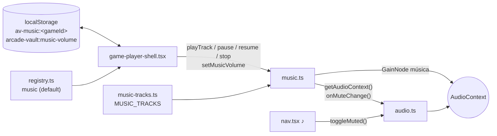

# SPEC 13 — Música de fondo en los juegos

> **Estado:** aprobado

> **Depende de:** 08-libreria-sonido-motores-v0.2.2 (`audio.ts`, mute global), 12-controles-tactiles-movil-v0.4.0 (HUD táctil)
> **Fecha:** 2026-10-03
> **Versión:** 0.4.0 → 0.5.0 (minor — funcionalidad nueva visible al usuario)
> **Objetivo:** Que los juegos con motor tengan música de fondo chiptune sintetizada, a volumen medio-bajo por defecto, con un selector de pista y un control de volumen en el reproductor.

## Alcance

**Incluye:**

- `components/games/music.ts` (nuevo): reproductor de música sintetizada sobre el mismo `AudioContext` que los efectos.
  - Toca una pista en bucle (secuenciador de notas con Web Audio).
  - Expone `playTrack` / `pauseMusic` / `resumeMusic` / `stopMusic`.
  - Volumen de música en un `GainNode` propio, de 0 a 100 (por defecto 30), persistido en `localStorage`.
  - Respeta el mute global: con ♪ OFF no suena, y el cambio se aplica en vivo.
- `components/games/music-tracks.ts` (nuevo): catálogo de 4 pistas chiptune, cada una con id, etiqueta y su secuencia de notas.
- `components/games/audio.ts`:
  - Expone el `AudioContext` compartido para que lo use `music.ts`.
  - Agrega una suscripción a cambios de mute, para que la música reaccione al ♪ del nav sin recargar.
  - Los efectos y `beep` no cambian.
- `components/games/registry.ts`: campo opcional `music` con la pista por defecto de cada juego. Un juego sin `music` no tiene música.
- `components/games/game-player-shell.tsx`:
  - Ciclo de vida de la música según la partida: suena al jugar, se pausa en EN PAUSA (incluida la pausa automática), se detiene en game over y vuelve a empezar con JUGAR DE NUEVO.
  - Selector de pista (con la opción SIN MÚSICA) y slider de volumen.
  - En desktop van en línea en el HUD. En táctil, un botón ♫ abre un panel que pausa el juego mientras está abierto.
  - La pista elegida se recuerda por juego.
- `app/globals.css`: estilos del control de música (en línea y panel ♫).
- `app/globals.css` (ajuste pedido durante la implementación): en escritorio, el gabinete CRT limita su ancho según el alto de la ventana (`100dvh`), así la pantalla 4:3 entra entera sin scroll y se reajusta al cambiar el tamaño de la ventana. Lo mismo en pantalla completa.
- `components/games/README.md`: documenta `music` y cómo agregar una pista al catálogo.
- `package.json` / `package-lock.json`: version `0.4.0` → `0.5.0`.
- `CHANGELOG.md`: entrada para `0.5.0` enlazando a este spec.

**Fuera de alcance (para futuros specs):**

- Archivos de audio (MP3/OGG): toda la música es sintetizada.
- Música fuera del reproductor (home, catálogo, menús).
- Los 4 juegos sin motor (mock estático).
- Volumen propio para los efectos o un volumen general: el nuevo control es solo para la música.
- Cualquier cambio en los motores (`*-engine.ts`) o en el contrato `game-engine.ts`.
- Música que reacciona al juego (tempo según nivel, cambios por eventos), crossfade entre pistas y jingles de game over o subida de nivel.
- Editor o importación de pistas por el usuario.

## Modelo de datos

Sin tablas nuevas ni cambios en Supabase. Lo que se persiste va en `localStorage`, en dos claves nuevas.

```ts
// components/games/music-tracks.ts
export const TRACK_IDS = ["bloques", "orbita", "turbo", "jardin"] as const;
export type TrackId = (typeof TRACK_IDS)[number];
/** Lo que elige el jugador en el selector: una pista o ninguna. */
export type MusicChoice = TrackId | "none";

/** [altura MIDI (60 = Do central) o null = silencio, duración en tiempos]. */
export type Note = readonly [pitch: number | null, beats: number];

export type Voice = {
  wave: OscillatorType; // "square" | "triangle" | "sawtooth" | "sine"
  gain: number; // volumen relativo de la voz dentro de la pista (0–1)
  notes: readonly Note[];
};

export type MusicTrack = {
  id: TrackId;
  label: string; // etiqueta del selector, ej. "ÓRBITA"
  bpm: number;
  /** Melodía + bajo (y opcionalmente una 3ª voz). Todas las voces suman la
   * misma cantidad de tiempos: así el bucle cierra sin desfasarse. */
  voices: readonly Voice[];
};

export const MUSIC_TRACKS: Record<TrackId, MusicTrack>;

// components/games/music.ts
export function playTrack(id: TrackId): void; // empieza desde el inicio
export function pauseMusic(): void; // recuerda la posición
export function resumeMusic(): void; // sigue desde donde quedó
export function stopMusic(): void;
export function getMusicVolume(): number; // 0–100
export function setMusicVolume(volume: number): void;

// components/games/audio.ts (agregados)
export function getAudioContext(): AudioContext | null; // el singleton actual, ahora exportado
export function onMuteChange(listener: (muted: boolean) => void): () => void;

// components/games/registry.ts
export type GameRegistration = {
  // ...campos actuales
  music?: TrackId; // pista por defecto del juego (nuevo)
};
```

**Catálogo inicial (composiciones originales):**

| id        | Etiqueta | Carácter                                          | BPM | Default de    |
| --------- | -------- | ------------------------------------------------- | --- | ------------- |
| `bloques` | BLOQUES  | Puzzle: melodía saltarina en menor, onda cuadrada | 140 | CAÍDA         |
| `orbita`  | ÓRBITA   | Espacial: arpegios lentos, onda triangular        | 96  | ROCAS         |
| `turbo`   | TURBO    | Arcade movido: bajo pulsante, melodía rápida      | 160 | BLOQUE BUSTER |
| `jardin`  | JARDÍN   | Relajada: tonalidad mayor, notas largas           | 110 | SERPENTINA    |

**Persistencia (`localStorage`):**

| Clave                       | Valor                        | Default                                                                            |
| --------------------------- | ---------------------------- | ---------------------------------------------------------------------------------- |
| `arcade-vault:music-volume` | entero 0–100, en pasos de 10 | `30`                                                                               |
| `av-music:<gameId>`         | `TrackId` o `"none"`         | el `music` del juego en `registry.ts`. Un valor inválido o ausente cae al default. |

**Volumen efectivo:** `musicGain = muted ? 0 : (volume / 100) * MUSIC_MAX_GAIN`, con `MUSIC_MAX_GAIN = 0.25`. Ese tope evita que la música al 100 % tape los efectos, que usan una ganancia de ~0,12–0,15.

**Ciclo de vida en `game-player-shell.tsx`:**

| Evento                                        | Música                                                                              |
| --------------------------------------------- | ----------------------------------------------------------------------------------- |
| El motor arranca (`phase: "playing"`)         | `playTrack(choice)` si `choice !== "none"`                                          |
| `playing → paused` (botón o pausa automática) | `pauseMusic()`                                                                      |
| `paused → playing`                            | `resumeMusic()`                                                                     |
| `→ gameover`                                  | `stopMusic()`                                                                       |
| JUGAR DE NUEVO                                | `playTrack(choice)` desde el inicio                                                 |
| Cambio de pista en el selector                | Jugando: `playTrack(nueva)`. En pausa: se toca al reanudar. `"none"`: `stopMusic()` |
| Salir del reproductor (desmontaje)            | `stopMusic()`                                                                       |
| ♪ OFF / ON en el nav                          | `onMuteChange` → la ganancia pasa a 0 o vuelve, sin cortar la pista                 |



Convenciones:

- Secuenciador con _lookahead_: un timer cada ~25 ms agenda las notas de los próximos ~100 ms con `audioCtx.currentTime`. Así el tempo no depende de los FPS del juego ni de los tirones del timer.
- El `AudioContext` es compartido con los efectos, así que pausar la música nunca suspende el contexto: solo deja de agendar notas y recuerda en qué tiempo quedó.
- Mientras el contexto está suspendido (antes del primer gesto), su reloj no avanza y no se agenda nada. La música arranca sola con la primera tecla o toque, que reanuda el contexto.

## Plan de implementación

Cada paso termina con algo que se puede abrir en la app y escuchar o ver. Los pasos 1–4 se prueban en el navegador del PC. El paso 5 se prueba con DevTools en modo dispositivo (`Ctrl+Shift+M`) o desde el celular.

1. **Primera música sonando (CAÍDA):**
   - `audio.ts`: exportar `getAudioContext()` (el singleton actual) y agregar `onMuteChange()`, que `setMuted` notifica.
   - `music-tracks.ts`: tipos `TrackId`, `MusicChoice`, `Note`, `Voice`, `MusicTrack`, con solo la pista `bloques` compuesta. `TRACK_IDS` ya lista las 4.
   - `music.ts`: secuenciador con lookahead, `GainNode` de música, `playTrack` / `stopMusic`, y volumen fijo por defecto (30) leído y guardado en `arcade-vault:music-volume`.
   - `registry.ts`: campo `music?: TrackId`, con `music: "bloques"` solo en CAÍDA.
   - Shell: `playTrack` cuando el motor arranca y `stopMusic` al desmontar.

   Prueba manual: abrir CAÍDA y presionar una tecla. Suena BLOQUES en bucle a volumen bajo, y al hacer clic en SALIR se calla.

2. **Ciclo de vida completo y mute:**
   - Shell: `pauseMusic` / `resumeMusic` / `stopMusic` / `playTrack` según la tabla del Modelo de datos (pausa, pausa automática, game over, JUGAR DE NUEVO).
   - `music.ts`: suscripción a `onMuteChange`, así ♪ OFF/ON cambia la ganancia en vivo.

   Prueba manual: PAUSA calla la música y REANUDAR sigue desde donde quedó. Cambiar de pestaña la calla. FIN la detiene y JUGAR DE NUEVO la arranca desde el inicio. ♪ OFF en el nav la calla al instante y ♪ ON la devuelve.

3. **Catálogo completo:** componer `orbita`, `turbo` y `jardin` en `music-tracks.ts`, y declarar `music` en ROCAS, BLOQUE BUSTER y SERPENTINA según la tabla. Prueba manual: cada uno de los 4 juegos tiene su propia música y todas cierran el bucle sin cortes ni desfase.
4. **Controles en desktop:**
   - En el HUD, un desplegable de pista (las 4 + SIN MÚSICA) y un slider de volumen de 0 a 100 en pasos de 10 (diseñados con `/frontend-design`, con la estética del HUD).
   - Pista por juego en `av-music:<gameId>`, leída en el efecto que crea el motor (nunca en el render, por la hidratación).

   Prueba manual: cambiar de pista en plena partida cambia la música al instante. SIN MÚSICA la calla. Mover el slider cambia el volumen en vivo, y en 0 no suena. Al recargar, se recuerdan la pista de ese juego y el volumen.

5. **Controles en táctil:**
   - En táctil, en vez de los controles en línea, un ícono ♫ junto a ❚❚ ■ ⤢ ✕ que abre un panel con el mismo desplegable y slider.
   - Abrir el panel pausa el juego si estaba corriendo. Al cerrarlo, se reanuda solo si lo pausó el panel.

   Prueba manual: en DevTools modo dispositivo, en vertical y en horizontal, ♫ abre el panel sobre el juego, se puede cambiar pista y volumen con el dedo, y al cerrarlo el juego sigue. Ningún control se sale de pantalla.

6. **Documentación y versión:**
   - `components/games/README.md`: describir `music` en la receta para agregar un juego y cómo componer y agregar una pista al catálogo (notas MIDI, voces de igual duración).
   - `package.json` / `package-lock.json` pasan de `0.4.0` a `0.5.0`.
   - Agregar la entrada `0.5.0` en `CHANGELOG.md` enlazando a este spec.

   Prueba manual: el Footer muestra `v0.5.0`.

## Criterios de aceptación

### Reproducción

- [ ] En los 4 juegos con motor suena su pista por defecto (CAÍDA → BLOQUES, ROCAS → ÓRBITA, BLOQUE BUSTER → TURBO, SERPENTINA → JARDÍN), a partir de la primera tecla o toque.
- [ ] Cada pista suena en bucle continuo durante al menos 3 vueltas, sin cortes, silencios no compuestos ni desfase entre melodía y bajo.
- [ ] Sin preferencia guardada, el volumen de música arranca en 30.
- [ ] Con la música al volumen por defecto, los efectos de sonido del juego se siguen distinguiendo con claridad.
- [ ] El tempo de la música no cambia aunque el juego baje de FPS (comprobado con la CPU frenada 4× en DevTools).
- [ ] En un juego sin motor (ej. `/juegos/gloton/jugar`) no suena música.

### Ciclo de vida

- [ ] PAUSA calla la música y REANUDAR la sigue desde donde quedó, no desde el inicio.
- [ ] La pausa automática (cambiar de pestaña o bloquear el celular) también calla la música, y al volver sigue callada hasta tocar REANUDAR.
- [ ] Al pasar a game over (por FIN o por perder) la música se detiene.
- [ ] JUGAR DE NUEVO arranca la música desde el inicio de la pista.
- [ ] Al salir del reproductor (✕ / SALIR, o navegando a otra página) la música se detiene y no sigue sonando en el resto del sitio.

### Controles

- [ ] En desktop, el HUD muestra un desplegable con BLOQUES, ÓRBITA, TURBO, JARDÍN y SIN MÚSICA, más un slider de volumen de 0 a 100 en pasos de 10.
- [ ] Cambiar de pista en plena partida cambia la música al instante, sin reiniciar la partida ni tocar puntaje o vidas.
- [ ] Elegir SIN MÚSICA la calla, y volver a elegir una pista la hace sonar otra vez.
- [ ] Mover el slider cambia el volumen en vivo, y en 0 no se oye nada.
- [ ] Al recargar la página se recuerdan el volumen (global) y la pista elegida para ese juego. Cada juego recuerda su propia pista.
- [ ] Con ♪ OFF en el nav, ni la música ni los efectos suenan. Con ♪ ON, la música vuelve al volumen elegido sin reiniciar la pista.
- [ ] En táctil, el ícono ♫ abre un panel con el desplegable y el slider, operables con el dedo, en vertical y en horizontal, sin que nada se salga de pantalla.
- [ ] En táctil, abrir el panel ♫ pausa la partida. Al cerrarlo, la partida se reanuda solo si la había pausado el panel; si ya estaba en pausa, sigue en pausa.
- [ ] La consola no muestra errores de hidratación ni de audio al cargar el reproductor en móvil o desktop.
- [ ] En escritorio (1280×620, 1366×657, 1536×730, 1920×950), el gabinete CRT entra entero en la ventana sin hacer scroll, también en pantalla completa. Al agrandar o achicar la ventana se reajusta sin recargar.

### Proyecto

- [ ] Ningún archivo `components/games/*/*-engine.ts` ni `components/games/game-engine.ts` cambió (`git diff --stat`).
- [ ] `npx tsc --noEmit`, `npm run lint` y `npm run build` terminan sin errores.
- [ ] `package.json` y `package-lock.json` dicen `0.5.0`, el Footer muestra `v0.5.0` y `CHANGELOG.md` tiene la entrada `0.5.0` enlazando a este spec.
- [ ] `components/games/README.md` documenta `music` y cómo agregar una pista.

## Decisiones

- **Sí:** música sintetizada con Web Audio, sin archivos. Es coherente con los efectos actuales (`audio.ts`), no agrega descargas, no requiere licencias y encaja con la estética chiptune.
- **No:** archivos MP3/OGG. Suenan más ricos, pero hay que conseguir pistas con licencia libre y pesan cientos de KB por pista.
- **Sí:** catálogo compartido de 4 pistas, con un default por juego en `registry.ts` y la elección del jugador recordada por juego. Es el mismo modelo que las skins: el jugador puede cambiar de música, y cada juego conserva su identidad por defecto.
- **No:** pistas propias por juego (cuatro juegos por N pistas). Multiplica la composición sin aportar al jugador más que el catálogo compartido.
- **Sí:** la opción SIN MÚSICA en el selector, además del slider. Callar la música de un juego concreto no debería obligar a bajar el volumen global.
- **Sí:** un volumen de música separado de los efectos, global y persistido. El ♪ del nav sigue siendo un mute de todo. El jugador puede bajar la música sin perder el feedback de los efectos.
- **No:** un volumen general único para música y efectos. No permitiría equilibrarlos entre sí.
- **Sí:** el volumen por defecto en 30, con un tope de ganancia `MUSIC_MAX_GAIN = 0.25`. "Medio bajo" a pedido del usuario. El tope evita que la música al 100 % tape los efectos (~0,12–0,15 de ganancia).
- **Sí:** la música sigue a la partida: se pausa con la pausa, se detiene en game over y arranca desde el inicio con JUGAR DE NUEVO. Música sonando en pausa o en la pantalla de game over molesta, y reanudar desde donde quedó mantiene la continuidad.
- **Sí:** el ciclo de vida lo maneja el shell, a partir de `EngineState.phase`. Los motores no se tocan: la música es de la plataforma, igual que el gamepad del spec 12.
- **Sí:** secuenciador con lookahead sobre `audioCtx.currentTime`, en lugar de agendar notas desde el `requestAnimationFrame` del juego. El tempo queda estable aunque el juego baje de FPS (el problema de rendimiento del spec 12).
- **Sí:** reusar el `AudioContext` de `audio.ts` y pausar dejando de agendar notas, no suspendiendo el contexto. Un solo contexto por página, y pausar la música no apaga los efectos.
- **Sí:** arrancar con el primer gesto, sin forzar el autoplay. Los navegadores bloquean el audio sin un gesto del usuario, y el primer `keydown` o toque ya reanuda el contexto.
- **Sí:** en táctil, un botón ♫ con panel. En desktop, los controles van en línea. El HUD táctil ya va justo de espacio, sobre todo en horizontal.
- **Sí:** el panel ♫ pausa la partida al abrirse y la reanuda al cerrarse solo si fue él quien la pausó. Cambiar de música con el dedo en plena partida haría perder una vida. Si el jugador ya estaba en pausa, cerrar el panel no debe reanudar por sorpresa.
- **Sí:** ajustar el reproductor de escritorio al alto de la ventana en este spec, aunque no es música. El usuario lo pidió durante la implementación: el canvas medía siempre unos 753 px de alto y obligaba a hacer scroll en ventanas típicas. Es solo CSS (`max-width` del `.crt` calculado con `100dvh`).
- **Sí:** implementar después de mergear el spec 12, en una rama nueva desde `master`. Este spec depende del HUD táctil.
- **Sí:** versión minor `0.4.0` → `0.5.0`. Es funcionalidad nueva visible al usuario, con el mismo criterio que la v0.3.0 y la v0.4.0.

## Riesgos

| Riesgo                                                                                                                      | Mitigación                                                                                                                                                              |
| --------------------------------------------------------------------------------------------------------------------------- | ----------------------------------------------------------------------------------------------------------------------------------------------------------------------- |
| La música resulta repetitiva o molesta tras varios minutos (bucles cortos).                                                 | Pistas de al menos 16 compases. Volumen bajo por defecto, SIN MÚSICA y el slider a mano.                                                                                |
| El secuenciador se desincroniza o deja huecos si la pestaña queda en segundo plano (los timers se frenan a ~1 por segundo). | La música se pausa con la pausa automática al ocultar la pestaña. Al reanudar, el secuenciador re-sincroniza contra `audioCtx.currentTime` y no agenda notas atrasadas. |
| Clics o chasquidos al cortar notas, pausar o cambiar de pista.                                                              | Cada nota con una envolvente breve de ataque y caída. `stopMusic` / `pauseMusic` bajan la ganancia en ~30 ms antes de cortar.                                           |
| Muchos osciladores vivos a la vez cargan la CPU en celulares lentos.                                                        | Un oscilador por nota, creado justo antes de sonar y con `stop()` programado. Máximo 3 voces por pista.                                                                 |
| Notas fuera de tiempo o voces desfasadas por un error al componer (voces con duraciones distintas).                         | `music.ts` valida en desarrollo que todas las voces de una pista sumen los mismos tiempos y avisa por consola si no.                                                    |
| La música queda sonando al navegar a otra página (el singleton de módulo sobrevive a la navegación del App Router).         | `stopMusic()` en el cleanup del efecto del shell. Hay un criterio de aceptación que lo verifica.                                                                        |
| `localStorage` bloqueado (modo privado estricto) hace fallar la lectura o escritura de volumen y pista.                     | Lecturas y escrituras en `try/catch`, con los defaults (30 y el `music` del registro) si fallan. La música suena igual, solo que no se recuerda.                        |
| iOS Safari en modo silencio (switch físico) no reproduce audio de Web Audio.                                                | Aceptado: es comportamiento del sistema y pasa igual con los efectos actuales.                                                                                          |

## Lo que **no** entra en este spec

- Archivos de audio (MP3/OGG).
- Música fuera del reproductor (home, catálogo, menús).
- Música para los 4 juegos sin motor.
- Volumen propio para los efectos o un volumen general.
- Cambios en los motores o en `game-engine.ts`.
- Música que reacciona al juego, crossfade y jingles.
- Editor o importación de pistas.

Cada uno de esos, si llega, va en su propio spec.
