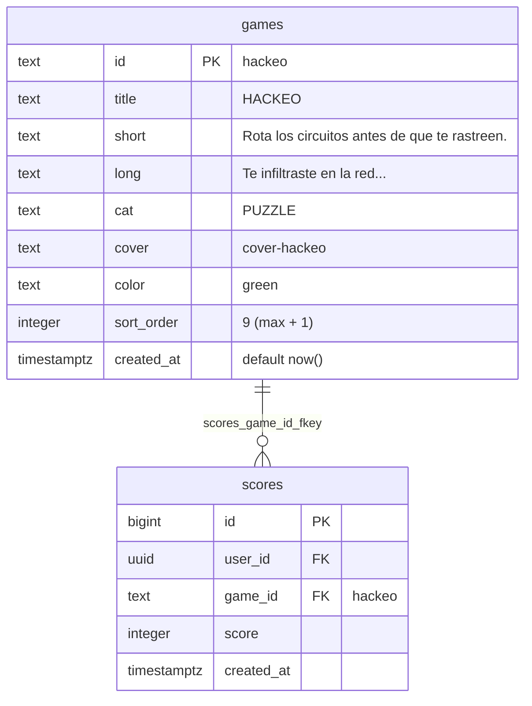
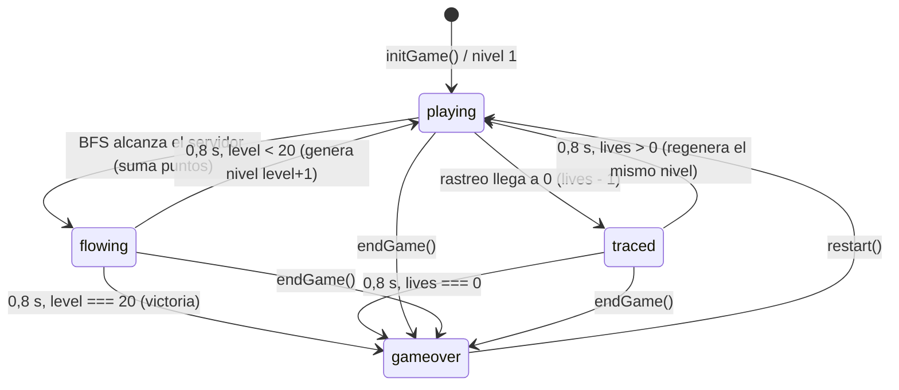
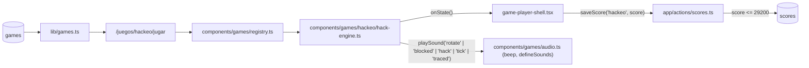

# SPEC GAME-JAM — HACKEO (cyberpunk)

> **Estado:** Borrador
> **Tema:** cyberpunk
> **Depende de:** 05-rocas-asteroids-motor, 06-ranking-global-catalogo-juegos-v0.2.0, 11-score-plausibility-caps-v0.2.5
> **Fecha:** 2026-09-27
> **Versión:** a asignar al promover (minor — package.json es la fuente de verdad)
> **Objetivo:** Agregar al catálogo HACKEO, un puzzle de rotar casillas de circuito para enlazar la terminal con el servidor antes de que se agote el rastreo, escrito desde cero con su fila en `games`, su portada y su motor real.

## Alcance

**Incluye:**

- `components/games/hackeo/hack-engine.ts`: motor que exporta `createHackEngine: EngineFactory`, escrito desde cero (no hay fuente en `references/started-games/`). Grilla de casillas de circuito de 64px, de 6×4 a 10×7 según el nivel, 20 niveles fijos (ver Modelo de datos). Sonidos propios declarados dentro del motor con `defineSounds` + `beep` de `components/games/audio.ts` — `audio.ts` no se modifica.
- `components/games/registry.ts`: agrega la entrada `hackeo: { load: () => import("./hackeo/hack-engine").then((m) => m.createHackEngine), maxPlausibleScore: 29_200 }` — tope **exacto** (el juego tiene un final enumerable de 20 niveles, ver cálculo en Modelo de datos), mismo criterio que `bloque-buster` en spec `11-score-plausibility-caps-v0.2.5`.
- `sql/00N_add_game_hackeo.sql` (N = siguiente número libre de `sql/` al implementar; hoy sería `005`): `insert ... on conflict (id) do nothing` de la fila `hackeo` en `games` — idempotente, nunca un `INSERT` a secas ni un `DROP`/`UPDATE` de filas existentes. Aplicado al proyecto real vía el MCP de Supabase (`apply_migration`), igual que specs 04/05/06.
- `app/globals.css`: bloque `.cover-hackeo` en la sección "Cover art generators".
- `package.json`: bump **minor** sobre la versión vigente al promover (hoy `0.2.5` → `0.3.0`).
- `CHANGELOG.md`: entrada para esa versión enlazando a este spec.
- `references/juegos-implementados.md`: fila nueva `hackeo` con motor ✅ (regla de `CLAUDE.md`).

**Fuera de alcance (para futuros specs):**

- Controles táctiles/móvil dedicados (un toque genera `pointerdown` con `button === 0` y rota en sentido horario "gratis", pero no se diseña ni se prueba para móvil — no hay giro antihorario táctil).
- Audio con archivos (`.mp3`/`.wav`) — los sonidos se sintetizan con `beep`.
- `devicePixelRatio` / escalado por densidad de píxeles.
- Modo sin fin después del nivel 20.
- Mecánica de "flujo que avanza por las casillas" al estilo Pipe Mania estricto (el líquido recorriendo el circuito mientras se arma) — el rastreo es un temporizador por nivel (ver Decisiones).
- Casillas con tipos especiales (bonus, casillas que se rotan solas, cortafuegos móviles).
- Bonus por eficiencia de rotaciones o por "combo" de niveles sin perder vidas.
- Validación en build de que cada clave de `registry.ts` tenga fila en `games`.
- Cambios a `game-player-shell.tsx`, `game-engine.ts` o `app/actions/scores.ts` — el contrato ya cubre este juego sin tocarlos.

## Modelo de datos

Sin nuevas tablas — reusa `scores`/`games` de specs 04/06. Agrega **una fila** a `games` (caso C).

**Fila nueva en `games`:**

| Columna      | Valor                                                                                                                                                                                                                                                                |
| ------------ | -------------------------------------------------------------------------------------------------------------------------------------------------------------------------------------------------------------------------------------------------------------------- |
| `id`         | `hackeo`                                                                                                                                                                                                                                                             |
| `title`      | `HACKEO`                                                                                                                                                                                                                                                             |
| `short`      | `Rota los circuitos antes de que te rastreen.`                                                                                                                                                                                                                       |
| `long`       | `Te infiltraste en la red de una megacorporación. Rota cada casilla de circuito para enlazar tu terminal con el servidor antes de que el rastreo te encuentre. Cada intrusión exitosa abre una red más grande, con menos tiempo y cortafuegos que bloquean el paso.` |
| `cat`        | `PUZZLE`                                                                                                                                                                                                                                                             |
| `cover`      | `cover-hackeo`                                                                                                                                                                                                                                                       |
| `color`      | `green`                                                                                                                                                                                                                                                              |
| `sort_order` | `9` (máximo actual `8` según `sql/004_recreate_games_table.sql` + 1 — **recalcular al implementar** contra la base real: otra spec de esta misma jam puede haber tomado el 9 antes)                                                                                  |

**Portada (`.cover-hackeo`, sección "Cover art generators" de `app/globals.css`):** fondo `linear-gradient(135deg, #00261a, #0a0a18)` (mismo patrón oscuro-a-`#0a0a18` que `.cover-snake`). En `::after`, un trazo de circuito en `var(--green)` hecho con `linear-gradient` de 6px de grosor: tramo horizontal desde el borde izquierdo al 35% del ancho, tramo vertical hacia abajo, tramo horizontal hasta el borde derecho — un camino en escalón como el de una partida resuelta. En los extremos, dos nodos `radial-gradient`: la terminal de entrada en `var(--cyan)` (izquierda) y el servidor en `var(--magenta)` (derecha). `filter: drop-shadow(0 0 6px rgba(0,255,136,0.6))` para el brillo neón. Opcional en `::before`: una retícula tenue de casillas (`repeating-linear-gradient` de `var(--ink)` a baja opacidad) insinuando la grilla. Sin imágenes.

**Casillas y grilla:**

Cada casilla es una máscara de 4 bits de conexiones: `N = 1`, `E = 2`, `S = 4`, `W = 8`. Rotar 90° en sentido horario es una rotación de los 4 bits (`N→E→S→W→N`).

| Tipo       | Máscara base   | Rotaciones distintas | Uso                                                                               |
| ---------- | -------------- | -------------------- | --------------------------------------------------------------------------------- |
| Recta      | `N+S` (`0101`) | 2                    | Camino y relleno                                                                  |
| Curva      | `N+E` (`0011`) | 4                    | Camino y relleno                                                                  |
| T          | `N+E+S`        | 4                    | Camino (reemplaza a recta/curva con probabilidad 15%) y relleno                   |
| Cruce      | `N+E+S+W`      | 1                    | Camino (probabilidad 5%) y relleno raro; rotarlo no cambia nada (válido)          |
| Cortafuego | `0000`         | —                    | Casilla bloqueada: no conecta, no rota; solo fuera del camino solución (nivel 3+) |

La **terminal de entrada** es un nodo fijo pegado al lado `W` de la casilla `(0, filaEntrada)`; el **servidor** es un nodo fijo pegado al lado `E` de la casilla `(cols-1, filaSalida)`. Ambos se dibujan fuera de la grilla, en el margen.

**Generación de cada nivel (garantiza que siempre hay solución):**

1. Sortear `filaEntrada` y `filaSalida` al azar.
2. Trazar un camino auto-evitante de `(0, filaEntrada)` a `(cols-1, filaSalida)` con DFS aleatorio con backtracking. Si el camino ocupa más del 60% de las casillas, reintentar (hasta 50 intentos; después se acepta el último).
3. Cada casilla del camino recibe la máscara exacta que une su lado de entrada con su lado de salida (recta o curva); con 15% de probabilidad se promueve a T y con 5% a cruce — una T o un cruce siempre tienen una rotación que contiene cualquier par de lados, así que la solución se preserva.
4. Las casillas fuera del camino se rellenan al azar (recta 35%, curva 35%, T 25%, cruce 5%).
5. Se convierten en cortafuegos `firewalls(level)` casillas al azar **fuera del camino**.
6. Cada casilla no-cortafuego recibe 0–3 rotaciones aleatorias. Si el resultado ya está resuelto, se vuelve a rotar al azar (hasta que no lo esté).

**Conexión:** después de cada rotación se corre un BFS desde la casilla de entrada (si tiene abierto su lado `W`), avanzando solo entre casillas vecinas con **aberturas enfrentadas** (la abertura `E` de una y la `W` de la de su derecha, etc.). Las aberturas que apuntan al vacío o a un cortafuego ("fugas") están permitidas y no penalizan. El nivel se completa cuando el BFS alcanza la casilla del servidor con su lado `E` abierto. Las casillas alcanzadas por el BFS se dibujan "energizadas" (trazo `--green` con glow); el resto, apagadas (trazo gris-verde tenue).

**Tabla de dificultad por nivel (20 niveles fijos):**

| Nivel | Grilla (cols×filas) | Rastreo `T(level)` (s) | Cortafuegos                  |
| ----- | ------------------- | ---------------------- | ---------------------------- |
| 1–2   | 6×4                 | `60 − 2·(level−1)`     | 0                            |
| 3–5   | 7×5                 | ídem                   | `floor((level−1)/2)`         |
| 6–9   | 8×5                 | ídem                   | ídem                         |
| 10–14 | 9×6                 | ídem                   | ídem                         |
| 15–20 | 10×7                | ídem                   | ídem (máx. 9 en nivel 19–20) |

`T(level)` va de 60 s (nivel 1) a 22 s (nivel 20). Cortafuegos: nivel 3 → 1, nivel 5 → 2, …, nivel 20 → 9. La grilla más grande (10×7 = 640×448 px) entra centrada en 800×600 dejando 80 px por lado para los nodos de entrada/servidor y una franja superior para la barra de rastreo.

**Tabla de puntuación:**

| Evento                              | Puntos                                        |
| ----------------------------------- | --------------------------------------------- |
| Nivel completado (enlace logrado)   | `+100 × level`                                |
| Bonus de rastreo al completar nivel | `+10 × floor(segundosRestantes)`              |
| Rastreo agotado (vida perdida)      | `0` (no resta; se pierde la vida y el tiempo) |

Todos los valores son enteros (`floor` sobre el tiempo restante); `score` nunca se escribe con un valor derivado de una división sin `floor`.

**`maxPlausibleScore` = 29 200 (exacto, cota superior):**

- Suma de "nivel completado": `100 × (1 + 2 + … + 20) = 100 × 210 = 21 000`.
- Suma de bonus de rastreo, con el tiempo restante acotado por `T(level)`: `10 × Σ T(level) = 10 × (20·60 − 2·(0+1+…+19)) = 10 × (1 200 − 380) = 8 200`.
- Perder una vida reinicia el nivel sin sumar nada, así que no hay forma de sumar dos veces el mismo nivel.
- Total: `21 000 + 8 200 = 29 200`. Inalcanzable en la práctica (exigiría resolver cada nivel en 0 s), pero es un techo matemático exacto — ningún score legítimo lo supera.

**Mapeo a `EngineState`:**

| Campo   | Valor                                                                                                                                                                                                                                                             |
| ------- | ----------------------------------------------------------------------------------------------------------------------------------------------------------------------------------------------------------------------------------------------------------------- |
| `score` | Acumulado según la tabla de puntuación. Nunca se resetea al perder una vida — solo en `restart()`.                                                                                                                                                                |
| `lives` | Arranca en `3`. Cuando el rastreo llega a 0 se resta 1 vida y **el mismo nivel** se regenera con una grilla nueva y el rastreo completo `T(level)`. Llega a `0` → `phase: "gameover"`.                                                                            |
| `level` | Nivel actual, `1` a `20`. Sube en 1 al completar un nivel (tras la animación de flujo). Al completar el nivel 20 no sube más: la partida termina en victoria.                                                                                                     |
| `badge` | ``{ label: "RASTREO", value: `${Math.ceil(restante)}s` }`` — segundos que quedan de rastreo. Cambia como mucho una vez por segundo, así que `onState` sigue disparándose solo ante cambios reales (no por frame).                                                 |
| `phase` | `"paused"` si `isPaused`; `"gameover"` si `internalPhase === "gameover"` (vidas en 0, victoria tras el nivel 20, o `endGame()`); si no, `"playing"` — incluye los estados internos `"flowing"` y `"traced"`, que son animaciones breves con el rastreo congelado. |

**Estados internos** (más granulares que `EnginePhase`, colapsados en `currentPhase()`):

- `"flowing"`: el enlace está hecho; se anima un pulso de datos (punto brillante `--cyan`) recorriendo el camino energizado de la entrada al servidor durante 0,8 s. Input ignorado, rastreo congelado.
- `"traced"`: el rastreo alcanzó al jugador; la grilla parpadea en `--magenta` durante 0,8 s. Input ignorado.

**Controles:**

| Input                                    | Acción                                                                                     | `preventDefault`                                                |
| ---------------------------------------- | ------------------------------------------------------------------------------------------ | --------------------------------------------------------------- |
| Clic izquierdo (`button === 0`)          | Rota la casilla bajo el puntero 90° en sentido horario y mueve el cursor a esa casilla     | No (es el canvas)                                               |
| Clic derecho (`button === 2`)            | Rota la casilla bajo el puntero 90° en sentido antihorario y mueve el cursor a esa casilla | Sí, en `contextmenu` del canvas (no abre el menú del navegador) |
| `ArrowUp/Down/Left/Right` / `KeyW/A/S/D` | Mueve el cursor de teclado una casilla (se detiene en los bordes, no hace wrap)            | Sí                                                              |
| `Space` / `Enter` / `KeyE`               | Rota la casilla del cursor en sentido horario                                              | Sí (`Space`, `Enter`)                                           |
| `KeyQ`                                   | Rota la casilla del cursor en sentido antihorario                                          | No                                                              |

- Puntero con `pointerdown` sobre el canvas, convirtiendo `clientX/clientY` al espacio interno 800×600 con `getBoundingClientRect()` + escala (`motor-referencia.md` §3.8). Un clic fuera de la grilla no hace nada.
- Clic o tecla sobre un cortafuego: no rota, suena `blocked`.
- El cursor de teclado se dibuja siempre (marco `--yellow` alrededor de la casilla), arranca en la casilla de entrada al generar cada nivel.
- Sin tecla de pausa propia — la pausa es del shell.

**Sonido (declarado dentro del motor con `defineSounds`; `audio.ts` no se modifica):**

| Preset    | Dispara en                                                                        | Síntesis orientativa                                                  |
| --------- | --------------------------------------------------------------------------------- | --------------------------------------------------------------------- |
| `rotate`  | Cada rotación efectiva de una casilla.                                            | `beep(520, 0.04, "square", 0.08)`                                     |
| `blocked` | Intento de rotar un cortafuego.                                                   | `beep(110, 0.08, "sawtooth", 0.12)`                                   |
| `hack`    | El BFS alcanza el servidor (nivel completado, incluida la victoria del nivel 20). | Arpegio ascendente `beep(440)` → `beep(660)` → `beep(880)`, triangle  |
| `tick`    | Cada segundo entero de rastreo cuando quedan ≤ 5 s.                               | `beep(1000, 0.03, "square", 0.06)`                                    |
| `traced`  | El rastreo llega a 0 (vida perdida, incluida la última).                          | `beep(160, 0.3, "sawtooth", 0.18)` + `beep(80, 0.35, "square", 0.15)` |

**Resolución:** nativa 800×600, sin letterbox. Casilla fija de 64 px; la grilla del nivel se centra horizontal y verticalmente (debajo de una franja de ~48 px reservada arriba para la barra de rastreo). La barra de rastreo es **gráfica, sin texto** (un rectángulo `--green` que se vacía y pasa a `--magenta` en los últimos 5 s) — el número de segundos vive en el `badge` del HUD del shell.

**Assets:** ninguno binario. Casillas, nodos, cortafuegos (casilla con una `X` o rayado `--magenta`), cursor y pulso de datos se dibujan con primitivas de canvas (`lineTo`, `arc`, `fillRect`, `shadowBlur`).

## Plan de implementación

1. `sql/00N_add_game_hackeo.sql` (N = siguiente libre en `sql/`) con `insert into games (id, title, short, long, cat, cover, color, sort_order) values (...) on conflict (id) do nothing` de la fila de la tabla de arriba, con `sort_order` = máximo real + 1. Aplicar con el MCP de Supabase (`apply_migration`) y verificar con `list_tables`/`get_advisors`. Test manual: `select * from games where id = 'hackeo'` devuelve la fila.
2. Bloque `.cover-hackeo` en `app/globals.css`, sección "Cover art generators" (fondo + trazo de circuito en escalón + nodos cyan/magenta, ver Modelo de datos). Test manual: `/games` muestra la card de HACKEO con su portada (todavía sin motor, `/juegos/hackeo/jugar` muestra el mock).
3. Esqueleto del motor en `components/games/hackeo/hack-engine.ts`: factory, `ctx`, `defineSounds` con los 5 presets, los 6 métodos de `EngineHandle` con sus guardas de idempotencia (`motor-referencia.md` §2), loop RAF con `dt` topado a 0,05 s, `reportState()` con diff campo por campo (incluido `badge.value`), listeners nombrados (`handleKeyDown`, `handlePointerDown`, `handleContextMenu`) que `destroy()` saca. Test manual: `npm run lint`.
4. Modelo de casillas y dibujo: máscaras de 4 bits, rotación CW/CCW por rotación de bits, tabla de dificultad por nivel, layout centrado de la grilla, dibujo de casillas apagadas, cortafuegos, nodos de entrada/servidor y cursor. Grilla fija de prueba, sin generación todavía. Test manual: se ve una grilla 6×4 con los nodos en los márgenes.
5. Generación de nivel: DFS aleatorio con backtracking para el camino, máscaras del camino con promoción a T/cruce, relleno, cortafuegos fuera del camino, scramble de rotaciones que no deja el nivel resuelto. Test manual: recargar varias veces y confirmar grillas distintas; con un log temporal, confirmar que el camino solución va de la entrada al servidor.
6. Input de puntero: `pointerdown` con conversión de coordenadas al espacio 800×600, clic izquierdo CW, clic derecho CCW, `contextmenu` con `preventDefault()` en el canvas, `blocked` sobre cortafuegos, `rotate` en rotación efectiva. Test manual: con la ventana redimensionada (canvas escalado), el clic rota exactamente la casilla bajo el puntero; el clic derecho no abre el menú contextual.
7. Input de teclado: cursor con flechas/WASD (sin wrap), `Space`/`Enter`/`KeyE` CW, `KeyQ` CCW, `preventDefault()` en flechas, `Space` y `Enter`. Test manual: resolver un nivel solo con teclado sin que la página scrollee.
8. Conexión y completado: BFS tras cada rotación, casillas energizadas iluminadas, detección de enlace → suma `100 × level + 10 × floor(restante)`, `hack`, estado `"flowing"` de 0,8 s con el pulso de datos recorriendo el camino, luego nivel siguiente. Test manual: completar el nivel 1 y confirmar el score exacto (ej. 100 + 10 × segundos restantes que muestra el badge) y que `level` pasa a 2 con grilla nueva.
9. Rastreo: cuenta regresiva `T(level)` escalada por `dt`, barra gráfica arriba de la grilla, `badge` `RASTREO` con `Math.ceil`, `tick` en los últimos 5 s, al llegar a 0 → `lives − 1`, `traced`, estado `"traced"` de 0,8 s, regeneración del mismo nivel con rastreo completo; `lives === 0` → `"gameover"`. Test manual: dejar correr el rastreo 3 veces — la partida sigue tras la 1ª y la 2ª y abre el modal en la 3ª, con el score conservado.
10. Progresión y victoria: tamaños de grilla y cortafuegos según la tabla, fin de partida tras el `"flowing"` del nivel 20 (`internalPhase = "gameover"`, `level` queda en 20). Test manual: con una constante temporal de "nivel inicial" (revertida antes del commit), arrancar en el nivel 19 y confirmar grilla 10×7 con 9 cortafuegos, y que completar el 20 abre el modal de fin.
11. Entrada en `components/games/registry.ts`: `hackeo: { load: () => import("./hackeo/hack-engine").then((m) => m.createHackEngine), maxPlausibleScore: 29_200 }`. Test manual: `/juegos/hackeo/jugar` muestra el motor real en vez del mock.
12. `package.json` bump minor + entrada en `CHANGELOG.md` + fila `hackeo` en `references/juegos-implementados.md`. Test manual: el Footer muestra la versión nueva.
13. Verificación end-to-end vía Playwright MCP contra `npm run dev`: partida real con mouse y con teclado, completar al menos 2 niveles, perder las 3 vidas por rastreo hasta el game over real; con sesión activa, confirmar fila nueva en `scores` y su reflejo en `/juegos/hackeo`, `/games` y `/salon-de-la-fama`; confirmar aislamiento del chunk, ausencia de fugas de listeners/RAF al entrar y salir varias veces, y los 5 sonidos interceptando `AudioContext`. Además `npm run lint` y `npm run build` sin errores. Test manual: partida completa hasta game over, puntaje guardado y visible en las tres páginas.

## Criterios de aceptación

- [ ] La fila `hackeo` existe en `games` con los 7 valores de la tabla, insertada con `on conflict (id) do nothing`.
- [ ] `/games` muestra la card de HACKEO con la portada `.cover-hackeo` (trazo de circuito verde y nodos cyan/magenta, sin imágenes).
- [ ] El motor exporta `createHackEngine` cumpliendo `EngineFactory`.
- [ ] `registry.ts` carga el motor con `import()` dinámico (no import estático) y declara `maxPlausibleScore: 29_200`.
- [ ] Cada nivel generado tiene solución (existe una combinación de rotaciones que enlaza entrada y servidor) y nunca arranca ya resuelto.
- [ ] Los cortafuegos nunca caen sobre el camino solución, no rotan, y aparecen a partir del nivel 3 en la cantidad de la tabla.
- [ ] Clic izquierdo rota la casilla bajo el puntero en sentido horario y clic derecho en antihorario, con la casilla correcta aunque el canvas esté escalado por CSS; el clic derecho no abre el menú contextual.
- [ ] Flechas/WASD mueven el cursor, `Space`/`Enter`/`KeyE` rotan CW y `KeyQ` CCW; ninguna de esas teclas scrollea la página.
- [ ] Las casillas conectadas a la entrada se dibujan energizadas y se actualizan tras cada rotación.
- [ ] Enlazar entrada y servidor suma exactamente `100 × level + 10 × floor(segundosRestantes)`, siempre entero, y avanza al nivel siguiente con una grilla nueva.
- [ ] El rastreo cuenta hacia atrás desde `T(level) = 60 − 2·(level−1)` s; el `badge` "RASTREO" muestra los segundos restantes y se actualiza como mucho una vez por segundo.
- [ ] Agotar el rastreo resta 1 vida, suena `traced` y regenera el mismo nivel con rastreo completo, sin tocar `score` ni `level`.
- [ ] Con `lives === 0` la partida pasa a `phase: "gameover"` y abre el modal de fin.
- [ ] Completar el nivel 20 termina la partida como `"gameover"` (victoria) y dispara el guardado del score.
- [ ] Durante las animaciones `"flowing"` y `"traced"` el input se ignora y el rastreo no corre.
- [ ] El HUD (`player-hud`) refleja score/vidas/nivel reales del motor, nada hardcodeado.
- [ ] El canvas no dibuja su propio texto de HUD ni overlay de pausa/game over (la barra de rastreo es gráfica, sin números).
- [ ] PAUSA congela la simulación real (el RAF se cancela, el rastreo no avanza).
- [ ] REANUDAR continúa sin salto: el rastreo no descuenta el tiempo que estuvo en pausa.
- [ ] FIN fuerza game over con el score actual en cualquier momento, incluso durante `"flowing"`/`"traced"` o con el juego pausado.
- [ ] Con sesión activa, una partida terminada crea exactamente una fila nueva en `scores`.
- [ ] Sin sesión, el modal muestra el CTA a `/auth` y no se guarda nada.
- [ ] Si el guardado falla, se muestra el error con botón REINTENTAR.
- [ ] "JUGAR DE NUEVO" reinicia el motor (score 0, 3 vidas, nivel 1, grilla nueva) sin remontar el componente.
- [ ] "VOLVER AL VAULT" navega a `/juegos/hackeo`.
- [ ] Salir de la página cancela el RAF y saca los listeners de teclado, `pointerdown` y `contextmenu` del motor (sin fugas al entrar/salir repetidas veces).
- [ ] Visitar otro juego no descarga el chunk de `hack-engine.ts`.
- [ ] `/juegos/hackeo` ("Mejor global", "Partidas") y `/salon-de-la-fama` (tab HACKEO y tab GLOBAL) reflejan la partida sin intervención manual.
- [ ] `rotate`/`blocked`/`hack`/`tick`/`traced` suenan en sus eventos; con mute activo, ninguno produce nodos de audio.
- [ ] El motor no lee `localStorage` ni toca el DOM fuera del canvas recibido.
- [ ] `npm run lint` y `npm run build` sin errores.
- [ ] La fila de `games` tiene RLS de solo lectura (heredada de la tabla) y `get_advisors` no reporta hallazgos nuevos.

## Decisiones

- **Sí:** el jugador **rota** casillas ya colocadas (estilo _Pipes_/_Net_), en vez de colocar piezas de una cola como Pipe Mania clásico. _Decidido por game-jam — revisar._ Es el concepto asignado, garantiza solución por construcción (generador de camino + scramble) y es más barato que la cola + colocación. Diferencia explícita con **CAÑERÍA** de `references/candidatos-juegos.md` (Pipe Mania con cola, "Con reservas", pendiente): si se implementa HACKEO, CAÑERÍA pasa a superponerse bastante y conviene re-evaluarla con `@game-planner`.
- **Sí:** el "rastreo" es un **temporizador por nivel** con barra gráfica, no un flujo de datos que avanza por las casillas mientras se arma el circuito. _Decidido por game-jam — revisar._ Un flujo progresivo obliga a resolver casillas en orden y a manejar derrames — mucho más motor para una sesión corta; el temporizador conserva la presión y deja el "flujo" como recompensa visual (`"flowing"`, 0,8 s).
- **Sí:** 20 niveles fijos con victoria al completar el 20, mapeada a `"gameover"`. _Decidido por game-jam — revisar._ Da un final enumerable y, con eso, un `maxPlausibleScore` **exacto** (29 200) en vez de un techo de cordura; mismo criterio que `bloque-buster` (2080). Una partida perfecta dura ~10–15 min, dentro de "sesión corta".
- **Sí:** `lives = 3`; agotar el rastreo resta una vida y **regenera** el mismo nivel (grilla nueva, rastreo completo). _Decidido por game-jam — revisar._ Regenerar en vez de repetir la misma grilla evita que el jugador memorice la solución mientras corre el reloj de la segunda vida.
- **Sí:** puntaje `100 × level + 10 × floor(segundosRestantes)`. _Decidido por game-jam — revisar._ Premia avanzar (peso creciente por nivel) y resolver rápido; sin penalización por rotaciones para no castigar la exploración en un puzzle. Todo entero por construcción.
- **Sí:** `badge` = `RASTREO` con los segundos restantes (`Math.ceil`). _Decidido por game-jam — revisar._ Es el dato crítico que no cabe en score/vidas/nivel, y como el canvas no puede dibujar texto de HUD, el número tiene que vivir en el shell. Cambia 1 vez/s, compatible con la regla de `onState`.
- **Sí:** fugas permitidas — solo importa que exista un camino entrada→servidor por aberturas enfrentadas. _Decidido por game-jam — revisar._ Exigir un circuito sin extremos sueltos (regla de _Net_) vuelve imposibles muchas grillas con relleno aleatorio y obligaría a generar la grilla entera como árbol.
- **Sí:** clic izquierdo CW / clic derecho CCW + cursor de teclado completo. _Decidido por game-jam — revisar._ El mouse es el control natural de un puzzle de grilla; el teclado queda como alternativa completa (accesibilidad y paridad con el resto del catálogo). `preventDefault()` en flechas, `Space` y `Enter` (bug conocido de `rocas`, no repetirlo) y en `contextmenu` del canvas.
- **Sí:** grilla de 6×4 a 10×7 con casilla fija de 64 px. _Decidido por game-jam — revisar._ 10×7 es lo máximo que entra en 800×600 con margen para los nodos y la barra de rastreo sin cambiar el tamaño de casilla (el objetivo del clic no se achica entre niveles).
- **Sí:** cortafuegos solo fuera del camino solución, desde el nivel 3 (`floor((level−1)/2)`, máx. 9). _Decidido por game-jam — revisar._ Aumentan la dificultad cortando atajos sin romper la solubilidad garantizada.
- **Sí:** `cat: PUZZLE`, `color: green`, cover `.cover-hackeo`, `sort_order` = máximo + 1. _Decidido por game-jam — revisar._ Sugeridos en la asignación de la jam; `green` es el verde "terminal" del imaginario hacker. El `sort_order` se recalcula al implementar porque otras specs de la misma jam (`autopista-neon`, `cazadrones`) también son caso C.
- **Sí:** 5 sonidos propios con `defineSounds` dentro del motor. Patrón vigente desde el refactor "cada motor declara sus propios sonidos" — `audio.ts` no se toca.
- **Sí:** bump **minor**. Caso C: agrega un juego nuevo visible al catálogo (plantilla de `/add-game`), a diferencia del patch de specs 09/10 que completaban juegos ya listados.
- **No:** tocar `game-player-shell.tsx`, `game-engine.ts` o `app/actions/scores.ts`. El contrato alcanza: puntero + teclado, estado en `EngineState`, victoria como `"gameover"`.

## Riesgos

| Riesgo                                                                                                       | Mitigación                                                                                                                                                                                              |
| ------------------------------------------------------------------------------------------------------------ | ------------------------------------------------------------------------------------------------------------------------------------------------------------------------------------------------------- |
| Coordenadas de puntero mal escaladas: el clic rota una casilla vecina cuando el canvas está escalado por CSS | Convertir con `getBoundingClientRect()` + `canvas.width / rect.width` (patrón de `motor-referencia.md` §3.8); probar en el paso 6 con la ventana en varios tamaños                                      |
| El generador produce un nivel sin solución (camino mal enmascarado, cortafuego sobre el camino)              | Máscaras del camino derivadas de los lados reales de entrada/salida; cortafuegos sorteados solo entre casillas fuera del camino; en desarrollo, validar con un BFS sobre la solución antes del scramble |
| El scramble deja el nivel ya resuelto (sobre todo en grillas chicas o caminos con muchos cruces)             | Después del scramble correr el BFS; si ya conecta, volver a rotar al azar hasta que no                                                                                                                  |
| DFS aleatorio genera caminos que cubren casi toda la grilla (niveles triviales o tediosos)                   | Reintentar si el camino supera el 60% de las casillas (máx. 50 intentos)                                                                                                                                |
| `resume()` no descuenta bien el rastreo y se come el tiempo de pausa                                         | El rastreo avanza solo con el `dt` del loop, que se topa y se resetea con `lastTime = null` en `resume()`/`restart()`/`endGame()`                                                                       |
| El score deja de ser entero por el bonus de tiempo                                                           | `floor()` sobre los segundos restantes antes de multiplicar; validar con `Number.isInteger(score)` en la verificación                                                                                   |
| Un score legítimo supera `maxPlausibleScore` y `saveScore` lo rechaza                                        | El tope 29 200 es la suma exacta del máximo teórico; si cambia la tabla de dificultad o de puntos, recalcular el tope en el mismo commit                                                                |
| El badge dispara `onState` en cada frame si se reporta el tiempo con decimales                               | `value` usa `Math.ceil(restante)`; `reportState()` compara `badge.value`, así que solo cambia 1 vez por segundo                                                                                         |
| El listener de `contextmenu` queda colgado tras salir de la página                                           | Handler nombrado registrado en el canvas y removido en `destroy()`, igual que `pointerdown` y los de teclado                                                                                            |
| Doble `sort_order = 9` si otra spec de la jam se implementa antes                                            | El paso 1 calcula `max(sort_order) + 1` contra la base real al implementar, no usa el 9 fijo                                                                                                            |

## Lo que **no** está en este spec

- Controles táctiles/móvil dedicados.
- Audio con archivos.
- `devicePixelRatio`.
- Modo sin fin después del nivel 20.
- Flujo de datos que avanza por las casillas al estilo Pipe Mania estricto.
- Casillas especiales (bonus, auto-rotantes, cortafuegos móviles).
- Bonus por eficiencia de rotaciones o por racha de niveles.
- Validación en build de ids de `registry.ts` contra `games`.
- Cambios a `game-player-shell.tsx`, `game-engine.ts` o `app/actions/scores.ts`.

Cada uno de estos, si se implementa, va en su propio spec.
