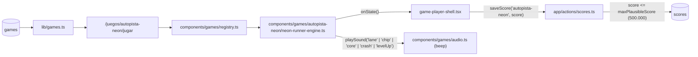
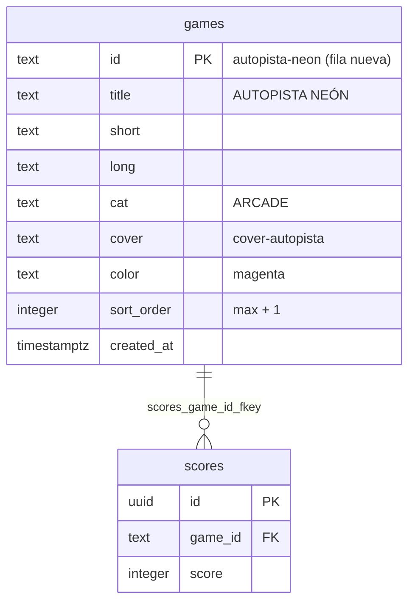
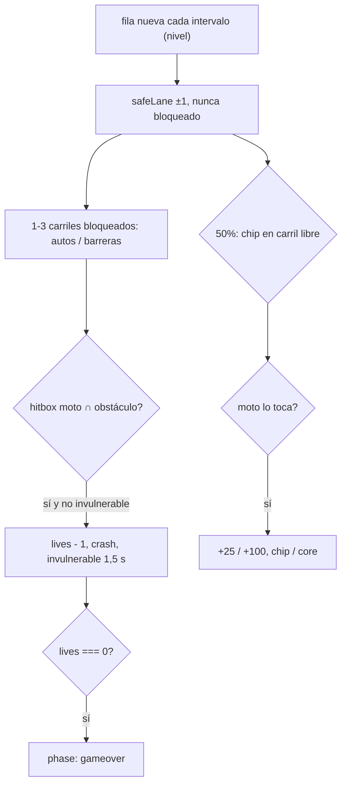

# SPEC GAME-JAM — AUTOPISTA NEÓN (cyberpunk)

> **Estado:** Borrador
> **Tema:** cyberpunk
> **Depende de:** 05-rocas-asteroids-motor, 06-ranking-global-catalogo-juegos-v0.2.0, 11-score-plausibility-caps-v0.2.5
> **Fecha:** 2026-09-27
> **Versión:** a asignar al promover (minor — package.json es la fuente de verdad; hoy sería `0.2.5 → 0.3.0`)
> **Objetivo:** Escribir desde cero el motor de AUTOPISTA NEÓN, un runner sin fin de carriles con vista cenital en el que una moto de luz esquiva autos y barreras y junta chips de datos, y sumarlo al catálogo como juego nuevo (fila en `games` + portada CSS propia).

## Alcance

**Incluye:**

- `components/games/autopista-neon/neon-runner-engine.ts`: motor que exporta `createNeonRunnerEngine: EngineFactory`, escrito desde cero (no hay fuente en `references/started-games/`), nativo 800×600, sin assets binarios, con sonido propio declarado con `defineSounds` + `beep` de `components/games/audio.ts` (ver Modelo de datos).
- `components/games/registry.ts`: agrega la entrada `"autopista-neon": { load: () => import("./autopista-neon/neon-runner-engine").then((m) => m.createNeonRunnerEngine), maxPlausibleScore: 500_000 }` — techo de cordura, el juego es sin fin (cálculo en Modelo de datos).
- `sql/00N_add_game_autopista-neon.sql` (`N` = siguiente número libre de `sql/` al promover; hoy sería `005`): `insert ... on conflict (id) do nothing` de la fila `autopista-neon` en `games` — idempotente, nunca un `INSERT` a secas ni un `DROP`/`UPDATE` de filas existentes. Aplicado al proyecto real vía el MCP de Supabase (`apply_migration`), igual que specs 04/05/06.
- `app/globals.css`: bloque `.cover-autopista` en la sección "Cover art generators" (portada nueva, solo CSS con los tokens `var(--magenta|--cyan|--yellow|--ink)`).
- `references/juegos-implementados.md`: fila nueva `autopista-neon` con su motor (regla de `CLAUDE.md`).
- `package.json`: bump minor de versión.
- `CHANGELOG.md`: entrada para la versión nueva enlazando a este spec.

**Fuera de alcance (para futuros specs):**

- Controles táctiles avanzados (swipe, joystick virtual, layout móvil). El `pointerdown` por mitades de pantalla cubre clic y tap simple; nada más.
- Power-ups (escudo, imán de chips, turbo), combustible o cualquier recurso que se agote.
- Adelantar/embestir autos para sumar puntos, disparos, o enemigos que persigan.
- Tráfico en sentido contrario, curvas, bifurcaciones o cambio de perspectiva (pseudo-3D).
- Audio con archivos (`.mp3`/`.wav`) — todo sintetizado con `beep`.
- `devicePixelRatio` / escalado por densidad de píxeles.
- Validación en build de que cada clave de `registry.ts` tenga fila en `games`.
- Cambios a `game-player-shell.tsx`, `game-engine.ts` o `app/actions/scores.ts` — el contrato ya cubre este juego sin tocarlos.

## Modelo de datos

Sin nuevas tablas — reusa `scores`/`games` de specs 04/06. Caso **C**: agrega una fila nueva a `games` (ver abajo).

**Geometría del arena (800×600 nativo, sin letterbox):**

| Elemento             | Valor                                                                                                                                               |
| -------------------- | --------------------------------------------------------------------------------------------------------------------------------------------------- |
| Autopista            | `x ∈ [150, 650]` (500px), 5 carriles de 100px. Centros de carril: `200, 300, 400, 500, 600` (índices `0..4`).                                       |
| Banquinas / ciudad   | `x ∈ [0, 150)` y `(650, 800]`: siluetas de edificios con ventanas encendidas, scroll en parallax al 50% de la velocidad de la ruta.                 |
| Moto                 | Centro fijo en `y = 500`, dibujada de 28×56px; **hitbox** de 22×46px (más chica que el dibujo, para que los roces visuales no cuenten como choque). |
| Auto                 | 44×72px, ocupa 1 carril.                                                                                                                            |
| Barrera              | 1 carril (92×20px) o doble (192×20px, dos carriles contiguos).                                                                                      |
| Chip / núcleo        | Rombo de 20×20px (hitbox AABB de 20×20).                                                                                                            |
| Aparición / descarte | Los obstáculos y chips nacen en `y = -100` y se eliminan al pasar `y > 700`.                                                                        |
| Escala de distancia  | `1 metro = 10px` de scroll.                                                                                                                         |

**Tabla de puntuación:**

| Evento                              | Puntos |
| ----------------------------------- | ------ |
| Cada 10 m recorridos (100px)        | +1     |
| Chip de datos (cian) recogido       | +25    |
| Núcleo de datos (amarillo) recogido | +100   |

Todos enteros. El score se compone de `floor(distanciaPx / 100)` (puntos de distancia, derivado con `floor` de un acumulador en float, nunca escrito fraccionario) más la suma de chips. Chocar no resta puntos — resta una vida.

**Progresión (nivel, velocidad, densidad):**

| Magnitud                     | Fórmula                                                                                      |
| ---------------------------- | -------------------------------------------------------------------------------------------- |
| `level`                      | `1 + floor(metros / 500)`, sin techo.                                                        |
| Velocidad de scroll (px/s)   | `min(900, 300 + (level - 1) * 60)` — 30 m/s en nivel 1, tope de 90 m/s desde el nivel 11.    |
| Intervalo entre filas (s)    | `max(0.5, 1.0 - (level - 1) * 0.05)` — tope de 2 filas/s desde el nivel 11.                  |
| Carriles bloqueados por fila | Nivel 1: 1 · niveles 2–4: 1–2 · nivel ≥ 5: 1–3. Nunca más de 3 de 5, nunca el carril seguro. |
| Barrera doble                | Desde nivel 2.                                                                               |
| Autos que cambian de carril  | Desde nivel 3, 25% de los autos de una fila.                                                 |
| Chip en la fila              | 50% de las filas traen 1 chip en un carril libre de esa fila; de esos, 10% es núcleo (+100). |

Con estas fórmulas, llegar al nivel 11 (5.000 m, velocidad tope) toma ~97 s de juego sin chocar — la partida típica dura 1–3 minutos.

**Garantía de camino (spawner por filas):** los obstáculos no aparecen sueltos sino en **filas** (todas sus piezas comparten la misma `y` y la misma velocidad de scroll, así una fila nunca alcanza a otra). El spawner mantiene un `safeLane` (arranca en `2`, el central); cada fila nueva lo mueve como mucho ±1 carril (`clamp(safeLane + rand{-1,0,1}, 0, 4)`) y **nunca bloquea `safeLane`** — ni con un auto, ni con una barrera doble, ni con el destino de un auto que cambia de carril. Como el intervalo mínimo entre filas (0,5 s) es 5× el tiempo de cambiar un carril (0,1 s), siempre existe un camino recorrible. Los primeros 2 s de partida (tras `start()`/`restart()`) no aparecen filas.

**Autos que cambian de carril (nivel ≥ 3):** al cruzar `y = 0` encienden un guiño amarillo del lado hacia el que van a moverse durante 0,5 s y luego se deslizan 1 carril a 250px/s. El carril destino tiene que estar libre en su fila y no ser `safeLane`; si no hay destino válido, el auto no cambia de carril.

**Choque:** si la hitbox de la moto se superpone con un auto o barrera (AABB, usando la `x` real de la moto aunque esté a mitad de un cambio de carril), `lives -= 1`, suena `crash`, el obstáculo chocado se elimina y la moto queda **invulnerable 1,5 s** (parpadea alternando alfa cada 0,1 s; ignora choques pero sigue juntando chips). La velocidad y el nivel no se resetean. `lives === 0` → `phase: "gameover"`. No hay victoria.

**`maxPlausibleScore` = 500.000 (techo de cordura, juego sin fin):**

- Distancia: a velocidad tope 90 m/s → 9 pts/s.
- Chips, cota teórica imposible: tope de 2 filas/s, cada una con un núcleo (+100) y todos recogidos → 200 pts/s. Total ≤ 209 pts/s ≈ 752.400 pts/h → 500.000 exige más de 40 min seguidos a velocidad tope con suerte imposible (el 100% de las filas con núcleo) y sin perder 3 vidas.
- Esperado real a velocidad tope: 1 chip/s × (0,9 × 25 + 0,1 × 100) = 32,5 pts/s + 9 = ~41,5 pts/s ≈ 149.400 pts/h → 500.000 exige ~3,3 h sin perder las 3 vidas a 90 m/s con 2 filas por segundo.
- Una partida buena real anda en 2.000–15.000 puntos, así que el techo nunca corta una partida legítima y sí corta un POST fabricado de 7 cifras.

**Mapeo a `EngineState`:**

| Campo   | Valor                                                                                                                                                                                           |
| ------- | ----------------------------------------------------------------------------------------------------------------------------------------------------------------------------------------------- |
| `score` | `floor(distanciaPx / 100) + puntosDeChips`. Cambia como mucho ~9 veces/s por distancia (a 90 m/s) más un salto por chip — nunca en cada frame a baja velocidad. Solo se resetea en `restart()`. |
| `lives` | Arranca en `3`. Cada choque fuera de la invulnerabilidad resta 1. Llega a `0` → `phase: "gameover"`.                                                                                            |
| `level` | `1 + floor(metros / 500)`, sin techo (la velocidad y la densidad se topan en nivel 11/5, el número sigue subiendo como indicador de distancia).                                                 |
| `badge` | `{ label: "KM", value: (metros / 1000).toFixed(1) }` — distancia recorrida en km con un decimal (ej. `"2.4"`); cambia cada 100 m, ~1 vez/s a velocidad tope.                                    |
| `phase` | `"paused"` si `isPaused`; `"gameover"` si `lives === 0` o tras `endGame()`; si no, `"playing"`.                                                                                                 |

`reportState()` compara campo por campo (incluido `badge.value`) antes de llamar a `onState`, igual que el esqueleto canónico.

**Controles:**

| Input                                                                              | Acción             | Restricción                                                                                                    | `preventDefault` |
| ---------------------------------------------------------------------------------- | ------------------ | -------------------------------------------------------------------------------------------------------------- | ---------------- |
| `ArrowLeft` / `KeyA`                                                               | Carril objetivo −1 | Ignorado en el carril 0; ignorado si `e.repeat` (mantener apretado no cruza varios carriles)                   | Sí               |
| `ArrowRight` / `KeyD`                                                              | Carril objetivo +1 | Ignorado en el carril 4; ignorado si `e.repeat`                                                                | Sí               |
| `pointerdown` en la mitad izquierda del canvas (`x < 400` en coordenadas internas) | Carril objetivo −1 | Solo botón primario (`e.button === 0`) o toque; coordenadas convertidas con `getBoundingClientRect()` + escala | Sí               |
| `pointerdown` en la mitad derecha (`x ≥ 400`)                                      | Carril objetivo +1 | Ídem                                                                                                           | Sí               |

El input se aplica directo en el handler sobre `targetLane` (no hay cola): la moto se desliza hacia el centro del carril objetivo a 1000px/s (0,1 s por carril); dos pulsaciones rápidas encadenan dos carriles. Todos los handlers ignoran el input si `isPaused` o si la partida terminó. `keydown`/`keyup` van en `window`; `pointerdown` va en el `canvas` (así un clic en PAUSA/FIN del shell no mueve la moto). Todos son funciones nombradas y se sacan en `destroy()`.

**Sonido (propio del motor, `defineSounds` + `beep`, sin tocar `audio.ts`):**

| Nombre    | Preset                                                                                                   | Dispara en                                   |
| --------- | -------------------------------------------------------------------------------------------------------- | -------------------------------------------- |
| `lane`    | `beep(520, 0.04, "square", 0.06)`                                                                        | Cada cambio de carril aceptado.              |
| `chip`    | `beep(1320, 0.08, "triangle", 0.12)`                                                                     | Recoger un chip de datos.                    |
| `core`    | `beep(660, 0.15, "triangle", 0.12)` + `beep(990, 0.15, "triangle", 0.1)` (acorde simultáneo, sin timers) | Recoger un núcleo.                           |
| `crash`   | `beep(110, 0.35, "sawtooth", 0.2)` + `beep(70, 0.4, "square", 0.15)`                                     | Cada vida perdida (incluye el choque final). |
| `levelUp` | `beep(1046, 0.12, "triangle", 0.1)` + `beep(1318, 0.12, "triangle", 0.08)`                               | `level` sube.                                |

Ningún sonido usa `setTimeout` — los acordes son `beep` simultáneos, así `destroy()` no tiene timers de audio que limpiar.

**Render (sin assets, todo `fillRect`/`path` sobre canvas):** fondo `#07070f`; asfalto `#0d0d1a`; bordes de la autopista en magenta (`#ff006e`) con glow; divisores de carril discontinuos en cian (`#00f5ff`) que scrollean con un offset módulo 60px; edificios de las banquinas como rectángulos oscuros con ventanitas cian/magenta/amarillo generadas de forma determinística por tramo (sin `Math.random()` por frame); moto magenta con estela cian; autos cian/verde/amarillo con dos luces traseras rojas; barreras a rayas diagonales amarillo/magenta; chip cian y núcleo amarillo como rombos con glow. El glow (`shadowBlur`) se aplica solo a bordes, moto y chips, nunca a los edificios (costo de GPU). **Nunca** texto de HUD ni overlay de pausa/game over en el canvas.

**Fila nueva de `games` (caso C):**

| Columna      | Valor                                                                                                                                                                                                                                                |
| ------------ | ---------------------------------------------------------------------------------------------------------------------------------------------------------------------------------------------------------------------------------------------------- |
| `id`         | `autopista-neon`                                                                                                                                                                                                                                     |
| `title`      | `AUTOPISTA NEÓN`                                                                                                                                                                                                                                     |
| `short`      | `Esquiva el tráfico a toda velocidad por la autopista de neón.`                                                                                                                                                                                      |
| `long`       | `Una moto de luz corta la noche de la megaciudad por cinco carriles de neón. Cambia de carril para esquivar autos y barreras, recoge chips de datos en el camino y aguanta: cada 500 metros la autopista acelera. Tres choques y tu señal se apaga.` |
| `cat`        | `ARCADE`                                                                                                                                                                                                                                             |
| `cover`      | `cover-autopista`                                                                                                                                                                                                                                    |
| `color`      | `magenta`                                                                                                                                                                                                                                            |
| `sort_order` | `max(sort_order) + 1` al momento de aplicar la migración — hoy `9` (el máximo es `8`, `duelo-pixel`), pero si otra spec de la jam se promueve antes, corre un lugar.                                                                                 |

**Portada `.cover-autopista`** (sección "Cover art generators" de `app/globals.css`, mismo patrón de gradientes apilados que `.cover-rana`/`.cover-duelo`): fondo `linear-gradient(180deg, #1a0030, #0a0a18)`; en `::after`, dos líneas verticales sólidas `var(--magenta)` como bordes de la ruta (≈22% y ≈78%), cuatro líneas discontinuas `var(--cyan)` como divisores de carril entre ellas (`repeating-linear-gradient` vertical), un rectángulo `var(--magenta)` angosto abajo al centro (la moto), un rectángulo `var(--cyan)` más arriba en otro carril (un auto) y un punto `var(--yellow)` (un núcleo); `filter: drop-shadow(0 0 8px rgba(255,0,110,0.5))`.

## Plan de implementación

1. `sql/00N_add_game_autopista-neon.sql` con `insert into games (...) values (...) on conflict (id) do nothing` de la fila de la tabla de arriba (`sort_order` = máximo actual + 1, confirmado contra la base en vivo). Aplicar con el MCP de Supabase (`apply_migration`) y verificar con `list_tables`/`get_advisors`. Test manual: `select * from games where id = 'autopista-neon'` devuelve la fila; `/games` muestra la card (sin portada todavía).
2. Bloque `.cover-autopista` en `app/globals.css`, sección "Cover art generators". Test manual: `/games` y `/juegos/autopista-neon` muestran la portada nueva (ruta con bordes magenta, divisores cian, moto, auto y núcleo).
3. Esqueleto del motor en `components/games/autopista-neon/neon-runner-engine.ts`: factory, `ctx`, constantes de geometría (carriles, moto, hitbox), estado (`score`, `lives`, `level`, `distancePx`, `chipPoints`, `targetLane`, `bikeX`, `invulnTimer`, `safeLane`, `rowTimer`, `graceTimer`), `initGame()`, los 6 métodos de `EngineHandle` con sus guardas de idempotencia, loop RAF con `dt` topado a 0,05 s, `reportState()` con diff campo por campo (incluido `badge`). Dibuja la autopista estática y la moto en el carril central. Test manual: `npm run lint`.
4. Entrada en `components/games/registry.ts` con `import()` dinámico y `maxPlausibleScore: 500_000`. Test manual: entrar a `/juegos/autopista-neon/jugar` y ver la autopista y la moto del motor real en vez del mock estático; PAUSA/REANUDAR/FIN responden.
5. Scroll y distancia: `distancePx += speed * dt`; divisores de carril y edificios scrollean (edificios al 50%); `score`, `level` (`1 + floor(metros/500)`), velocidad (`min(900, 300 + (level-1)*60)`) y `badge` KM derivados de la distancia; `playSound("levelUp")` al subir de nivel. Test manual: sin tocar nada, el score sube de a 1 cada 10 m, el badge KM avanza, y a los ~17 s `level` pasa a 2 con el acorde y el scroll se ve más rápido.
6. Input: `ArrowLeft/Right` + `KeyA/D` (con `preventDefault`, ignorando `e.repeat`) y `pointerdown` en el canvas por mitades con conversión de coordenadas; `targetLane` con clamp `0..4`; deslizamiento de `bikeX` a 1000px/s; `playSound("lane")`; input ignorado en pausa/gameover. Test manual: cambiar de carril con los 3 esquemas sin que la página scrollee; mantener apretada una flecha mueve un solo carril; clic en la mitad izquierda/derecha mueve 1 carril; en los bordes no pasa nada.
7. Spawner de filas: intervalo por nivel, gracia de 2 s, `safeLane` ±1 que nunca se bloquea, 1–3 carriles bloqueados según nivel, autos y barreras (dobles desde nivel 2), descarte al pasar `y > 700`. Todavía sin colisión. Test manual: jugar hasta nivel 5 y confirmar visualmente que cada fila deja al menos 2 carriles libres y que siempre hay un camino que solo exige moverse ±1 carril entre filas.
8. Colisiones y vidas: AABB hitbox moto vs. obstáculos con la `x` real de la moto; choque → `lives -= 1`, `playSound("crash")`, se elimina el obstáculo, invulnerabilidad 1,5 s con parpadeo; `lives === 0` → `phase: "gameover"`. Test manual: chocar a propósito 3 veces — la partida sigue tras la 1ª y la 2ª (con parpadeo, y un segundo obstáculo durante el parpadeo no resta), termina en la 3ª y abre el modal.
9. Chips y núcleos: 50% de las filas con 1 chip en un carril libre de esa fila (10% núcleo), AABB con la moto, `+25`/`+100`, `playSound("chip" | "core")`, el chip desaparece al recogerse. Test manual: recoger un chip y un núcleo y confirmar el salto exacto de `+25`/`+100` en el HUD y sus sonidos; un chip nunca aparece encima de un obstáculo.
10. Autos que cambian de carril (nivel ≥ 3): guiño de 0,5 s al cruzar `y = 0`, deslizamiento de 1 carril a 250px/s hacia un destino libre que no sea `safeLane`. Test manual: en nivel 3+, ver el guiño antes del cambio; ningún auto se mete en el único carril libre de su fila.
11. Pulido visual cyberpunk: glow en bordes/moto/chips, estela de la moto, luces traseras de los autos, ventanas determinísticas de los edificios. Test manual: el juego mantiene 60 fps en DevTools (Performance) a velocidad tope.
12. Bump minor en `package.json` + entrada en `CHANGELOG.md` + fila `autopista-neon` en `references/juegos-implementados.md`. Test manual: el Footer muestra la versión nueva.
13. Verificación end-to-end completa vía Playwright MCP contra `npm run dev`: partida real cambiando de carril con teclado y clic, juntando chips, subiendo de nivel y perdiendo las 3 vidas hasta el game over real; con sesión activa, confirmar fila nueva en `scores` y su reflejo en `/juegos/autopista-neon`, `/games` y `/salon-de-la-fama`; confirmar aislamiento del chunk (el motor no se descarga al visitar otro juego), ausencia de fugas de listeners/RAF al salir y volver a entrar, y los 5 sonidos interceptando `AudioContext`. Además `npm run lint` y `npm run build` sin errores. Test manual: partida completa hasta game over real, puntaje guardado y visible en las tres páginas.

## Criterios de aceptación

- [ ] La fila `autopista-neon` existe en `games` con los 7 valores de la tabla, insertada con `on conflict (id) do nothing`.
- [ ] La fila de `games` tiene RLS de solo lectura (heredada de la tabla) y `get_advisors` no reporta hallazgos nuevos.
- [ ] `/games` y `/juegos/autopista-neon` muestran la portada `.cover-autopista` (no un fondo vacío).
- [ ] El motor exporta `createNeonRunnerEngine` cumpliendo `EngineFactory`.
- [ ] `registry.ts` carga el motor con `import()` dinámico (no import estático) y declara `maxPlausibleScore: 500_000`.
- [ ] La autopista scrollea sola y la velocidad sube visiblemente cada 500 m hasta el tope de nivel 11.
- [ ] `ArrowLeft/Right` y `KeyA/D` cambian de carril de a uno; ninguna de las 4 teclas scrollea la página; mantener apretada una tecla mueve un solo carril.
- [ ] Clic/tap en la mitad izquierda o derecha del canvas mueve la moto un carril hacia ese lado, también con el canvas escalado por CSS a otro tamaño.
- [ ] Un clic en los botones del shell (PAUSA, FIN) no mueve la moto.
- [ ] Cada fila de obstáculos deja al menos 2 carriles libres y siempre existe un camino que exige moverse como mucho 1 carril entre filas consecutivas.
- [ ] Recorrer 10 m suma exactamente +1; un chip +25; un núcleo +100. El score reportado es siempre un entero ≥ 0.
- [ ] Chocar un auto o barrera resta 1 vida, suena `crash`, y otorga 1,5 s de invulnerabilidad visible (parpadeo) sin resetear score, nivel ni velocidad.
- [ ] El tercer choque (`lives === 0`) dispara `phase: "gameover"` y abre el modal de fin de partida.
- [ ] El HUD (`player-hud`) refleja `score`/`lives`/`level` reales del motor; el `badge` muestra "KM" con la distancia con un decimal.
- [ ] `onState` no se llama en cada frame: solo cuando cambia score, vidas, nivel, fase o el valor del badge.
- [ ] El canvas no dibuja su propio texto de HUD ni overlay de pausa/game over.
- [ ] PAUSA congela la simulación real (el RAF se cancela, no solo un flag visual) y el input se ignora mientras dura.
- [ ] REANUDAR continúa sin salto de posición (`dt` no incluye el tiempo en pausa).
- [ ] FIN fuerza game over con el score actual en cualquier momento, incluso en pausa.
- [ ] Con sesión activa, una partida terminada crea exactamente una fila nueva en `scores`.
- [ ] Sin sesión, el modal muestra el CTA a `/auth` y no se guarda nada.
- [ ] Si el guardado falla, se muestra el error con botón REINTENTAR.
- [ ] "JUGAR DE NUEVO" reinicia el motor (score 0, 3 vidas, nivel 1, carril central, 2 s de gracia) sin remontar el componente.
- [ ] "VOLVER AL VAULT" navega a `/juegos/autopista-neon`.
- [ ] Salir de la página cancela el RAF y saca los listeners de `window` (teclado) y del `canvas` (puntero) — sin fugas al entrar/salir repetidas veces.
- [ ] Visitar otro juego no descarga el chunk de `neon-runner-engine.ts`.
- [ ] `/juegos/autopista-neon` ("Mejor global", "Partidas") y `/salon-de-la-fama` (tab AUTOPISTA NEÓN y tab GLOBAL) reflejan la partida sin intervención manual.
- [ ] `lane`/`chip`/`core`/`crash`/`levelUp` suenan en sus eventos; con mute activo, ninguno produce nodos de audio.
- [ ] El motor no lee `localStorage`, no usa assets binarios ni toca el DOM fuera del canvas recibido.
- [ ] `references/juegos-implementados.md` lista `autopista-neon` con su motor.
- [ ] `npm run lint` y `npm run build` sin errores.

## Decisiones

- **Sí:** caso **C** — `autopista-neon` no tiene fila en `games` ni se parece a ninguna fila sin motor. _(decidido por game-jam — revisar)_ RANARIA también tiene "autopista" y carriles, pero es Frogger (cruzar carriles de costado, con troncos y meta); acá la moto corre _a lo largo_ de los carriles sin fin. No se tomó como reskin de RANARIA para no gastar esa fila del catálogo en otra mecánica.
- **Sí:** se solapa parcialmente con el candidato CARRETERA (Road Fighter/Spy Hunter) de `references/candidatos-juegos.md` (hueco "reflejos/carreras"). _(decidido por game-jam — revisar)_ Se diferencia en que el movimiento es por **carriles discretos** (no puntero continuo), no hay combustible, y la economía de puntos pasa por los chips. Si se promueve esta spec, CARRETERA pierde sentido como juego aparte — conviene anotarlo en el log de `game-planner`.
- **Sí:** 5 carriles de 100px en una autopista de 500px centrada, con 150px de ciudad a cada lado. _(decidido por game-jam — revisar)_ 5 carriles dan margen para bloquear hasta 3 y dejar 2 libres; los laterales llevan la ambientación cyberpunk sin afectar la jugabilidad.
- **Sí:** puntuación por distancia `+1` cada 10 m, no `+1` por metro. _(decidido por game-jam — revisar)_ Con `+1`/m el score cambiaría ~90 veces/s a velocidad tope y `onState` se dispararía prácticamente cada frame; a `+1`/10 m son ≤ 9 cambios/s. Los chips (+25/+100) quedan con peso real frente a la distancia.
- **Sí:** dos tipos de chip (cian +25 común, núcleo amarillo +100 al 10%). _(decidido por game-jam — revisar)_ Un premio raro de mayor valor invita a arriesgar carriles fuera del camino seguro — ahí está la decisión interesante del juego.
- **Sí:** `lives = 3`, choque con 1,5 s de invulnerabilidad y el obstáculo chocado eliminado; no se resetea la velocidad. _(decidido por game-jam — revisar)_ Evita la muerte en cadena (chocar dos veces el mismo auto) y mantiene la tensión. Reiniciar la velocidad al chocar sería más indulgente pero rompería la relación nivel ↔ distancia.
- **Sí:** `level = 1 + floor(metros / 500)` sin techo; velocidad topada en 900px/s (nivel 11) y densidad topada en nivel 5/11. _(decidido por game-jam — revisar)_ Topar la velocidad hace posible acotar el `maxPlausibleScore` y evita que el juego se vuelva injugable por la física (con `dt` topado a 0,05 s, 900px/s = 45px/frame < 68px de ventana de solapamiento moto+barrera, sin túnel).
- **Sí:** `badge` = `{ label: "KM", value: (metros/1000).toFixed(1) }`. _(decidido por game-jam — revisar)_ La distancia es el dato propio del runner que no cabe en score/vidas/nivel; con un decimal cambia ~1 vez/s, barato para React. Se descartó "CHIPS" (se infiere del score) y la velocidad (redundante con el nivel).
- **Sí:** spawner por **filas** con `safeLane` que se mueve como mucho ±1 y nunca se bloquea; todas las piezas de una fila scrollean a la misma velocidad. _(decidido por game-jam — revisar)_ Es la única forma simple de garantizar que siempre hay salida (el riesgo que el `game-planner` marcó para CARRETERA). Los autos "más lentos que la moto" se descartaron porque filas a distintas velocidades se alcanzan y pueden formar muros.
- **Sí:** input aplicado directo en el handler sobre `targetLane`, ignorando `e.repeat`. _(decidido por game-jam — revisar)_ En un juego de carriles discretos, una pulsación = un carril; el auto-repeat del SO cruzaría la autopista entera sin querer.
- **Sí:** `pointerdown` en el `canvas` por mitades (izquierda/derecha), no en `window`. _(decidido por game-jam — revisar)_ Cubre clic y tap con el mismo evento, y al estar en el canvas los clics en los botones del shell no mueven la moto. Swipe y joystick virtual quedan fuera.
- **Sí:** `preventDefault()` en `ArrowLeft/Right`, `KeyA/D` y en el `pointerdown` del canvas. Mismo criterio que specs 07/09/10 — jugar no debe scrollear la página.
- **Sí:** 2 s de gracia sin filas al empezar/reiniciar. _(decidido por game-jam — revisar)_ Da tiempo a ubicarse antes del primer obstáculo.
- **Sí:** sonidos propios con `defineSounds` dentro del motor, acordes como `beep` simultáneos sin `setTimeout`. Sigue la convención vigente (el motor declara sus sonidos, `audio.ts` no se toca) y deja `destroy()` sin timers de audio que limpiar.
- **Sí:** `maxPlausibleScore = 500_000` como techo de cordura. _(decidido por game-jam — revisar)_ Cálculo en Modelo de datos: ≥ 40 min a velocidad tope en el peor caso teórico imposible, ~3,3 h en el caso real; mismo orden que el techo sugerido para CARRETERA.
- **Sí:** `title` "AUTOPISTA NEÓN", `cat` ARCADE, `color` magenta, `cover` `cover-autopista`. _(decidido por game-jam — revisar)_ Magenta es el color del neón de la ruta y de la moto; no hay otra card ARCADE magenta en el catálogo.
- **Sí:** la entrada en `registry.ts` va en el paso 4, antes de la mecánica (a diferencia del orden de specs 09/10). _(decidido por game-jam — revisar)_ La fila de `games` ya existe desde el paso 1, así que registrar el motor temprano permite probar cada paso de mecánica jugando en `/juegos/autopista-neon/jugar`.
- **Sí:** bump **minor**. Agrega un juego nuevo visible al catálogo (caso C) — no es completar el motor de una fila existente como 09/10. El número exacto se fija al promover leyendo `package.json`.
- **No:** victoria ni meta — el juego es sin fin; la única salida es `lives === 0` o FIN.
- **No:** assets binarios. Todo se dibuja con primitivas de canvas; los sonidos se sintetizan.
- **No:** tocar `game-player-shell.tsx`, `game-engine.ts` o `app/actions/scores.ts`. El contrato existente alcanza.

## Riesgos

| Riesgo                                                                                                                           | Mitigación                                                                                                                                                                    |
| -------------------------------------------------------------------------------------------------------------------------------- | ----------------------------------------------------------------------------------------------------------------------------------------------------------------------------- |
| El spawner genera una fila sin salida (o una secuencia de filas imposible de recorrer a tiempo)                                  | `safeLane` nunca se bloquea y se mueve como mucho ±1; el intervalo mínimo entre filas (0,5 s) es 5× el tiempo de cambio de carril; verificar a nivel 11 que no aparecen muros |
| Coordenadas de puntero mal escaladas (el canvas se escala por CSS): el clic cae en la mitad equivocada                           | Convertir con `getBoundingClientRect()` + `canvas.width / rect.width` como en `bloque-buster`; probar con la ventana angosta y ancha                                          |
| El motor reporta un score no entero (distancia en float)                                                                         | `score = floor(distancePx / 100) + chipPoints`, el acumulador float nunca se reporta; validar con `Number.isInteger(score)` en la verificación                                |
| `onState` se dispara cada frame por la distancia o el badge y React re-renderiza el HUD a 60 Hz                                  | Diff campo por campo en `reportState()`; distancia en pasos de 10 m y badge con 1 decimal (≤ 9 y ≤ 1 cambios/s respectivamente)                                               |
| Túnel de colisión a velocidad tope con `dt` alto (la barrera "salta" la moto entre dos frames)                                   | `dt` topado a 0,05 s → 45px/frame máx., menor que la ventana de solapamiento de 68px (hitbox 46 + barrera 20); velocidad topada en 900px/s                                    |
| `resume()`/`restart()` arrastran el `dt` de la pausa y los obstáculos saltan                                                     | `lastTime = null` en `resume()`/`restart()`/`endGame()`, igual que el esqueleto canónico                                                                                      |
| Se escapa el listener de `pointerdown` del canvas en `destroy()` (fuga al entrar/salir, o doble cambio de carril en Strict Mode) | Handler nombrado, `canvas.removeEventListener("pointerdown", ...)` en `destroy()` junto a los de `window`; probar entrar/salir varias veces y en dev                          |
| `shadowBlur` en muchos elementos baja los FPS en equipos modestos                                                                | Glow solo en bordes, moto y chips; edificios sin blur; medir en DevTools a velocidad tope                                                                                     |
| Conflicto de `sort_order` o de número de migración con otras specs de la misma jam promovidas en paralelo                        | Tomar `max(sort_order) + 1` y el siguiente `sql/00N_` libre **al promover**, confirmando contra la base en vivo, no con los valores de este borrador                          |
| Solapamiento de catálogo con CARRETERA (candidato evaluado) o RANARIA                                                            | Documentado en Decisiones; el humano decide al promover si esta spec reemplaza a CARRETERA                                                                                    |

## Lo que **no** está en este spec

- Controles táctiles avanzados (swipe, joystick virtual, layout móvil).
- Power-ups, combustible o recursos que se agoten.
- Puntos por adelantar/embestir autos, disparos o enemigos que persigan.
- Tráfico en sentido contrario, curvas, bifurcaciones o pseudo-3D.
- Audio con archivos.
- `devicePixelRatio`.
- Validación en build de ids de `registry.ts` contra `games`.
- Cambios a `game-player-shell.tsx`, `game-engine.ts` o `app/actions/scores.ts`.

Cada uno de estos, si se implementa, va en su propio spec.
