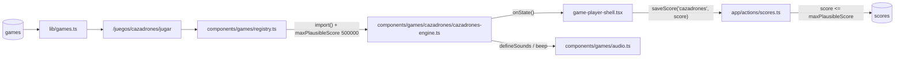
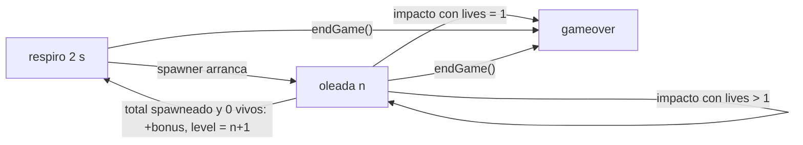
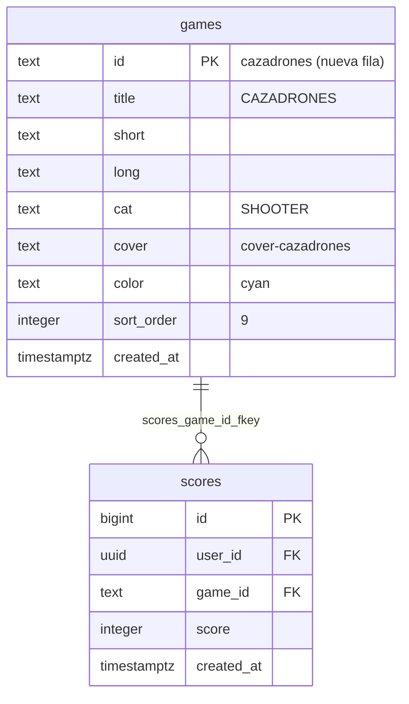

# SPEC GAME-JAM — CAZADRONES (cyberpunk)

> **Estado:** Borrador
> **Tema:** cyberpunk
> **Depende de:** 05-rocas-asteroids-motor, 06-ranking-global-catalogo-juegos-v0.2.0, 11-score-plausibility-caps-v0.2.5
> **Fecha:** 2026-09-27
> **Versión:** a asignar al promover (minor — package.json es la fuente de verdad; hoy `0.2.5`)
> **Objetivo:** Escribir desde cero el motor de CAZADRONES, un shooter de arena twin-stick sin inercia (WASD/flechas para moverse, mouse para apuntar, clic sostenido para disparar en ráfaga) contra oleadas de drones de seguridad sobre una azotea cyberpunk, y sumarlo al catálogo como juego nuevo.

## Alcance

**Incluye:**

- `components/games/cazadrones/cazadrones-engine.ts`: motor que exporta `createCazadronesEngine: EngineFactory`, escrito desde cero (no hay fuente en `references/started-games/`), nativo 800×600, solo con primitivas de canvas (sin assets binarios) y con sus propios sonidos declarados con `defineSounds` + `beep` de `components/games/audio.ts` (ver Modelo de datos).
- `components/games/registry.ts`: agrega la entrada `cazadrones: { load: () => import("./cazadrones/cazadrones-engine").then((m) => m.createCazadronesEngine), maxPlausibleScore: 500_000 }` — techo de cordura (juego sin fin, cálculo en Modelo de datos).
- `sql/00N_add_game_cazadrones.sql` (N = siguiente número libre de `sql/` al promover; hoy sería `005`): `insert ... on conflict (id) do nothing` de la fila `cazadrones` en `games` — idempotente, nunca un `INSERT` a secas ni un `DROP`/`UPDATE` de filas existentes. Aplicado al proyecto real vía el MCP de Supabase (`apply_migration`), igual que specs 04/05/06.
- `app/globals.css`: bloque `.cover-cazadrones` en la sección "Cover art generators".
- `references/juegos-implementados.md`: fila nueva de `cazadrones` (regla de `CLAUDE.md`).
- `package.json`: bump **minor** (hoy `0.2.5` → `0.3.0`, confirmar al promover).
- `CHANGELOG.md`: entrada para la versión nueva enlazando a este spec.

**Fuera de alcance (para futuros specs):**

- Controles táctiles/móvil (un twin-stick en táctil necesita doble joystick virtual; el contrato hoy no lo cubre).
- Apuntado solo con teclado (sin mouse) — ver Decisiones.
- Audio con archivos (`.mp3`/`.wav`) — los sonidos se sintetizan con `beep`.
- `devicePixelRatio` / escalado por densidad de píxeles.
- Power-ups, armas alternativas, bombas de pantalla, vidas extra y obstáculos con colisión en la azotea.
- Jefes de oleada.
- Validación en build de que cada clave de `registry.ts` tenga fila en `games`.
- Cambios a `game-player-shell.tsx`, `game-engine.ts`, `audio.ts` o `app/actions/scores.ts` — el contrato ya cubre este juego sin tocarlos.

## Modelo de datos

Sin nuevas tablas — reusa `scores`/`games` de specs 04/06. Agrega **una fila** a `games` (caso C).

**Tabla de puntuación:**

| Evento                                 | Puntos                    |
| -------------------------------------- | ------------------------- |
| Perseguidor destruido                  | +100                      |
| Kamikaze destruido (en cualquier fase) | +150                      |
| Tirador destruido (2 impactos)         | +200                      |
| Oleada `n` limpiada                    | +250 × `min(n, 10)`       |
| Dron que choca al jugador              | 0 (se destruye sin sumar) |
| Kamikaze que se autodestruye al fallar | 0                         |

Todos los valores son enteros y fijos; `score` nunca baja. Cada dron suma como máximo una vez (al ser destruido por un disparo del jugador).

**Oleadas:**

| Parámetro de la oleada `n`      | Fórmula                                             |
| ------------------------------- | --------------------------------------------------- |
| Total de drones                 | `total = min(60, 6 + 3 × (n − 1))`                  |
| Tiradores                       | `n ≥ 2 ? floor(total / 4) : 0`                      |
| Kamikazes                       | `n ≥ 3 ? floor(total / 5) : 0`                      |
| Perseguidores                   | `total − tiradores − kamikazes`                     |
| Intervalo entre apariciones     | `max(0.35, 1.2 − 0.07 × (n − 1))` s                 |
| Máximo de drones vivos a la vez | `min(14, 4 + n)` (si se alcanza, el spawner espera) |
| Multiplicador de velocidad      | `speedMul = min(1.75, 1 + 0.05 × (n − 1))`          |
| Respiro antes de cada oleada    | 2 s sin drones (también antes de la oleada 1)       |

El orden de aparición de los `total` drones se baraja al iniciar la oleada. Cada dron aparece en un punto aleatorio de un borde aleatorio, 30 px **fuera** del arena, y entra caminando; si el punto sorteado queda a menos de 200 px del jugador, se re-sortea (hasta 5 intentos). La oleada termina cuando se spawnearon los `total` y no queda ninguno vivo (destruido, autodestruido o chocado): suma el bonus, suena `wave` y arranca el respiro de la siguiente.

**Drones:**

| Tipo        | Color (canvas)     | Radio | Vida | Velocidad base                      | Comportamiento                                                                                                                                                                                                                                                                                                                                           |
| ----------- | ------------------ | ----- | ---- | ----------------------------------- | -------------------------------------------------------------------------------------------------------------------------------------------------------------------------------------------------------------------------------------------------------------------------------------------------------------------------------------------------------- |
| Perseguidor | magenta `#ff006e`  | 14 px | 1    | `100 × speedMul` px/s               | Va en línea recta hacia la posición actual del jugador, con una repulsión simple entre drones (si dos centros quedan a < 28 px se empujan) para que no se apilen en un solo punto.                                                                                                                                                                       |
| Tirador     | amarillo `#f5ff00` | 16 px | 2    | `80 × speedMul` px/s                | Se acerca hasta un anillo de 220–280 px del jugador y ahí se desplaza en perpendicular (orbita). Solo dispara estando totalmente dentro del arena: primer tiro 1 s después de entrar, luego cada `max(1.0, 2.2 − 0.1 × (n − 1))` s ± 0,3 s. Bala enemiga: radio 4 px, `220 × speedMul` px/s, apuntada a la posición del jugador en el momento del tiro.  |
| Kamikaze    | verde `#00ff88`    | 12 px | 1    | `70 × speedMul` px/s (acercamiento) | Se acerca hasta quedar a < 220 px del jugador y dentro del arena → **arma** 0,6 s quieto parpadeando (suena `arm`) → **embiste** en línea recta hacia donde estaba el jugador al terminar de armar, a 460 px/s, durante 1,2 s o hasta salir 30 px del arena. Si la embestida termina sin tocar al jugador, se autodestruye (explosión visual, 0 puntos). |

Tope de 30 balas enemigas simultáneas (si se alcanza, el tirador saltea ese tiro).

**Jugador:**

- Círculo de radio visual 12 px (hitbox de 10 px, más indulgente) con un cañón corto que apunta hacia la mira; color cian `#00f5ff`.
- Movimiento **sin inercia**: velocidad 260 px/s en la dirección de las teclas presionadas, normalizada en diagonal (no se mueve más rápido en diagonal); al soltar se detiene en seco. Queda contenido en la azotea con un margen de 12 px al borde.
- Disparo: mientras el botón izquierdo del mouse (o `Space`) está sostenido, dispara una bala cada 0,125 s (8/s) desde la punta del cañón hacia la mira. Bala: radio 3 px, 700 px/s, se descarta al salir del arena.
- Al ser tocado por un dron o una bala enemiga: −1 vida, suena `hurt`, se limpian todas las balas enemigas, el dron que chocó se destruye sin sumar puntos, y el jugador queda 2 s invulnerable (parpadea, no colisiona). No hay respawn ni reposicionamiento — sigue donde estaba.
- La mira es un retículo cian dibujado en el canvas en la posición del mouse (convertida al espacio interno 800×600); antes del primer `mousemove`, la mira arranca 100 px arriba del jugador.

**Mapeo a `EngineState`:**

| Campo   | Valor                                                                                                                                                                                               |
| ------- | --------------------------------------------------------------------------------------------------------------------------------------------------------------------------------------------------- |
| `score` | Acumulado según la tabla de puntuación. Solo se resetea en `restart()`.                                                                                                                             |
| `lives` | Arranca en `3`. Resta 1 por cada impacto recibido (dron o bala enemiga) fuera de la invulnerabilidad. Sin vidas extra. Llega a `0` → `phase: "gameover"`.                                           |
| `level` | Número de la oleada actual `n` (arranca en `1`). Sube al terminar una oleada, en el momento en que empieza el respiro de la siguiente.                                                              |
| `badge` | `{ label: "DRONES", value: String(restantes) }` — drones de la oleada actual que todavía no fueron eliminados (vivos + por aparecer). Durante el respiro muestra el `total` de la oleada que viene. |
| `phase` | `"paused"` si `isPaused`; `"gameover"` si `lives === 0` o tras `endGame()`; si no (incluido el respiro entre oleadas), `"playing"`.                                                                 |

Estado interno (`internalPhase`): `"respiro" | "oleada" | "gameover"`, colapsado a `EnginePhase` en `currentPhase()`. El juego no tiene victoria: las oleadas son infinitas.

**Controles:**

| Input                            | Acción                                           | `preventDefault`              |
| -------------------------------- | ------------------------------------------------ | ----------------------------- |
| `KeyW` / `ArrowUp`               | Mover arriba                                     | Solo las flechas              |
| `KeyS` / `ArrowDown`             | Mover abajo                                      | Solo las flechas              |
| `KeyA` / `ArrowLeft`             | Mover izquierda                                  | Solo las flechas              |
| `KeyD` / `ArrowRight`            | Mover derecha                                    | Solo las flechas              |
| `mousemove` sobre el canvas      | Mover la mira (coordenadas escaladas)            | No                            |
| `mousedown` botón 0 en el canvas | Empezar a disparar (ráfaga mientras se sostiene) | Sí (evita selección de texto) |
| `mouseup` en `window`            | Dejar de disparar                                | No                            |
| `Space` (sostenido)              | Disparar hacia la mira (alternativa al clic)     | Sí                            |
| `contextmenu` en el canvas       | Sin acción (se bloquea el menú contextual)       | Sí                            |
| `blur` de `window`               | Suelta todas las teclas y el disparo             | —                             |

Conversión de coordenadas del mouse (canvas escalado por CSS, resolución interna fija), igual que `bloque-buster`:

```ts
const rect = canvas.getBoundingClientRect();
const x = (e.clientX - rect.left) * (canvas.width / rect.width);
const y = (e.clientY - rect.top) * (canvas.height / rect.height);
```

El motor pone `canvas.style.cursor = "none"` al crearse (la mira se dibuja en el canvas) y lo restaura a `""` en `destroy()`. No hay tecla de pausa propia — la pausa es el botón PAUSA del shell.

**Sonido (propio del motor, `defineSounds` + `beep`; `audio.ts` no se modifica):**

| Nombre      | Dispara en                                             | Preset sugerido                                                                            |
| ----------- | ------------------------------------------------------ | ------------------------------------------------------------------------------------------ |
| `shoot`     | Cada bala del jugador                                  | `beep(880, 0.04, "square", 0.04)` (bajo: suena 8 veces por segundo)                        |
| `hit`       | Impacto que daña a un tirador sin destruirlo           | `beep(440, 0.05, "square", 0.08)`                                                          |
| `explode`   | Dron destruido por el jugador o kamikaze autodestruido | `beep(120, 0.15, "sawtooth", 0.12)` + `beep(80, 0.2, "triangle", 0.1)`                     |
| `enemyShot` | Un tirador dispara                                     | `beep(300, 0.06, "triangle", 0.06)`                                                        |
| `arm`       | Un kamikaze empieza a armar su embestida               | `beep(1200, 0.05, "square", 0.06)`                                                         |
| `hurt`      | El jugador pierde una vida (incluye la última)         | `beep(200, 0.25, "sawtooth", 0.15)` + `beep(100, 0.3, "square", 0.1)`                      |
| `wave`      | Oleada limpiada                                        | acorde simultáneo `beep(523, 0.25)` + `beep(659, 0.25)` + `beep(784, 0.25)`, gain 0.06 c/u |

Ningún sonido usa `setTimeout` (los acordes son `beep`s simultáneos), así que no hay timers de audio que limpiar en `destroy()`.

**Render (sin assets, sin texto):** fondo de azotea `#0a0a18` con grilla cian de baja opacidad (celdas de 40 px), un helipuerto (círculo + "H" dibujada con dos rectángulos, no con `fillText`) en el centro, borde de baranda magenta con glow, y un par de ductos de ventilación decorativos (sin colisión). Drones como círculos con un aro exterior y 2–4 "hélices" rotando según su tipo; tiradores con 2 impactos muestran una grieta tras el primero. Explosiones como partículas cortas (≤ 0,4 s, tope global de 200). Durante el respiro, el borde de la baranda pulsa en cian — sin banner de texto "OLEADA N" (el número lo muestra el HUD del shell en `level`).

**Techo de puntuación (`maxPlausibleScore = 500_000`, techo de cordura):**

Máximo por oleada = puntos por matar a todos sus drones + bonus:

| Oleada `n` | Total | Tir. | Kam. | Pers. | Máx. por kills | Bonus | Máx. oleada | Acumulado      |
| ---------- | ----- | ---- | ---- | ----- | -------------- | ----- | ----------- | -------------- |
| 1          | 6     | 0    | 0    | 6     | 600            | 250   | 850         | 850            |
| 2          | 9     | 2    | 0    | 7     | 1.100          | 500   | 1.600       | 2.450          |
| 3          | 12    | 3    | 2    | 7     | 1.600          | 750   | 2.350       | 4.800          |
| 5          | 18    | 4    | 3    | 11    | 2.350          | 1.250 | 3.600       | 11.350         |
| 10         | 33    | 8    | 6    | 19    | 4.400          | 2.500 | 6.900       | 39.300         |
| 15         | 48    | 12   | 9    | 27    | 6.450          | 2.500 | 8.950       | 79.900         |
| 19         | 60    | 15   | 12   | 33    | 8.100          | 2.500 | 10.600      | 119.650        |
| ≥ 20       | 60    | 15   | 12   | 33    | 8.100          | 2.500 | 10.600      | +10.600/oleada |

(Filas intermedias omitidas; el acumulado incluye todas.) Llegar a 500.000 exige ≈ 36 oleadas perfectas más allá de la 19 → oleada ~55. Desde la oleada 14 cada oleada de 60 drones dura como mínimo `60 × 0,35 s + 2 s = 23 s`, así que el ritmo máximo teórico es ≈ 460 pts/s: son ~14 minutos seguidos al tope de dificultad (14 drones vivos, velocidad ×1,75, balas cruzadas) con solo 3 vidas y sin vidas extra. Puntajes realistas: 5.000–60.000.





**Fila nueva en `games` (caso C):**

| Columna      | Valor                                                                                                                                                                                                              |
| ------------ | ------------------------------------------------------------------------------------------------------------------------------------------------------------------------------------------------------------------ |
| `id`         | `cazadrones`                                                                                                                                                                                                       |
| `title`      | `CAZADRONES`                                                                                                                                                                                                       |
| `short`      | `Limpia la azotea de drones de seguridad.`                                                                                                                                                                         |
| `long`       | `Te acorralaron en la azotea de una torre corporativa. Oleadas de drones perseguidores, tiradores y kamikazes entran desde los bordes, cada vez más rápidos y numerosos. Muévete, apunta y no sueltes el gatillo.` |
| `cat`        | `SHOOTER`                                                                                                                                                                                                          |
| `cover`      | `cover-cazadrones`                                                                                                                                                                                                 |
| `color`      | `cyan`                                                                                                                                                                                                             |
| `sort_order` | `max(sort_order) + 1` al momento de aplicar (hoy `9`, después de `duelo-pixel` = 8; si otro juego de la jam se promueve antes, tomar el siguiente libre)                                                           |



**Portada `.cover-cazadrones` (`app/globals.css`, mismo patrón de gradientes que las portadas existentes):**

- Base: `linear-gradient(180deg, #1a0030, #0a0a18)` (cielo nocturno violeta).
- `::after`: skyline al pie (3–4 bloques `linear-gradient(#05050c, #05050c)` de alturas distintas con `no-repeat`, con un par de ventanas `var(--cyan)` de 2 px), tres drones como `radial-gradient` en la mitad superior (`var(--magenta)`, `var(--yellow)`, `var(--green)`, 6–8 px) y una mira en el centro (anillo `radial-gradient(circle, transparent 0 14px, var(--cyan) 15px 17px, transparent 18px)`), con `filter: drop-shadow(0 0 6px rgba(0,245,255,0.5))`.
- `::before`: un trazo de láser `var(--cyan)` de 2 px en diagonal desde la mira hacia el dron magenta (`linear-gradient` rotado o `transform: rotate(...)`), con `box-shadow` de glow. Solo tokens `var(--cyan|--magenta|--yellow|--green|--ink)` para los colores de acento.

## Plan de implementación

1. `sql/00N_add_game_cazadrones.sql` con `insert into games (...) values (...) on conflict (id) do nothing` de la fila de arriba. Aplicar con el MCP de Supabase (`apply_migration`) y verificar con `list_tables`/`get_advisors`. Test manual: `select * from games where id = 'cazadrones'` devuelve la fila; `/games` muestra la card (con portada vacía todavía).
2. Bloque `.cover-cazadrones` en `app/globals.css`, sección "Cover art generators". Test manual: `/games` y `/juegos/cazadrones` muestran la portada nueva (skyline, drones y mira); `/juegos/cazadrones/jugar` sigue mostrando el mock estático.
3. Esqueleto del motor en `components/games/cazadrones/cazadrones-engine.ts`: factory, `ctx`, los 6 métodos de `EngineHandle` con sus guardas de idempotencia (motor-referencia §2), loop RAF con `dt` topado a 0,05 s, `reportState()` con diff campo por campo (incluido `badge.value`), listeners de teclado/mouse/`blur`/`contextmenu` nombrados y removidos en `destroy()`, `cursor: none` y su restauración. Dibuja la azotea (grilla, helipuerto, baranda, ductos) y el jugador quieto en el centro. Test manual: `npm run lint`.
4. Movimiento del jugador sin inercia (WASD + flechas, diagonal normalizada, 260 px/s, clamp con margen de 12 px) y mira siguiendo al mouse con coordenadas escaladas. Test manual: mover en las 8 direcciones sin que la página scrollee; achicar la ventana y confirmar que la mira sigue exactamente al cursor.
5. Disparo: ráfaga de 8 balas/s mientras el botón izquierdo o `Space` están sostenidos, `mouseup` en `window`, `blur` suelta todo; sonido `shoot`. Test manual: mantener clic y ver la ráfaga continua; soltar fuera del canvas y confirmar que deja de disparar; cambiar de pestaña con el clic apretado y volver sin disparo fantasma.
6. Perseguidor + spawner de oleadas: estructura de oleada (`total`, composición barajada, intervalo, máximo vivos, `speedMul`), spawn en bordes con re-sorteo lejos del jugador, respiro de 2 s, colisión bala↔dron (círculos), `+100`, `explode`, partículas, fin de oleada con bonus y `wave`, `level` y `badge` actualizados. Test manual: limpiar la oleada 1 (6 perseguidores) y confirmar `score = 850`, `level = 2`, `badge` bajando de 6 a 0 durante la oleada.
7. Daño al jugador: colisión jugador↔dron → −1 vida, `hurt`, dron destruido sin puntos, 2 s de invulnerabilidad con parpadeo; `lives === 0` → `"gameover"`. Test manual: dejarse tocar 3 veces — el juego sigue tras la 1ª y 2ª, termina en la 3ª y abre el modal; durante el parpadeo un dron no quita vida.
8. Tirador: acercamiento al anillo, órbita, 2 de vida (grieta + `hit` al primer impacto), balas enemigas con tope de 30 y `enemyShot`, limpieza de balas enemigas al recibir daño. Test manual: en la oleada 2 aparecen 2 tiradores que orbitan y disparan; un tirador necesita 2 impactos y suma 200; una bala enemiga quita una vida.
9. Kamikaze: acercamiento, armado de 0,6 s con parpadeo y `arm`, embestida a 460 px/s, autodestrucción sin puntos al fallar, `+150` si se lo derriba en cualquier fase. Test manual: en la oleada 3 esquivar una embestida (explota sola, sin sumar) y derribar otro mientras arma (suma 150).
10. Entrada en `components/games/registry.ts` con `import()` dinámico y `maxPlausibleScore: 500_000`. Test manual: entrar a `/juegos/cazadrones/jugar` y ver el motor real en vez del mock.
11. Fila de `cazadrones` en `references/juegos-implementados.md`, bump **minor** de `package.json` y entrada en `CHANGELOG.md`. Test manual: el Footer muestra la versión nueva.
12. Verificación end-to-end completa vía Playwright MCP contra `npm run dev` (ver sección homónima en `add-game-impl/SKILL.md`): partida real con WASD/flechas + mouse, al menos hasta la oleada 3 (los 3 tipos de dron), game over real por vidas y otro por FIN; con sesión activa, fila nueva en `scores` y su reflejo en `/juegos/cazadrones`, `/games` y `/salon-de-la-fama`; aislamiento del chunk; sin fugas de listeners/RAF al salir y volver a entrar; sonidos interceptando `AudioContext`. Además `npm run lint` y `npm run build` sin errores. Test manual: partida completa hasta game over, puntaje guardado y visible en las tres páginas.

## Criterios de aceptación

- [ ] El motor exporta `createCazadronesEngine` cumpliendo `EngineFactory`.
- [ ] `registry.ts` carga el motor con `import()` dinámico (no import estático) y declara `maxPlausibleScore: 500_000`.
- [ ] El jugador se mueve sin inercia con WASD y con flechas (se detiene en seco al soltar, la diagonal no es más rápida) y no sale de la azotea; ninguna tecla del juego scrollea la página.
- [ ] La mira sigue exactamente al cursor a cualquier tamaño de ventana (coordenadas escaladas al espacio 800×600); el cursor del sistema se oculta sobre el canvas y vuelve al salir de la página.
- [ ] Mantener clic izquierdo o `Space` dispara una ráfaga de 8 balas/s hacia la mira; soltar (incluso fuera del canvas) o perder el foco de la ventana detiene el disparo.
- [ ] Clic derecho sobre el canvas no abre el menú contextual.
- [ ] Las oleadas siguen las fórmulas documentadas (total, composición, intervalo, máximo vivos, `speedMul`) y los drones entran desde fuera de los bordes, nunca a menos de 200 px del jugador salvo que se agoten los re-sorteos.
- [ ] Perseguidor (+100), kamikaze (+150) y tirador (+200, 2 impactos) suman lo documentado; el bonus de oleada es `250 × min(n, 10)`; `score` siempre es entero y nunca baja.
- [ ] Un dron que choca al jugador y un kamikaze que se autodestruye no suman puntos.
- [ ] Los tiradores orbitan a 220–280 px y disparan solo dentro del arena; nunca hay más de 30 balas enemigas simultáneas.
- [ ] Los kamikazes arman 0,6 s (visible y audible) antes de embestir en línea recta.
- [ ] Recibir un impacto resta 1 vida, limpia las balas enemigas y da 2 s de invulnerabilidad visible; el tercer impacto dispara `phase: "gameover"` y abre el modal.
- [ ] El HUD (`player-hud`) refleja `score`/`lives`/`level` reales del motor (`level` = oleada actual) y el `badge` "DRONES" con los restantes de la oleada; nada hardcodeado.
- [ ] `onState` no se llama en cada frame — solo cuando cambia un valor mostrado.
- [ ] El canvas no dibuja texto de HUD, banners de oleada ni overlay de pausa/game over.
- [ ] PAUSA congela la simulación real (el RAF se cancela, no solo un flag visual).
- [ ] REANUDAR continúa sin salto de física (dt no incluye el tiempo en pausa) y sin disparo fantasma.
- [ ] FIN fuerza game over con el score actual en cualquier momento, incluso pausado o durante el respiro.
- [ ] Con sesión activa, una partida terminada crea exactamente una fila nueva en `scores`.
- [ ] Sin sesión, el modal muestra el CTA a `/auth` y no se guarda nada.
- [ ] Si el guardado falla, se muestra el error con botón REINTENTAR.
- [ ] "JUGAR DE NUEVO" reinicia el motor (score 0, 3 vidas, oleada 1, arena vacía, jugador al centro) sin remontar el componente.
- [ ] "VOLVER AL VAULT" navega a `/juegos/cazadrones`.
- [ ] Salir de la página cancela el RAF y saca todos los listeners del motor (`keydown`, `keyup`, `mousemove`, `mousedown`, `mouseup`, `contextmenu`, `blur`), sin fugas al entrar/salir repetidas veces.
- [ ] Visitar otro juego no descarga el chunk de `cazadrones-engine.ts`.
- [ ] `/juegos/cazadrones` ("Mejor global", "Partidas") y `/salon-de-la-fama` (tab CAZADRONES y tab GLOBAL) reflejan la partida sin intervención manual.
- [ ] Los 7 sonidos suenan en sus eventos; con mute activo, ninguno produce nodos de audio.
- [ ] El motor no usa assets binarios, no lee `localStorage` ni toca el DOM fuera del canvas recibido.
- [ ] `npm run lint` y `npm run build` sin errores.
- [ ] La fila `cazadrones` de `games` tiene RLS de solo lectura (heredada de la tabla) y `get_advisors` no reporta hallazgos nuevos.
- [ ] `/games` muestra la portada `.cover-cazadrones` con solo tokens de color del tema para los acentos.

## Decisiones

- **Sí:** caso C con `game-id` `cazadrones` — no hay fila del catálogo sin motor que sea un reskin natural (INVASORES es un shooter de cañón fijo, no de arena). _decidido por game-jam — revisar_
- **Sí:** `cat = SHOOTER`, `color = cyan` (el catálogo tiene dos `cyan` y el jugador se dibuja en cian, coherente con la card). _decidido por game-jam — revisar_
- **Sí:** movimiento sin inercia a 260 px/s con diagonal normalizada — es la diferencia de sensación con ROCAS (que tiene inercia y rotación) y lo pedido en el concepto. _decidido por game-jam — revisar_
- **Sí:** mouse obligatorio para apuntar; `Space` solo como gatillo alternativo, no como apuntado. Un apuntado por teclado (ej. IJKL a 8 direcciones) cambia el balance y agrega un segundo esquema a probar; queda fuera de alcance. _decidido por game-jam — revisar_
- **Sí:** `mouseup` escuchado en `window` (no en el canvas) y `blur` que suelta todo — si el jugador suelta el clic fuera del canvas o sobre el overlay de pausa del shell, no queda disparando solo. _decidido por game-jam — revisar_
- **Sí:** cursor del sistema oculto (`canvas.style.cursor = "none"`) y mira dibujada en el canvas; se restaura en `destroy()`. Tocar el `style` del canvas recibido no viola "no tocar el DOM fuera del canvas". _decidido por game-jam — revisar_
- **Sí:** `preventDefault()` solo en flechas, `Space`, `mousedown` del canvas y `contextmenu`. WASD no scrollean, así que no hace falta bloquearlas. _decidido por game-jam — revisar_
- **Sí:** 3 vidas, sin vidas extra — mantiene el techo de cordura defendible. El impacto no reposiciona al jugador (en un twin-stick teletransportarlo al centro puede tirarlo encima de otro dron); en su lugar 2 s de invulnerabilidad y limpieza de balas enemigas. _decidido por game-jam — revisar_
- **Sí:** el dron que choca al jugador se destruye sin sumar puntos — evita que un choque "pague" y evita choques repetidos del mismo dron. _decidido por game-jam — revisar_
- **Sí:** `level` = número de oleada y `badge` = "DRONES" restantes — el progreso de la oleada es el dato más útil que no entra en `score`/`lives`/`level`, mismo patrón que "LÍNEAS" de CAÍDA y "LARGO" de SERPENTINA. _decidido por game-jam — revisar_
- **Sí:** oleadas infinitas con dificultad topada (60 drones, 14 vivos, `speedMul` 1,75, intervalo 0,35 s, bonus 2.500) — sin topes, el puntaje por segundo crece sin límite y el techo de cordura deja de tener sentido. _decidido por game-jam — revisar_
- **Sí:** `maxPlausibleScore = 500_000` (techo de cordura, cálculo en Modelo de datos) en lugar del `1_000_000` de ROCAS/CAÍDA — con 3 vidas, sin vidas extra y la dificultad topada, 500.000 ya exige ~55 oleadas perfectas; más alto solo daría más margen a un score falsificado. _decidido por game-jam — revisar_
- **Sí:** respiro de 2 s antes de cada oleada, sin banner de texto — el canvas no dibuja texto de HUD; el cambio se señala con el pulso cian de la baranda, el sonido `wave` y el `level` del HUD. _decidido por game-jam — revisar_
- **Sí:** kamikaze con 0,6 s de armado visible y audible — una embestida a 460 px/s sin aviso sería injusta. Si falla se autodestruye sin puntos para que no quede rebotando por la arena. _decidido por game-jam — revisar_
- **Sí:** 7 sonidos propios con `defineSounds` dentro del motor, acordes como `beep`s simultáneos (sin `setTimeout`), `shoot` con gain bajo porque suena 8 veces por segundo. _decidido por game-jam — revisar_
- **Sí:** ductos de ventilación solo decorativos, sin colisión — obstáculos con colisión agregan pathfinding a los drones y quedan para un spec futuro. _decidido por game-jam — revisar_
- **Sí:** bump **minor** — agregar un juego nuevo visible al catálogo (fila + portada + motor) es funcionalidad nueva, a diferencia de specs 09/10 (patch) que completaban el motor de filas ya existentes.
- **No:** tocar `game-player-shell.tsx`, `game-engine.ts`, `audio.ts` o `app/actions/scores.ts`. El contrato alcanza tal cual.
- **Nota:** `references/candidatos-juegos.md` tiene pendiente ARENA (Robotron: 2084), también twin-stick. CAZADRONES ocupa ese mismo nicho con menos tipos de enemigo y sin humanos a rescatar; si se implementa esta spec, conviene re-evaluar ARENA con `@game-planner` antes de hacerla. _decidido por game-jam — revisar_

## Riesgos

| Riesgo                                                                                                      | Mitigación                                                                                                                                                             |
| ----------------------------------------------------------------------------------------------------------- | ---------------------------------------------------------------------------------------------------------------------------------------------------------------------- |
| Coordenadas del mouse mal escaladas (el canvas se estira por CSS) → la mira no coincide con el cursor       | Convertir siempre con `getBoundingClientRect()` + `canvas.width / rect.width`, igual que `bloque-buster`; verificarlo con la ventana achicada en el paso 4             |
| Disparo "pegado" si el `mouseup` ocurre fuera del canvas, sobre el overlay de pausa o con la pestaña oculta | `mouseup` en `window`, `blur` que suelta teclas y gatillo, y `resume()` que pone el gatillo en `false`                                                                 |
| El score deja de ser entero                                                                                 | Todos los eventos suman constantes enteras; `speedMul` y los tiempos nunca se escriben en `score`; validar con `Number.isInteger(score)` en la verificación            |
| `onState` en cada frame por el `badge` o por el respiro                                                     | `badge.value` solo cambia al eliminar/spawnear drones; `reportState()` hace diff campo por campo antes de llamar                                                       |
| Rendimiento con muchas entidades (14 drones, 30 balas enemigas, ~20 balas propias, partículas)              | Topes explícitos (30 balas enemigas, 200 partículas, 14 vivos); colisiones círculo-círculo O(n·m) con estos tamaños son despreciables                                  |
| Drones que aparecen encima del jugador pegado a un borde                                                    | Spawn 30 px fuera del arena + re-sorteo si queda a < 200 px del jugador + invulnerabilidad al recibir daño                                                             |
| Salto de física al reanudar o tras un tab en segundo plano                                                  | `lastTime = null` en `resume()`/`restart()`/`endGame()` y `dt` topado a 0,05 s (motor-referencia §2); los temporizadores de spawn/disparo/armado avanzan solo con `dt` |
| El techo de 500.000 rechaza un puntaje legítimo                                                             | El cálculo exige ~55 oleadas perfectas al tope de dificultad; si aparecieran puntajes reales cerca del techo, subirlo en `registry.ts` es un cambio de una línea       |
| Choque de número de migración con otros juegos de la jam (`sql/005_...`)                                    | El número de `sql/00N_...` y el `sort_order` se fijan al promover, tomando el siguiente libre en ese momento                                                           |
| Sonido `shoot` a 8/s cansador o saturado                                                                    | Gain 0.04 y duración 0.04 s; ajustable en el preset sin tocar el resto del motor                                                                                       |

## Lo que **no** está en este spec

- Controles táctiles/móvil (doble joystick virtual).
- Apuntado solo con teclado.
- Audio con archivos.
- `devicePixelRatio`.
- Power-ups, armas alternativas, bombas de pantalla, vidas extra, jefes y obstáculos con colisión.
- Validación en build de ids de `registry.ts` contra `games`.
- Cambios a `game-player-shell.tsx`, `game-engine.ts`, `audio.ts` o `app/actions/scores.ts`.

Cada uno de estos, si se implementa, va en su propio spec.
